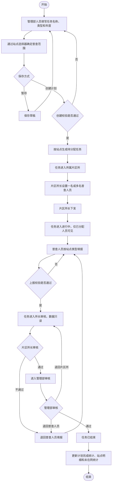
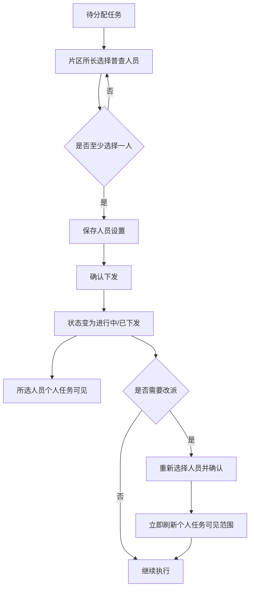
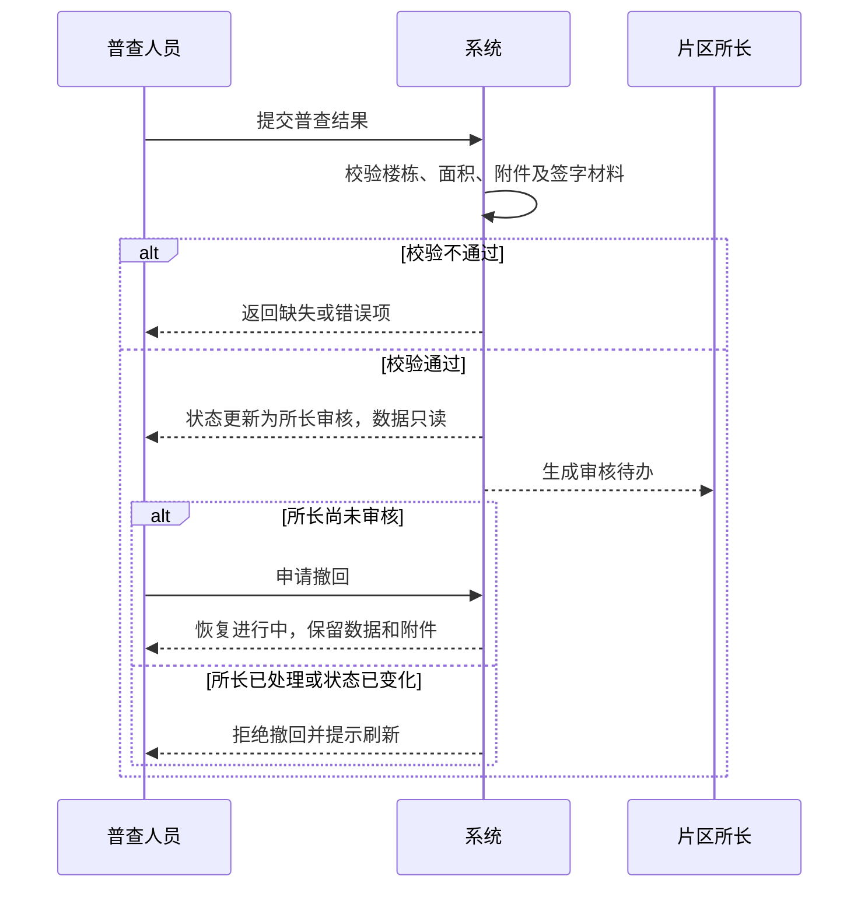
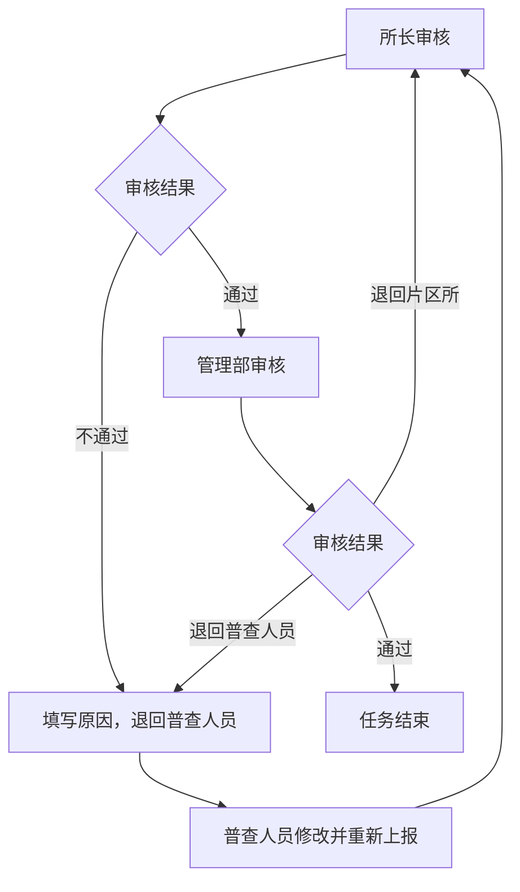

# 正常面积普查业务流程

## 1. 流程范围

本流程从管理部创建年度正常普查计划开始，到站点任务完成两级审核并沉淀站点明细和未在网统计结束。流程图描述正常普查入口；计划外任务在独立的计划外普查任务列表展示，但从人员分派开始完整复用本流程以及三类填报内容。

## 2. 参与角色

| 角色 | 流程职责 |
| --- | --- |
| 管理部人员 | 创建计划、确定站点范围、执行管理部审核、管理本部门计划内站点 |
| 片区所长 | 设置/改派普查人员、下发任务、执行片区所审核 |
| 普查人员 | 现场普查、数据填报、资料上传、暂存、上报和条件内撤回 |
| 业务管理员 | 全局查看、异常纠偏退回、审计追溯 |

## 3. 端到端主流程

## 4. 计划创建子流程

### 4.1 正常路径

1. 管理部人员进入“面积普查任务管理”，点击“新建普查计划”。
2. 填写任务名称、普查类型和普查年度。
3. 打开站点选择器，按管理部、片区所、站点名称/编码、上一年度是否普查筛选。
4. 选择一个或多个与计划类型一致的站点。
5. 点击“创建计划”。
6. 系统校验必填项并创建计划，对每个站点生成一条待分配任务。

### 4.2 草稿路径

- 点击“暂存”时允许字段或范围不完整。
- 草稿可在计划列表继续编辑或删除。
- 草稿不会生成可执行站点任务，也不会出现在片区所待办中。

### 4.3 选站规则

- 组织主数据仅包括长安、裕华、桥西三个管理部，其他数据自动过滤。
- 支持一键选择上一年度未普查站点。
- “两年一周期”当前为风险提示，不作为禁止选择的硬校验。
- 同一计划内同一站点只允许选择一次。
- 同一年度、同一类型的跨计划重复规则尚未最终确认，创建时应预留重复风险提示能力。

## 5. 分派与下发子流程

业务规则：

- 一条任务可设置多名普查人员。
- 未设置人员不得下发。
- 下发后不得重复下发，但允许片区所长改派。
- 改派后，未被继续选中的人员不再看到该任务；已填报数据不得丢失。

## 6. 三类站点填报子流程

### 6.1 共性流程

1. 普查人员从个人任务页进入对应类型填报页。
2. 查看站点或用户基础信息。
3. 维护楼栋/建筑物明细及普查面积。
4. 上传业务依据和站点资料。
5. 系统实时计算面积汇总与变化率。
6. 可暂存并退出；再次进入继续编辑。
7. 点击上报，系统执行完整性校验。
8. 校验通过后进入所长审核，页面切换为只读。

### 6.2 自管站差异流程

- 上传门头图和平面图。
- 导入或新建楼栋/建筑物。
- 对发生面积变化的楼栋录入一组或多组变更。
- 填写普查小结、未入网居民/非居民户数和明细。

### 6.3 用户站差异流程

- 首次普查可批量导入楼栋基础数据；非首次普查带出历史数据。
- 维护用户站平面图。
- 维护未在网建筑物统计。
- 生成合并核查明细表，上传签字版明细表后上报。

### 6.4 对公用户差异流程

- 首次普查可批量导入楼栋基础数据；非首次普查带出历史数据。
- 维护对公用户平面图。
- 生成对公用户核查汇总表，上传签字盖章版汇总表后上报。

## 7. 上报与撤回流程

## 8. 审核与退回流程

审核规则：

- 片区所审核只允许片区所长操作。
- 管理部审核只允许任务所属管理部人员操作。
- 审核通过时意见选填；审核不通过时退回原因必填。
- 提交审核时必须再次校验当前状态，避免多人重复处理。
- 审核记录保存节点、人员、时间、结果、意见、来源状态和目标状态。

## 9. 异常纠偏流程

### 9.1 业务管理员退回

业务管理员可对“管理部审核”或“普查完成”的站点进行异常纠偏退回：

1. 选择退回到普查人员填报、片区所审核或管理部审核。
2. 填写退回原因。
3. 系统清除当前完成时间，但保留原完成时间历史值。
4. 任务进入目标节点并标记最近审核结果为“已退回”。
5. 生成审批记录和不可篡改的操作日志。

### 9.2 删除计划内站点

- 管理部人员仅可删除本管理部的计划内站点。
- 删除需二次确认。
- 删除后从当前任务范围移除，保留站点快照和操作记录。
- 当前未按任务状态硬性限制删除，正式建设前作为待确认项。

### 9.3 同步失败

- 单条或批量同步失败时不得覆盖原数据。
- 批量处理继续执行其他记录，最终返回成功数、失败数和逐条原因。
- 用户可对失败项重新同步。

## 10. 状态流转表

| 流程节点 | 任务状态 | 审核状态 | 下发状态 | 可操作角色 | 主要动作 |
| --- | --- | --- | --- | --- | --- |
| 计划已创建 | 待分配 | 未上报 | 未下发 | 片区所长 | 设置人员、下发 |
| 普查执行 | 进行中 | 未上报 | 已下发 | 普查人员 | 填报、暂存、上报 |
| 片区所待审 | 所长审核 | 待审核 | 已下发 | 片区所长；普查人员可条件撤回 | 审核、撤回 |
| 管理部待审 | 管理部审核 | 待审核 | 已下发 | 管理部人员 | 审核、退回 |
| 审核退回 | 目标节点对应状态 | 已退回 | 已下发 | 目标节点责任人 | 修改或重新审核 |
| 流程结束 | 已结束/普查完成 | 通过 | 已下发 | 授权查看人员 | 查看；业务管理员可纠偏退回 |

## 11. 数据沉淀流程

任务结束后系统应同步更新：

- 计划总任务数、已完成任务数、进行中任务数。
- 有面积变化站点数。
- 站点原面积、现面积、变化率、居民和非居民面积变化。
- 普查人员、完成时间和最新同步时间。
- 未在网总户数、居民户数、非居民户数及户级明细。
- 审批记录、操作日志及附件索引。

## 12. 待确认流程边界

- 创建成功后是否允许增补站点或修改普查类型。
- 正常计划跨管理部选站规则。
- 同站点同年度跨计划重复创建的处理方式。
- 删除计划内站点的允许状态范围。
- 未在网建筑物正式数据模板。
- 全量普查数据导出流程，本期暂不建设。
