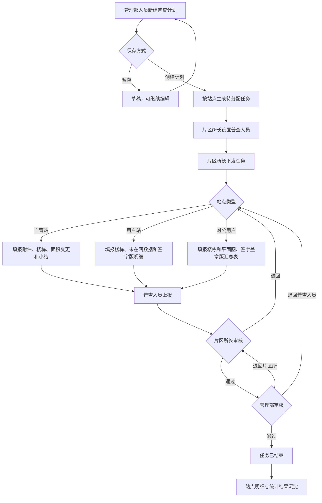

# 正常面积普查功能规格说明书

## 1. 文档说明

| 项目 | 内容 |
| --- | --- |
| 文档名称 | 正常面积普查功能规格说明书 |
| 适用系统 | 面积普查与检查管理系统 |
| 业务范围 | 按年度创建的计划内面积普查 |
| 基线日期 | 2026-07-16 |
| 文档状态 | 现状基线，可用于产品评审和研发拆分 |

本文描述“正常面积普查”的计划创建、任务执行、审核、查询和统计能力。计划外任务创建与列表不在本期范围，但计划外任务进入执行后复用本文件定义的三类填报、分派、撤回和两级审核能力；两个来源的任务列表相互隔离。面积检查以及全量普查数据导出不在本期范围。

## 2. 功能定义

正常面积普查是管理部按普查年度、站点类型和站点范围创建计划，片区所长分派并下发站点任务，普查人员完成现场数据填报，经片区所长和管理部两级审核后形成站点普查结果的闭环业务。

系统需要支持三类普查对象：

- 自管站
- 用户站
- 对公用户

组织范围限定为长安管理部、裕华管理部、桥西管理部及其下属片区所。

## 3. 目标与边界

### 3.1 目标

- 将年度普查计划拆分为可跟踪的站点任务。
- 按组织和人员权限控制任务可见范围及操作边界。
- 支持三类站点差异化填报，并统一汇总原面积、现面积和面积变化。
- 通过片区所长、管理部两级审核保证数据质量。
- 保留审批记录和关键操作日志，支持站点级追溯。
- 汇总未在网建筑物，为后续经营分析提供基础数据。

### 3.2 不在本期范围

- 计划外普查任务的创建与执行。
- 面积检查任务及整改流程。
- 管理部全量普查数据导出，后续单独立项确认。
- 计划外任务的创建、查询和独立任务列表；其执行能力复用本规格，不另建填报口径。
- 与计费、收费或客户主数据系统的正式接口实现细节。
- 未在网建筑物正式导入模板格式，当前标记为待确认。

## 4. 角色与权限

| 角色 | 数据范围 | 核心权限 | 禁止或受限操作 |
| --- | --- | --- | --- |
| 业务管理员 | 全部管理部 | 查看全部站点、审批记录和操作日志；将管理部审核中或已完成站点退回指定节点 | 不负责日常计划创建、人员分派和常规审核 |
| 管理部人员 | 本管理部 | 新建、暂存、编辑草稿和创建计划；查看计划；审核本管理部站点；查看、同步及删除本管理部计划内站点 | 不得查看或操作其他管理部数据 |
| 片区所长 | 本片区所 | 查看本所全部任务；设置、改派普查人员；下发任务；执行片区所审核；查看站点明细 | 审核权限严格限定为片区所长 |
| 普查人员 | 本人已分配且已下发任务 | 查看个人任务；填报、暂存、上报；在所长审核前撤回；查看本人站点明细 | 不得查看未分配或未下发任务，不得审核 |

## 5. 业务对象与数据模型

### 5.1 普查计划

| 字段 | 必填 | 规则 |
| --- | --- | --- |
| 任务名称 | 创建计划时是 | 最长 60 字；草稿允许不完整 |
| 普查类型 | 创建计划时是 | 自管站、用户站、对公用户，单个正常计划只对应一种类型 |
| 普查年度 | 创建计划时是 | 按年度管理 |
| 普查范围 | 创建计划时是 | 通过站点选择器选择一个或多个站点 |
| 所属管理部 | 系统生成 | 根据所选站点归属汇总 |
| 计划状态 | 系统生成 | 草稿、创建成功 |
| 创建时间 | 系统生成 | 精确到秒 |
| 任务完成统计 | 系统计算 | 已完成站点任务数/任务总数 |
| 有面积变化站点数 | 系统计算 | 现普查面积与原普查面积不一致的站点数 |

### 5.2 站点任务

| 字段 | 说明 |
| --- | --- |
| 任务标识 | 计划与站点组合的唯一标识 |
| 站点编码、站点名称、用热地址 | 来源于站点主数据 |
| 所属管理部、所属片区所 | 决定数据权限和审核责任人 |
| 站点类型 | 自管站、用户站、对公用户 |
| 所属年度 | 继承计划年度 |
| 普查人员 | 由片区所长设置，可多人 |
| 下发状态 | 未下发、已下发 |
| 任务状态 | 待分配、进行中、所长审核、管理部审核、已结束、已退回 |
| 审核状态 | 未上报、待审核/已上报、通过、已退回 |
| 更新时间 | 最近一次业务操作时间 |

### 5.3 楼栋或建筑物明细

三类填报共用的主要字段包括：楼号或建筑物名称、层数、建筑年代、用热性质、收费类别、控制方式、暖气类型、原普查面积、现普查面积、面积变化、变化率、核查依据、依据附件和备注。

面积计算规则：

- 面积变化 = 现普查面积 - 原普查面积。
- 原普查面积为 0 时，变化率显示“无法计算”，不得进行除零运算。
- 其他情况下，变化率 = 面积变化 ÷ 原普查面积 × 100%。
- 面积按住宅、非住宅及收费类别汇总，展示两位小数。

## 6. 用户故事

### US-01 创建年度普查计划

作为管理部人员，我希望按年度、站点类型和站点范围创建普查计划，以便形成站点级任务并进入执行流程。

验收条件：

- 可按管理部、片区所、站点名称/编码、上一年度是否普查筛选站点。
- 支持一键选择上一年度未普查站点；上一年度已普查站点仍允许手动选择。
- 暂存时允许信息不完整；创建计划时校验任务名称、普查类型、年度和至少一个站点。
- 创建成功后按所选站点生成任务，初始状态为“待分配”。

### US-02 分派和下发任务

作为片区所长，我希望为本所任务设置一名或多名普查人员并下发，以便指定人员开始普查。

验收条件：

- 未下发任务必须至少选择一名普查人员后才能下发。
- 下发后任务变为“进行中”，仅被选中的普查人员可见。
- 已下发任务允许重新设置人员；保存后立即更新个人任务可见范围。

### US-03 填报自管站

作为普查人员，我希望维护站点附件、楼栋明细、面积变更和普查小结，以便形成完整的自管站普查结果。

验收条件：

- 支持上传门头图、平面图，支持预览和删除。
- 支持导入、创建、编辑和删除楼栋或建筑物。
- 支持按楼栋录入一组或多组面积变更。
- 支持填写普查小结、居民/非居民未入网户数及明细。
- 上报前校验必填数据和附件；上报后内容只读。

### US-04 填报用户站和对公用户

作为普查人员，我希望维护用户站或对公用户的楼栋数据、平面图和签字版结果，以便完成对应类型的普查资料闭环。

验收条件：

- 首次普查支持通过模板批量导入楼栋基础数据。
- 非首次普查可带出上一轮数据，并在此基础上更新。
- 用户站支持维护未在网建筑物统计。
- 系统可生成核查明细/汇总表并供预览。
- 上报前必须上传平面图及签字版明细或汇总表。

### US-05 两级审核

作为片区所长或管理部人员，我希望审核权限范围内的站点数据，以便发现问题后退回、数据正确时逐级通过。

验收条件：

- 片区所长仅能处理“所长审核”状态且属于本所的任务。
- 片区所审核通过后进入“管理部审核”；不通过只能退回“普查人员填报”。
- 管理部审核通过后任务进入“已结束”；不通过可退回“片区所审核”或“普查人员填报”。
- 不通过时退回节点和退回原因必填；审批意见最长 300 字。
- 每次审核均生成审批记录和操作日志。

### US-06 撤回上报

作为普查人员，我希望在片区所长尚未审核前撤回已上报任务，以便修正误报数据。

验收条件：

- 仅“所长审核”且处于待审核/已上报的本人任务显示撤回操作。
- 撤回后任务恢复“进行中/未上报”。
- 已填报数据和附件保留，可修改后重新上报。

### US-07 查询站点明细

作为授权用户，我希望按组织、年度、状态、类型、建筑年代和完成时间查询站点，以便掌握进度和面积变化。

验收条件：

- 业务管理员查看全部；管理部人员查看本管理部；片区所长查看本所；普查人员查看本人站点。
- 列表展示原面积、现面积、变化率、居民/非居民面积变化、普查人员和完成时间。
- 支持单条同步和批量同步，同步失败时保留原值并反馈失败原因。

### US-08 统计未在网建筑物

作为授权用户，我希望按组织和年度汇总未在网居民、非居民户数并查看明细，以便掌握未入网情况。

验收条件：

- 支持组织树、年度、站点编码、站点名称和小区名称筛选。
- 汇总总户数、居民户数、非居民户数。
- 明细展示楼号、单元号、户室号、采暖方式和供热性质类别。
- 数据范围沿用角色组织权限。

## 7. 核心业务流程

## 8. 功能模块规格

### 8.1 计划管理

1. 计划列表支持按计划名称、所属年度、普查类型查询。
2. 列表展示所属管理部、计划名称、普查类型、任务完成统计、有面积变化站点数、计划状态、所属年度和创建时间。
3. 草稿允许编辑和删除；删除需二次确认且不可恢复。
4. 创建成功的计划进入详情页查看站点任务和完成统计。
5. 一个正常计划只选择一种站点类型；站点选择结果须与该类型匹配。

### 8.2 站点选择器

1. 查询条件：所属管理部、所属片区所、站点名称/编码、上一年度是否普查。
2. 列表字段：站点编码、站点名称、行政区、所属片区所、用热地址、上一年度是否普查。
3. 支持当前页多选、跨页保留选择、一键选择上一年度未普查站点。
4. 面积普查以两年为周期；该规则仅作为选择提示，不阻止人工选择上一年度已普查站点。
5. 系统仅保留长安、裕华、桥西三个管理部的数据，其他管理部数据自动过滤。

### 8.3 片区所任务处理

1. 页面展示本所全部任务，支持按年度、编码、名称和审核状态查询。
2. 任务页按自管站、用户站、对公用户分类切换。
3. 片区所长可设置多名普查人员、下发任务、下发后改派及审核。
4. 未设置人员时禁止下发；已下发任务禁止重复下发。

### 8.4 普查人员任务处理

1. 仅显示当前人员已分配且已下发的任务。
2. 支持按年度、编码、名称、站点类型和审核状态查询。
3. “进行中”或退回到填报节点的任务可编辑；审核中和已完成任务只读。
4. 根据站点类型进入对应填报页。
5. 在片区所长审核前允许撤回，审核动作发生后不得撤回。

### 8.5 审核与退回

| 当前节点 | 通过后 | 可退回节点 | 退回后责任人 |
| --- | --- | --- | --- |
| 片区所审核 | 管理部审核 | 普查人员填报 | 原普查人员 |
| 管理部审核 | 已结束 | 片区所审核、普查人员填报 | 所长或原普查人员 |
| 已结束（业务管理员纠偏） | 按选择节点恢复 | 管理部审核、片区所审核、普查人员填报 | 对应节点责任人 |

业务管理员退回仅用于异常纠偏，退回节点与原因必填，原完成时间需留存为历史信息。

### 8.6 站点删除

- 仅管理部人员可删除本管理部计划内站点。
- 删除前必须二次确认。
- 删除后从计划任务和当前站点明细中移除，但保留站点快照和操作记录。
- 删除是否需要限制任务状态，当前原型未做硬性限制，正式建设前需确认。

### 8.7 同步

- 支持单站同步和批量同步。
- 同步更新站点基础信息、普查状态、建筑年代、普查人员和完成时间。
- 不得覆盖正在人工填报的业务数据。
- 批量同步需返回成功数、失败数和逐条失败原因；失败记录保留原数据。

## 9. 状态机

| 当前状态 | 触发动作 | 下一状态 | 操作角色 |
| --- | --- | --- | --- |
| 草稿 | 创建计划 | 创建成功，生成待分配任务 | 管理部人员 |
| 待分配 | 设置人员并下发 | 进行中 | 片区所长 |
| 进行中 | 上报 | 所长审核 | 普查人员 |
| 所长审核 | 撤回 | 进行中 | 普查人员，且所长未审核 |
| 所长审核 | 审核通过 | 管理部审核 | 片区所长 |
| 所长审核 | 审核不通过 | 进行中/已退回 | 片区所长 |
| 管理部审核 | 审核通过 | 已结束 | 管理部人员 |
| 管理部审核 | 退回片区所 | 所长审核/已退回 | 管理部人员 |
| 管理部审核 | 退回普查人员 | 进行中/已退回 | 管理部人员 |
| 已结束 | 业务纠偏退回 | 所选业务节点/已退回 | 业务管理员 |

“已退回”同时表达审核结果，实际待办节点由退回目标决定。正式后端应分别保存流程节点和最近审核结果，避免仅用一个状态字段产生歧义。

## 10. 校验与异常处理

- 创建计划：任务名称、普查类型、普查年度和站点范围必填；草稿除外。
- 分派：至少选择一名普查人员。
- 填报：面积不得为负数；必填字典值不能为空；依据附件仅支持 PDF，单文件不超过 20MB。
- 导入：支持 `.xls`、`.xlsx`，单文件不超过 20MB；逐行校验，异常行不导入，有效行可继续导入。
- 上报：必填楼栋、附件、小结或签字版资料须完整；错误信息应集中展示并定位到缺失项。
- 审核：不通过时必须选择退回节点并填写原因；提交前二次校验任务状态，防止重复处理。
- 时间范围：开始值不得晚于结束值。
- 同步失败：不覆盖本地原值，提供可重试提示。
- 重复提交：按钮进入处理中状态，避免连续点击产生重复业务记录。

## 11. 非功能要求

### 11.1 权限与安全

- 所有列表、详情和统计接口必须在服务端按组织及人员范围过滤，前端隐藏不能替代权限校验。
- 附件访问需校验任务查看权限。
- 审核、退回、删除、改派、下发、同步等操作必须记录操作者、时间、前后状态和业务原因。

### 11.2 性能

- 普通列表查询在常规数据量下目标响应时间不超过 2 秒。
- 批量同步应异步或分批执行，页面显示处理结果，不因单条失败终止全部任务。
- 大附件上传需显示进度与失败重试能力。

### 11.3 可用性

- 列表操作列固定，横向滚动时持续可见。
- 审核中及已结束数据必须明确显示只读状态。
- 空数据、无权限、接口失败和数据冲突均需提供明确提示。

### 11.4 审计与可追溯

- 审批记录按时间倒序展示节点、人员、时间、结果和意见。
- 操作日志不可由普通业务角色修改或删除。
- 被删除站点和被退回的已完成结果需保留历史快照。

## 12. 待确认项

| 编号 | 待确认事项 | 当前处理 |
| --- | --- | --- |
| TBC-01 | 正常计划是否允许跨多个管理部选站，还是只能选择当前管理部 | 原型允许选择器展示三个管理部，正式权限规则待确认 |
| TBC-02 | 计划创建成功后是否允许调整计划基础信息和增减站点 | 当前仅草稿显示编辑；站点可由管理部人员在明细中删除 |
| TBC-03 | 删除计划内站点是否应限制为未下发或未上报状态 | 当前不做硬性状态限制 |
| TBC-04 | “已退回”与实际待办节点的后端状态编码 | 建议拆分流程节点与审核结果 |
| TBC-05 | 未在网建筑物明细的正式模板和必填字段 | 当前原型字段为临时口径 |
| TBC-06 | 用户站、对公用户签字材料的签章主体及文件命名规则 | 当前仅校验已上传 |
| TBC-07 | 普查周期“两年”是否需要系统硬校验 | 当前仅提示，不阻止人工选择 |
| TBC-08 | 管理部全量普查数据导出字段及审批范围 | 后续需求，本期不建设 |
