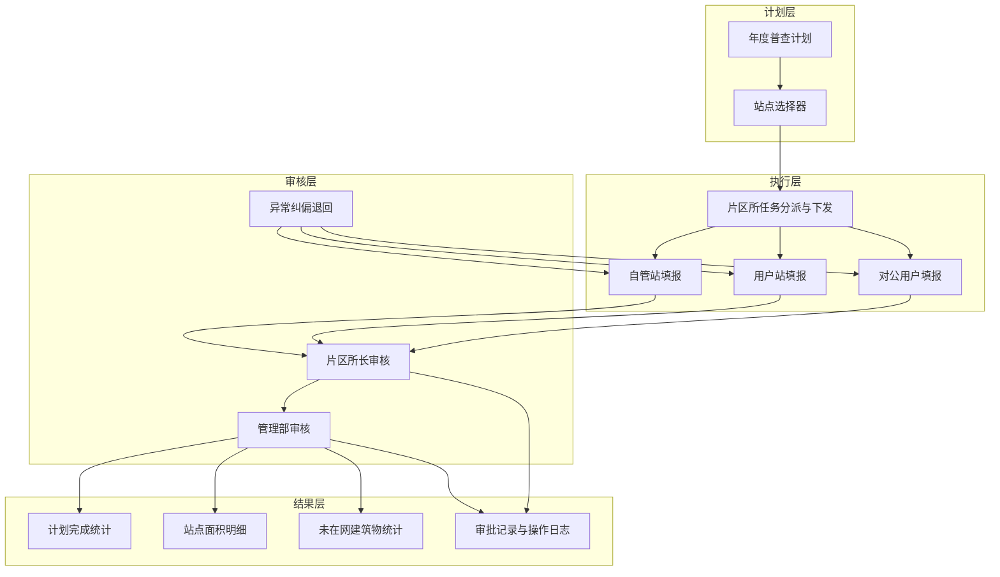

# 正常面积普查整体业务需求文档

## 1. 文档概述

### 1.1 建设背景

面积普查涉及年度计划编制、站点任务拆分、基层人员分派、现场数据采集、两级审核和结果汇总。若依赖线下表格和人工传递，容易出现任务责任不清、数据版本不一致、审核无法追溯和跨组织数据越权等问题，因此需要建设统一的正常面积普查闭环。

### 1.2 建设目标

- 建立“年度计划—站点任务—普查填报—两级审核—结果沉淀”的统一链路。
- 明确业务管理员、管理部人员、片区所长和普查人员的责任边界。
- 统一自管站、用户站、对公用户三类对象的面积数据口径。
- 提高数据完整性、审核效率和异常纠偏能力。
- 为站点面积变化分析及未在网建筑物统计提供可信数据源。

## 2. 业务现状与痛点

| 痛点 | 业务影响 | 需求方向 |
| --- | --- | --- |
| 年度普查范围分散在表格中 | 任务易遗漏或重复 | 统一计划和站点选择器 |
| 分派与下发依靠人工通知 | 责任人和进度不清 | 站点任务化、人员化 |
| 三类站点资料结构不同 | 数据难以统一汇总 | 共性模型加差异化填报 |
| 审核退回依赖口头沟通 | 原因和过程不可追溯 | 两级在线审核和审批记录 |
| 多组织共用系统 | 存在越权查看风险 | 组织、角色、人员三级数据权限 |
| 已完成数据出现问题时难纠偏 | 结果错误长期留存 | 业务管理员异常退回机制 |
| 未在网建筑物缺少统一统计 | 经营分析基础不足 | 统一户数和明细统计 |

## 3. 业务范围

### 3.1 本期范围

- 正常普查计划的新建、暂存、编辑草稿、创建、查看和删除草稿。
- 通过站点选择器配置普查范围。
- 创建站点任务并由片区所长设置人员、下发和改派。
- 自管站、用户站、对公用户三类填报。
- 片区所长审核和管理部审核。
- 普查人员条件内撤回、审核退回和业务管理员纠偏退回。
- 站点明细查询、同步、管理部删除计划内站点。
- 未在网建筑物统计及明细查看。
- 审批记录、关键操作日志和历史快照。

### 3.2 范围外

- 计划外普查任务的创建和独立列表；其分派、三类填报、撤回及两级审核复用本需求定义的正常普查执行能力。
- 面积检查、整改和复核。
- 计费调整、收费结算等下游业务。
- 全量普查数据导出，本期延后。
- 正式电子签章。

## 4. 组织与干系人

### 4.1 组织范围

系统当前只包含以下三个管理部：

- 长安管理部
- 裕华管理部
- 桥西管理部

其他管理部数据应在读取、选择和展示阶段自动过滤。

### 4.2 干系人

| 干系人 | 核心诉求 |
| --- | --- |
| 业务管理员 | 全局掌握进度和结果，可对异常完成数据纠偏 |
| 管理部人员 | 快速创建计划、审核本部门数据、管理站点范围 |
| 片区所长 | 掌握本所任务，便捷分派、下发、改派和审核 |
| 普查人员 | 只看到本人任务，快速填报并在误报时及时撤回 |
| 数据/运营人员 | 获得统一、可追溯的面积和未在网统计口径 |
| 系统运维人员 | 确保权限、接口、附件及日志稳定可靠 |

## 5. 整体业务架构

## 6. 总体业务规则

### 6.1 计划规则

- 正常普查按年度管理。
- 单个计划只配置一种普查类型，但可包含多个同类型站点。
- 创建成功时按站点生成独立任务。
- 草稿允许信息不完整且不生成执行待办。
- 普查周期为两年；当前只提示上一年度普查情况，不进行硬性拦截。

### 6.2 权限规则

- 业务管理员可查看全部管理部站点和完整流程记录。
- 管理部人员仅查看、审核和管理本管理部数据。
- 片区所操作权限严格收口为片区所长，数据范围为本片区所。
- 普查人员只看到本人已分配、已下发的任务和站点。
- 所有权限必须由服务端校验，不能仅依赖页面按钮控制。

### 6.3 执行规则

- 片区所长需先设置至少一名普查人员再下发。
- 下发后可改派，个人任务可见范围实时变化。
- 普查人员可暂存；上报后进入只读。
- 所长实际审核前，普查人员可撤回；审核后不能撤回。
- 正常与计划外任务使用独立列表展示；计划外任务不得混入正常普查的片区所或普查人员任务列表。
- 两类任务共用同一套自管站、用户站、对公用户填报内容和执行状态机，任务来源仅影响入口与来源标识。

### 6.4 审核规则

- 片区所长审核通过后进入管理部审核，不通过只能退回普查人员。
- 管理部审核通过后任务结束，不通过可退回片区所或普查人员。
- 业务管理员可将管理部审核中或已完成站点退回指定业务节点。
- 所有退回都必须填写原因并生成可追溯记录。

### 6.5 数据规则

- 原面积、现面积、面积变化、变化率及分类小计必须由系统统一计算。
- 历史普查数据与本次数据需可对照，不能覆盖历史版本。
- 删除站点、改派人员、退回已完成任务等操作需保留快照。
- 用户界面和文档统一使用“对公用户”称谓。

## 7. 高层业务需求

| 编号 | 业务需求 | 优先级 | 验收要点 |
| --- | --- | --- | --- |
| BR-001 | 系统应支持正常年度普查计划管理 | P0 | 可暂存、创建、查看、编辑草稿、删除草稿 |
| BR-002 | 系统应通过站点选择器维护普查范围 | P0 | 支持组织、关键字、上一年度普查情况筛选和多选 |
| BR-003 | 系统应按站点自动生成可执行任务 | P0 | 创建成功后每个站点唯一生成一条待分配任务 |
| BR-004 | 系统应支持片区所长设置多人、下发和改派 | P0 | 未设置人员不得下发，改派后权限立即生效 |
| BR-005 | 系统应支持普查人员个人任务工作台 | P0 | 仅展示本人已分配且已下发任务 |
| BR-006 | 系统应支持自管站完整填报 | P0 | 附件、楼栋、面积变更、小结、未入网数据闭环 |
| BR-007 | 系统应支持用户站完整填报 | P0 | 楼栋、平面图、未在网数据、签字版明细闭环 |
| BR-008 | 系统应支持对公用户完整填报 | P0 | 楼栋、平面图、核查汇总及签字盖章版闭环 |
| BR-009 | 系统应支持两级审核和定向退回 | P0 | 所长审核、管理部审核节点和退回范围正确 |
| BR-010 | 系统应支持条件内撤回 | P1 | 所长审核前可撤回，数据和附件不丢失 |
| BR-011 | 系统应提供跨计划站点明细 | P1 | 按权限查询进度、面积变化和完成结果 |
| BR-012 | 系统应支持站点信息同步 | P1 | 单条/批量、部分失败可追踪、不覆盖人工数据 |
| BR-013 | 系统应支持未在网建筑物统计 | P1 | 组织和年度汇总，支持户级明细 |
| BR-014 | 系统应记录全流程审计信息 | P0 | 审批和关键操作不可篡改、可追溯 |
| BR-015 | 系统应支持业务管理员异常纠偏 | P1 | 可退回管理部审核中或已完成站点 |

## 8. 核心数据需求

### 8.1 主数据

- 组织：管理部、片区所、行政区、办事处。
- 人员：用户、角色、所属组织、可分派普查人员。
- 站点：编码、名称、类型、地址、组织归属、联系人等。
- 字典：站点类型、用热性质、收费类别、控制方式、暖气类型、核查依据。

### 8.2 业务数据

- 普查计划及计划站点范围。
- 站点任务、人员分派、下发和状态。
- 楼栋/建筑物明细、面积及变更记录。
- 未在网建筑物汇总和户级明细。
- 附件元数据、签字材料和生成报表索引。
- 审批记录、操作日志、删除和退回历史快照。

### 8.3 数据保留

- 已完成任务不得物理覆盖历史版本。
- 被删除的计划内站点保留业务快照及删除日志。
- 附件需与任务版本绑定，退回重报后保留历史附件索引。
- 数据保留年限及归档策略待信息安全和档案制度确认。

## 9. 查询与统计需求

### 9.1 计划统计

- 任务总数、已完成数、进行中数。
- 有面积变化站点数。
- 按年度、类型和管理部查询计划。

### 9.2 站点统计

- 原面积、现面积、变化量和变化率。
- 居民面积变化、非居民面积变化。
- 任务状态、普查人员和完成时间。
- 按组织、年度、状态、类型、建筑年代和完成时间筛选。

### 9.3 未在网统计

- 总户数、居民户数、非居民户数。
- 按管理部、片区所、年度、站点和小区汇总。
- 查看楼号、单元、户室、采暖方式和供热性质类别。

全量普查数据导出不纳入本期建设，待后续明确字段、权限和审批要求。

## 10. 接口与集成需求

正式建设预计需要以下集成，具体接口协议待技术设计阶段确认：

- 组织和用户中心：同步组织、角色和人员。
- 站点主数据：获取站点编码、名称、类型、地址和归属。
- 历史普查数据：带出上一轮楼栋和面积数据。
- 文件服务：上传、预览、版本化存储附件及签字材料。
- 消息中心：下发、待审核、退回和改派通知。
- 日志审计平台：接收关键业务操作记录。

## 11. 非功能需求

| 类别 | 需求 |
| --- | --- |
| 安全 | 服务端执行角色、组织和人员范围校验；附件需鉴权访问 |
| 性能 | 常规列表查询目标 2 秒内返回；批量同步不得因单条失败中断 |
| 稳定性 | 上报、审核、退回、删除等操作支持幂等控制和状态冲突校验 |
| 易用性 | 操作列固定；审核中和已完成明确只读；错误可定位 |
| 审计 | 关键操作记录操作者、时间、原因、前后状态和对象标识 |
| 兼容性 | 支持主流桌面浏览器及常用管理端分辨率 |
| 文件 | PDF 单文件上限 20MB；Excel 导入单文件上限 20MB |

## 12. 总体验收标准

1. 管理部人员可完成从计划创建到站点任务生成的完整操作。
2. 片区所长只能看到本所任务，并可完成分派、下发、改派和所长审核。
3. 普查人员只能看到本人已下发任务，并能完成三类站点对应填报。
4. 上报后数据只读，所长审核前可撤回且数据不丢失。
5. 两级审核和定向退回符合权限及状态规则。
6. 管理部人员无法查看或操作其他管理部数据。
7. 业务管理员可全局查看并完成异常纠偏退回。
8. 站点明细能正确汇总面积变化，未在网统计能下钻到明细。
9. 删除、退回、审核、下发和改派均产生完整审计记录。
10. 页面及数据中统一使用“对公用户”。

## 13. 风险与依赖

| 风险/依赖 | 影响 | 应对建议 |
| --- | --- | --- |
| 站点和组织主数据质量不足 | 选站、权限和统计错误 | 上线前清洗并建立唯一编码 |
| 状态字段混用流程节点和审核结果 | 待办判断歧义 | 后端拆分任务节点、审核结果和下发状态 |
| 历史普查数据结构不一致 | 非首次普查无法可靠带出 | 制定迁移映射和异常数据清单 |
| 附件量大 | 上传和预览性能下降 | 对象存储、分片上传、异步生成预览 |
| 改派与审核并发 | 责任人或状态冲突 | 使用版本号/乐观锁和操作幂等键 |
| 未在网模板未定 | 研发返工 | 先冻结业务字段和导入样例再开发接口 |

## 14. 待确认事项

- 正常计划是否允许跨管理部选择站点。
- 创建成功后是否允许修改计划基础信息或新增站点。
- 同站点同年度跨计划的重复控制规则。
- 删除计划内站点允许的状态范围。
- 用户站、对公用户签字材料命名、签章主体和归档要求。
- 未在网建筑物正式字段、模板和必填口径。
- 历史数据带出失败时的人工处理流程。
- 消息通知渠道和触达时点。
- 数据保留年限及归档要求。
- 全量普查数据导出后续需求范围。
