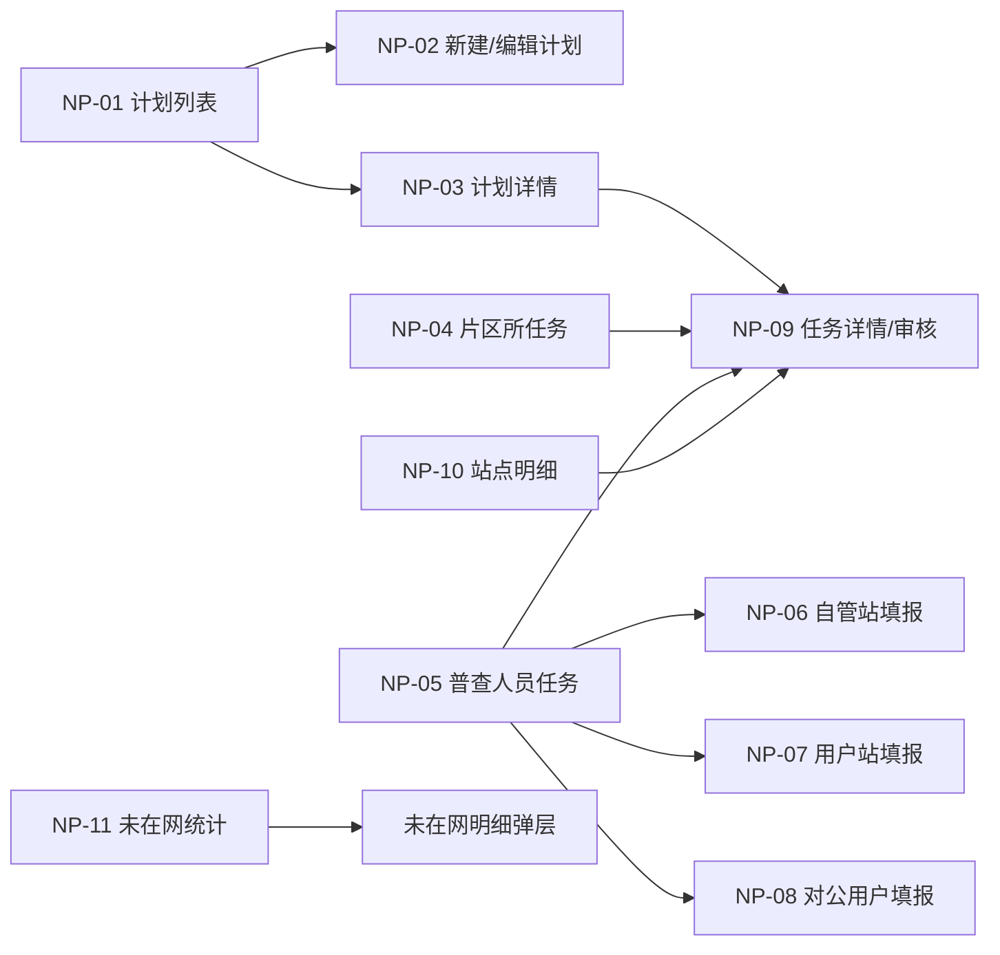

# 正常面积普查页面清单

## 1. 页面范围说明

本清单覆盖正常面积普查的管理端、片区所端、普查人员端及公共查询统计页面。计划外任务列表不计入本清单，且不得向 NP-04、NP-05 混入计划外任务；NP-06、NP-07、NP-08 的填报组件由正常普查与计划外普查共同复用。面积检查页面不计入本清单。

## 2. 页面总览

| 页面编号 | 页面名称 | 当前实现文件 | 主要角色 | 页面目的 |
| --- | --- | --- | --- | --- |
| NP-01 | 面积普查任务管理 | `area-survey-plan-list.html` | 管理部人员、业务管理员 | 查询和管理正常普查计划 |
| NP-02 | 新建/编辑普查计划 | `area-survey-plan-create.html` | 管理部人员 | 维护计划信息并通过站点选择器确定范围 |
| NP-03 | 普查计划详情 | `area-survey-plan-detail.html` | 管理部人员、片区所长、授权查看人员 | 查看计划基础信息、统计和站点任务 |
| NP-04 | 我的面积普查任务（片区所） | `area-survey-office-tasks.html` | 片区所长 | 分派、下发、改派和审核本所任务 |
| NP-05 | 我的面积普查任务（普查人员） | `area-survey-surveyor-tasks.html` | 普查人员 | 查看本人已下发任务并进入填报或撤回 |
| NP-06 | 自管站普查填报 | `area-survey-survey-fill.html` | 普查人员 | 填报自管站附件、楼栋、面积变更和小结 |
| NP-07 | 用户站普查填报 | `area-survey-user-fill.html` | 普查人员 | 填报用户站楼栋、未在网数据和签字版明细 |
| NP-08 | 对公用户普查填报 | `area-survey-corporate-fill.html` | 普查人员 | 填报对公用户楼栋和平面图、签字盖章版汇总表 |
| NP-09 | 普查任务详情/审核 | `area-survey-task-detail.html` | 片区所长、管理部人员、只读用户 | 查看站点数据、附件、审批记录并审核 |
| NP-10 | 面积普查站点明细 | `area-survey-station-details.html` | 业务管理员、管理部人员、片区所长、普查人员 | 跨计划查询站点进度和结果 |
| NP-11 | 未在网建筑物统计 | `area-survey-offnetwork-stats.html` | 业务管理员、管理部人员、片区所长、普查人员 | 汇总未在网居民/非居民户数并查看明细 |

`area-survey-my-tasks.html` 为早期合并式任务页，当前主导航已拆分为片区所任务页和普查人员任务页，不作为正式主流程页面。

## 3. 页面详细清单

### NP-01 面积普查任务管理

- 查询条件：计划名称、所属年度、普查类型。
- 列表字段：所属管理部、计划名称、普查类型、任务完成统计、有面积变化站点数、计划状态、所属年度、创建时间、操作。
- 主要操作：搜索、重置、新建计划、查看详情、编辑草稿、删除草稿。
- 弹层：计划详情抽屉、删除草稿确认框。
- 页面要求：操作列固定；分页支持 10/20/50 条及页码跳转。

### NP-02 新建/编辑普查计划

- 基础字段：任务名称、普查类型、普查年度。
- 普查范围：展示已选站点，支持新增和移除。
- 普查范围列表：首列增加“序号”，按当前展示顺序从 1 连续编号；移除后自动重排，不持久化、不参与排序和校验。
- 底部操作：取消、暂存、创建计划。
- 站点选择器筛选：所属管理部、所属片区所、站点名称/编码、上一年度是否普查。
- 站点选择器字段：站点编码、名称、行政区、所属片区所、用热地址、上一年度是否普查。
- 站点选择器操作：搜索、重置、选择当前页、一键选择上一年度未普查站点、添加。
- 弹层：站点选择器、未保存离开确认框。

### NP-03 普查计划详情

- 基础信息：计划名称、普查类型、年度、所属管理部、创建时间、计划状态。
- 统计卡片：任务总数、已完成任务、进行中任务、面积变化站点。
- 草稿模式：展示已选普查范围，并提供编辑计划入口。
- 创建成功模式筛选：站点编码、站点名称、所属片区所、审核状态。
- 任务列表：站点编码、名称、地址、管理部、片区所、年度、任务状态、审核状态、更新时间、操作。
- 主要操作：详情、当前角色可处理时进入审核。

### NP-04 我的面积普查任务（片区所）

- 数据范围：当前片区所全部任务。
- 查询条件：年度、站点编码、站点名称、所属片区所（锁定）、审核状态。
- 分类页签：自管站、用户站、对公用户。
- 列表字段：站点信息、组织、年度、状态、下发状态、审核状态、最近操作时间、操作。
- 主要操作：设置人员、重新设置人员、下发、查看详情、片区所审核。
- 弹层：普查人员选择、下发确认、重新设置人员确认。

### NP-05 我的面积普查任务（普查人员）

- 数据范围：分配给当前人员且已经下发的任务。
- 查询条件：年度、站点编码、站点名称、站点类型、所属片区所（锁定）、审核状态。
- 分类页签：自管站、用户站、对公用户。
- 主要操作：进入填报、查看详情、撤回。
- 弹层：撤回确认。

### NP-06 自管站普查填报

- 站点信息：编码、地址、管理部、片区所、行政区、办事处、普查人员、年度、未入网数量、小结。
- 附件：门头图、平面图，支持上传、预览、删除。
- 汇总：原/现总面积，住宅/非住宅及收费类别小计。
- 楼栋表：楼栋基础属性、普查状态、原/现面积、变化、变化率、控制方式、暖气类型、年代、依据。
- 主要操作：导入楼栋、添加/编辑/删除楼栋、录入面积变更、填写小结、暂存、上报。
- 弹层：附件上传与预览、Excel 导入、楼栋编辑、面积变更、普查小结、上报确认。
- 来源复用：正常任务与计划外任务共用全部填报字段、操作和校验；计划外进入时仅额外展示任务来源和普查原因。

### NP-07 用户站普查填报

- 用户信息：用户编码、全称、管理部、片区所、行政区、办事处、联系人、电话、地址、未在网汇总。
- 资料：用户站平面图、合并核查明细表、签字版明细表。
- 模式提示：首次普查支持批量导入；非首次普查带出历史数据。
- 楼栋表：基础属性、原/现面积、变化率、控制方式、暖气类型、建筑年代、核查依据和附件。
- 主要操作：导入楼栋、创建/编辑/删除楼栋、维护未在网数据、生成/预览核查明细、上传签字版、暂存、上报。
- 弹层：楼栋编辑、Excel 导入、未在网统计、资料上传/预览、上报确认。
- 来源复用：正常任务与计划外任务共用全部填报字段、操作和校验；计划外进入时仅额外展示任务来源和普查原因。

### NP-08 对公用户普查填报

- 用户信息：用户全称、简称、行政区、用户编码、地址、联系人、联系方式、用户卡号、管理部、办事处。
- 资料：对公用户平面图、核查汇总表、签字盖章版汇总表。
- 模式提示：首次普查支持批量导入；非首次普查带出历史数据。
- 楼栋表及面积汇总与用户站口径一致。
- 主要操作：导入楼栋、创建/编辑/删除楼栋、生成/预览核查汇总表、上传签字盖章版、暂存、上报。
- 弹层：楼栋编辑、Excel 导入、资料上传/预览、上报确认。
- 来源复用：正常任务与计划外任务共用全部填报字段、操作和校验；计划外进入时仅额外展示任务来源和普查原因。

### NP-09 普查任务详情/审核

- 站点基础信息：站点、组织、年度、普查人员、任务及审核状态。
- 面积汇总：原面积、现面积、面积变化及分类汇总。
- 业务明细：楼栋明细、普查依据附件、变更详情。
- 审批记录：节点、人员、时间、结果、意见。
- 主要操作：返回、预览附件、查看楼栋详情、审核。
- 审核弹层：结果、退回节点、审批意见；管理部审核允许退回片区所或普查人员，片区所审核只允许退回普查人员。

### NP-10 面积普查站点明细

- 组织树：按角色展示全部管理部、本管理部、本片区所或本人站点。
- 查询条件：年度、站点编码、站点名称、普查状态、站点类型、建筑年代区间、完成时间区间。
- 列表字段：组织和站点信息、类型、办事处、地址、建筑年代、原/现面积、变化率、居民/非居民面积变化、普查人员、完成时间、操作。
- 主要操作：详情、管理部审核、单条同步、批量同步、管理部删除本部门计划内站点、业务管理员退回。
- 弹层：同步确认、批量同步结果、退回站点。

### NP-11 未在网建筑物统计

- 组织树：按角色数据范围展示管理部和片区所。
- 查询条件：年度、编码、站点名称、小区名称。
- 汇总列表：编码、站点名称、小区名称、总户数、居民户数、非居民户数。
- 明细弹层：楼号、单元号、户室号、采暖方式、供热性质类别。
- 主要操作：查询、重置、查看详情、明细分页。

## 4. 页面跳转关系

## 5. 共性页面规范

- 所有业务列表的操作列固定在右侧。
- 页面按角色显示数据范围提示，服务端同步执行数据权限过滤。
- 表单必填项使用统一标识；提交失败时展示字段级错误和集中错误摘要。
- 审核中及已完成数据进入只读状态。
- 删除、撤回、退回、下发、改派和上报均需二次确认。
- 列表空状态、无权限状态、加载失败状态和接口冲突状态均需独立设计。
