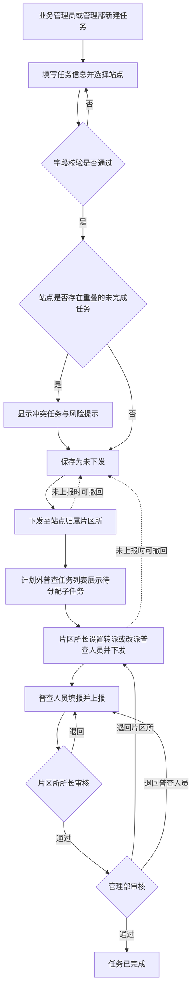

# 计划外普查任务管理《功能规格说明书》

## 1. 文档信息

- 版本：V1.7
- 日期：2026-07-17
- 功能位置：“面积普查”下新增管理菜单与执行菜单
- 菜单名称：计划外普查任务管理、计划外普查任务
- 当前阶段：计划外普查原因枚举调整方案待确认，原型待调整

## 2. 背景与功能定义

现有“面积普查任务管理”通过建立普查计划批量生成站点任务，适合年度性、计划性普查。对于面积变化、一管到户、新开户及增容、趸售用户等临时业务场景，需要脱离年度计划直接发起站点级普查任务。

本功能用于新建、查询、编辑、下发、撤回和跟踪计划外普查任务。除“计划外普查任务管理”外，设置独立执行菜单“计划外普查任务”，承载片区所分配、普查人员填报、所长审核和管理部审核。计划外站点子任务只在该计划外任务列表中展示，不混入正常普查的片区所任务列表或普查人员任务列表；进入处理后，流程、填报字段、页面能力、校验规则和状态流转与正常普查完全一致。列表、详情、填报和审核上下文持续展示“任务来源：计划外”及计划外普查原因。

## 3. 业务目标

1. 为紧急或非年度计划范围的普查需求提供独立发起入口。
2. 让业务管理员与管理部在权限范围内快速建立、下发任务。
3. 对同一站点存在时间重叠的未完成任务进行风险提示，由业务人员判断是否继续创建。
4. 保持计划内与计划外任务的执行、审核、统计口径一致。
5. 通过独立执行列表隔离正常与计划外任务，同时复用正常普查执行能力，避免形成两套填报和审核口径。

## 4. 用户角色与数据权限

系统管理部范围统一限定为三个：长安管理部、裕华管理部、桥西管理部。新华管理部不再出现在筛选项、站点选择器、组织树、任务列表和统计结果中；浏览器本地已有的新华管理部历史数据自动过滤，不参与当前业务展示和统计。

| 角色 | 数据范围 | 核心权限 |
| --- | --- | --- |
| 业务管理员 | 全部管理部 | 新建、编辑未下发任务、选择站点、下发、撤回、作废、查看全部任务及日志 |
| 管理部人员 | 本管理部及下属片区所 | 新建、编辑未下发任务、选择本部站点、下发至片区所、撤回、在站点明细审核本部数据、删除计划内站点、查看本部任务及完整审批记录 |
| 片区所长 | 本片区所 | 接收任务、设置/转派/改派普查人员、下发至普查人员、审核本所数据、查看本所站点明细并按完成状态筛选 |
| 普查人员 | 本人已分配任务 | 查看、填报、保存、上报，在所长审核前撤回填报 |

“计划外普查任务”执行菜单对上述四类角色均可见，并按照角色自动裁剪数据和操作：业务管理员查看全量进度；管理部人员查看本部任务并执行管理部审核；片区所长查看本所任务，转派/改派普查人员并执行所长审核；普查人员仅查看本人已分配任务并填报上报。普通片区所人员不得获得所长审核、转派或改派权限。

全量普查数据导出不纳入本期范围，后续单独确认导出角色、数据范围、字段和文件格式。

## 5. 用户故事

### US-01 新建计划外任务

作为业务管理员或管理部用户，我希望针对临时普查原因选择站点并新建任务，以便不必等待新建年度普查计划。

验收要点：

- 必填任务名称、开始时间、结束时间、计划外普查原因和站点。
- 结束时间必须晚于开始时间。
- 管理部用户只能选择本管理部站点。
- 点击“添加计划外普查站点”打开站点选择器，可跨站点类型批量选择用户站、自管站和对公用户。
- 站点存在时间重叠的计划内或计划外任务时，系统显示冲突任务信息，但不禁用站点、不阻止创建。

### US-02 任务下发

作为业务管理员或管理部用户，我希望将已建立的任务下发至站点归属片区所，以便片区所继续分配普查人员。

验收要点：

- 未下发前可修改所有字段。
- 下发时再次检查站点重复情况；存在冲突时进行二次提示，用户确认后仍可下发。
- 下发成功后任务进入“待分配”，相应片区所可见。

### US-03 下发后修改

作为任务发起人，我希望在任务内容有误时可控地修改，以便不会在普查人员不知情的情况下变更执行口径。

推荐规则：

- 任务下发后，任务名称、时间、原因和站点均不可直接修改。
- 任务尚未上报审核时，发起人可“撤回”任务；撤回后恢复为“未下发”，方可编辑并重新下发。
- 已进入所长审核、管理部审核或已完成的任务不可撤回修改；只能按现有退回流程处理。
- 撤回、编辑、再次下发均记录操作人、时间、变更前后内容。

### US-04 执行与审核

作为业务管理员、管理部人员、片区所长或普查人员，我希望通过独立的“计划外普查任务”列表处理计划外任务，以便在不混入正常任务列表的前提下，沿用正常普查的完整执行流程。

验收要点：

- 计划外普查任务列表按当前角色展示权限范围内的计划外任务，不与正常普查的片区所任务列表、普查人员任务列表混合展示。
- 列表、详情、人员分配、填报和审核页面显示“任务来源：计划外”和计划外普查原因。
- 计划外任务复用正常普查的自管站、用户站、对公用户填报页，并根据每个站点类型进入对应填报页面；字段、附件、楼栋明细、面积计算、导入、暂存、上报校验及只读规则均保持一致。
- 完整复用计划内流程：“任务下发 → 片区所分配普查人员 → 普查人员填报上报 → 片区所所长审核 → 管理部审核 → 任务完成”。
- 复用计划内任务的退回节点、退回原因、审核记录和操作日志规则。

### US-05 角色化计划外任务列表

作为不同岗位用户，我希望进入同一个“计划外普查任务”列表后看到与本人职责一致的任务和操作，以便在独立列表内完成各自业务节点。

验收要点：

- 业务管理员：查看全部管理部的任务进度、详情、审核记录和操作日志，不承担片区所分配及业务审核操作。
- 管理部人员：仅查看本管理部任务，在“面积普查站点明细”审核本部管辖站点数据，处理管理部审核和按既有规则退回，可执行计划内站点删除并查看完整审批记录。
- 片区所长：查看本片区所任务，设置、转派或改派普查人员，下发给普查人员、执行所长审核和退回，并在站点明细按完成状态筛选。
- 普查人员：仅查看本人已分配任务，进入对应站点类型填报页，保存、上报并查看退回意见。
- 同一主任务包含多个管理部或片区所时，各角色只看到权限范围内的站点子任务；主任务进度按全部子任务汇总。

## 6. 表单字段规格

| 字段 | 必填 | 控件 | 规则 |
| --- | --- | --- | --- |
| 任务名称 | 是 | 单行文本 | 1–60 个字符；去除首尾空格 |
| 开始时间 | 是 | 日期时间 | 不得晚于结束时间 |
| 结束时间 | 是 | 日期时间 | 必须晚于开始时间 |
| 计划外普查原因 | 是 | 单选 | 固定为：面积变化；一管到户；新开户及增容；趸售用户。不设置二级原因 |
| 站点 | 是 | “添加计划外普查站点”按钮 + 站点选择器 | 原因不限制站点类型；一条计划外任务可跨类型选择多个用户站、自管站和对公用户；每个站点生成一条执行子任务 |
| 所属管理部/片区所 | 系统生成 | 只读 | 根据站点归属自动带出 |
| 任务来源 | 系统生成 | 只读 | 固定为“计划外” |

## 7. 列表与查询

“计划外普查任务管理”用于发起和管理主任务；“计划外普查任务”列表用于处理站点子任务。两个菜单使用不同列表，但共享任务主键、站点子任务状态和操作日志。计划外站点子任务不进入正常普查的“我的面积普查任务（片区所）”和“我的面积普查任务（普查人员）”列表。

### 7.1 查询条件

- 任务名称：模糊查询。
- 普查原因：单选筛选，选项为“全部、面积变化、一管到户、新开户及增容、趸售用户”。
- 任务状态：单选筛选。
- 任务时间：日期区间。
- 站点名称/编码：模糊查询。
- 所属管理部：业务管理员可选；管理部用户固定为本部。

### 7.2 列表字段

“计划外普查任务管理”列表字段为：序号、任务名称、普查原因、站点数、所属管理部、开始时间、结束时间、任务完成统计、有面积变化站点数、任务状态、创建人、创建时间、操作。原“任务进度”列删除。

统计口径：

- 任务完成统计：按“已完成站点数/站点总数”展示，例如 `3/8`。
- 已完成站点数以站点子任务进入“已结束”为准；主任务状态“已完成”时全部站点视为已完成。
- 有面积变化站点数：仅统计已完成站点中，现普查面积与原普查面积不一致的站点。
- 未完成站点即使已暂存面积变化数据，也不计入有面积变化站点数。
- 两项统计随站点子任务状态及最终面积结果实时更新。

普查原因字段直接展示一级原因名称，统一使用“面积变化、一管到户、新开户及增容、趸售用户”四项标准文案，不显示二级类型或括号内补充类型。

### 7.3 操作按钮

| 状态 | 允许操作 |
| --- | --- |
| 未下发 | 详情、编辑、删除、下发 |
| 待分配/进行中且未上报 | 详情、撤回 |
| 所长审核/管理部审核 | 详情；按原有审核权限处理 |
| 已完成 | 详情 |
| 已作废 | 详情 |

### 7.4 “计划外普查任务”执行列表

- “计划外普查任务”执行列表同样增加“普查原因”字段和“普查原因”单选筛选项。
- 公共字段：任务名称、任务来源、普查原因、站点编码、站点名称、站点类型、所属管理部、所属片区所、执行人员、执行状态、审核状态、更新时间、操作。
- 筛选选项及一级原因展示规则与“计划外普查任务管理”列表完全一致。
- 任务来源固定展示为“计划外”，不得仅依赖菜单位置进行区分。
- 管理部人员、片区所长和普查人员的操作按钮、状态标签、分页方式与现有计划内任务列表保持一致。
- 业务管理员查看全量执行进度时仅展示详情类操作，避免越过业务节点直接处理。
- 列表根据角色直接承载任务分派、下发、填报入口和审核入口；无需跳转到正常普查任务列表寻找待办。
- 同一主任务可混合三类站点，列表按每个站点的实际类型路由到对应填报页面。

## 8. 状态模型

| 状态 | 进入条件 | 可离开方式 |
| --- | --- | --- |
| 未下发 | 新建保存或撤回成功 | 下发、删除、作废 |
| 待分配 | 下发至片区所 | 分配普查人员、发起人撤回 |
| 进行中 | 片区所已分配并下发普查人员 | 普查人员上报、发起人撤回 |
| 所长审核 | 普查人员上报 | 审核通过、退回普查人员 |
| 管理部审核 | 所长审核通过 | 审核通过、退回片区所或普查人员 |
| 已完成 | 管理部审核通过 | 按现有已完成任务退回机制处理 |
| 已作废 | 未开始执行的任务被作废 | 终态 |

## 9. 业务流程图

## 10. 异常与边界规则

1. **重复站点**：同一站点存在时间区间重叠的计划内或计划外未完成任务时，展示冲突任务名称、时间和来源；该提示不是硬性校验，用户可以继续选择、保存和下发。
2. **并发下发**：保存与下发时均刷新冲突提示；冲突不导致下发失败，但用户需在确认提示中主动确认继续操作。
3. **撤回任务**：只有任务发起人或具有全局权限的业务管理员可撤回；撤回后下游用户立即变为不可见。
4. **已有填报数据**：未上报时撤回不删除已填数据和附件；重新下发后继续使用。如果删除站点，需二次确认并保留历史快照。
5. **任务过期**：超过结束时间但未完成时标记“已逾期”，不自动结束任务，仍允许沿原审核链处理。
6. **站点归属变更**：任务下发后保留创建时的组织快照；归属变更由业务管理员人工协调处理。
7. **多组织任务**：同一主任务拆分为多个站点子任务，各角色仅处理权限范围内的子任务；单个子任务被退回不改变其他子任务的处理状态。
8. **来源识别**：任何从执行列表进入的详情、填报或审核页均必须携带来源上下文；来源缺失时按任务数据重新判断，不得误归入计划内任务。
9. **所长权限收口**：人员分配、转派、改派和所长审核必须校验片区所长角色及本所数据范围；普通片区所人员即使获得页面地址也只能只读查看权限范围内数据。
10. **管理部权限边界**：管理部人员只能审核、删除和查看本管理部管辖站点；计划内站点删除需二次确认并记录删除人、时间、原因和站点快照。
11. **导出能力**：本期不提供管理部全量普查数据导出入口，后续需求确认后另行建设。
12. **列表隔离**：计划外站点子任务只在计划外普查任务列表展示；正常普查的片区所任务和普查人员任务列表不得混入计划外数据。
13. **执行一致性**：计划外任务进入填报或审核后，除来源和普查原因外，不增加、删减或改变正常普查的业务字段、附件要求、校验规则和状态流转。
14. **历史原因兼容**：历史值按“一管到户（自管站）→ 一管到户”“新开户 → 新开户及增容”“燃气替代 → 趸售用户”映射；“面积变化”保持不变。列表、筛选、详情和执行页面均按新文案展示，历史任务不得因枚举调整丢失或无法查询。
15. **未知原因值**：若读取到不在兼容映射中的异常值，展示“未知原因”，保留原始值用于排查；编辑该任务时必须重新选择四项标准原因之一后方可保存。

## 11. 非功能要求

- 列表首屏查询在常规网络环境下建议不超过 2 秒。
- 默认每页 10 条，支持 10/20/50 条切换。
- 对下发、撤回、作废等幂等性操作禁止重复提交。
- 权限校验在服务端执行，前端隐藏按钮不作为安全措施。
- 所有创建、编辑、下发、撤回、作废和审核操作均写入审计日志。

## 12. 已确认执行口径

1. 计划外站点子任务在独立的“计划外普查任务”列表展示和处理。
2. 正常普查任务列表与计划外普查任务列表相互隔离，不混排任务。
3. 一个计划外主任务可同时包含自管站、用户站和对公用户。
4. 每个站点子任务根据自身类型进入对应的正常普查填报页面。
5. 三类站点的填报内容、字段、附件、导入、面积计算、暂存、上报校验及只读规则与正常普查一致。
6. 人员分派、下发、改派、撤回、片区所长审核、管理部审核、退回和完成规则与正常普查一致。
7. 计划外普查原因固定为“面积变化、一管到户、新开户及增容、趸售用户”，保持单选、不设置二级类型，且不限制可选站点类型。
8. 计划外主任务列表使用“任务完成统计”和“有面积变化站点数”，删除“任务进度”列；面积变化只统计已完成站点。
9. 历史原因按“一管到户（自管站）→ 一管到户”“新开户 → 新开户及增容”“燃气替代 → 趸售用户”迁移与兼容展示，“面积变化”保持不变。

## 13. 待确认项

1. 业务管理员的“作废”权限是否开放给管理部。
2. 单次批量选择站点的上限尚未确认。
