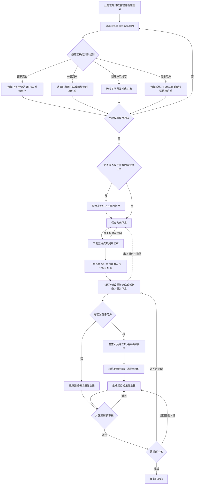

# 计划外普查任务管理《功能规格说明书》

## 1. 文档信息

- 版本：V1.11
- 日期：2026-07-20
- 功能位置：“面积普查”下新增管理菜单与执行菜单
- 菜单名称：计划外普查任务管理、计划外普查任务
- 当前阶段：V1.11 客户新口径方案待确认；V1.10 已实施能力继续保留

## 2. 背景与功能定义

现有“面积普查任务管理”通过建立普查计划批量生成站点任务，适合年度性、计划性普查。对于面积变化、一管到户、新开户及增容、趸售用户等临时业务场景，需要脱离年度计划直接发起站点级普查任务。

本功能用于新建、查询、编辑、下发、撤回和跟踪计划外普查任务。除“计划外普查任务管理”外，设置独立执行菜单“计划外普查任务”，承载片区所分配、普查人员填报、所长审核和管理部审核。计划外站点子任务只在该计划外任务列表中展示，不混入正常普查的片区所任务列表或普查人员任务列表；通用状态机和审核能力复用正常普查，但对象范围、模板、项目结构和材料要求必须按四类原因分别执行。列表、详情、填报和审核上下文持续展示“任务来源：计划外”及计划外普查原因。

## 3. 业务目标

1. 为紧急或非年度计划范围的普查需求提供独立发起入口。
2. 让业务管理员与管理部在权限范围内快速建立、下发任务。
3. 对同一站点存在时间重叠的未完成任务进行风险提示，由业务人员判断是否继续创建。
4. 保持计划内与计划外任务的执行、审核、统计口径一致。
5. 通过独立执行列表隔离正常与计划外任务，同时复用正常普查执行能力，避免形成两套填报和审核口径。
6. 当计划外普查原因是“趸售用户”时，允许在任务内新建尚未进入正式用户站档案的临时用户站，并纳入本次任务后续执行。
7. 按客户最新口径，对四类原因分别限制对象来源、临时对象能力和普查模板，覆盖 V1.10 的“原因不限制站点类型”规则。
8. 趸售任务下发后由普查人员建立一个或多个普查项目，项目面积由项目内楼栋或建筑物普查面积自动求和。

## 4. 用户角色与数据权限

系统管理部范围统一限定为三个：长安管理部、裕华管理部、桥西管理部。新华管理部不再出现在筛选项、站点选择器、组织树、任务列表和统计结果中；浏览器本地已有的新华管理部历史数据自动过滤，不参与当前业务展示和统计。

| 角色 | 数据范围 | 核心权限 |
| --- | --- | --- |
| 业务管理员 | 全部管理部 | 新建、编辑未下发任务、选择站点、下发、撤回、作废、查看全部任务及日志 |
| 管理部人员 | 本管理部及下属片区所 | 新建、编辑未下发任务、选择本部站点、下发至片区所、撤回、在站点明细审核本部数据、删除计划内站点、查看本部任务及完整审批记录 |
| 片区所长 | 本片区所 | 接收任务、设置/转派/改派普查人员、下发至普查人员、审核本所数据、查看本所站点明细并按完成状态筛选 |
| 普查人员 | 本人已分配任务 | 查看、填报、保存、上报，在所长审核前撤回填报 |

“计划外普查任务”执行菜单对上述四类角色均可见，并按照角色自动裁剪数据和操作：业务管理员查看全量进度；管理部人员查看本部任务并执行管理部审核；片区所长查看本所任务，转派/改派普查人员并执行所长审核；普查人员仅查看本人已分配任务并填报上报。普通片区所人员不得获得所长审核、转派或改派权限。

全量普查数据导出不纳入本期范围，后续单独确认导出角色、数据范围、字段和文件格式。

业务管理员和管理部人员均可在“趸售用户”原因下新建临时用户站。趸售原因下“添加计划外普查站点”的候选类型覆盖系统内全部已有站点；页面实际可见数据仍按角色数据权限裁剪，管理部人员只能选择本管理部，业务管理员可选择三个有效管理部。临时用户站的编辑、移除权限跟随主任务状态：任务未下发或撤回为“未下发”时可操作，下发后只读。

## 5. 用户故事

### US-01 新建计划外任务

作为业务管理员或管理部用户，我希望针对临时普查原因选择站点并新建任务，以便不必等待新建年度普查计划。

验收要点：

- 必填任务名称、开始时间、结束时间、计划外普查原因和站点。
- 结束时间必须晚于开始时间。
- 管理部用户只能选择本管理部站点。
- 点击“添加计划外普查站点”后，系统按当前原因应用对象规则：面积变化可选已有自管站、用户站、对公用户；一管到户只可选已有用户站；新开户及增容按用户站新开户、用户站增容、自管站增容子场景确定对象；趸售用户可从系统内全部已有站点中选择。
- 站点存在时间重叠的计划内或计划外任务时，系统显示冲突任务信息，但不禁用站点、不阻止创建。

### US-02 任务下发

作为业务管理员或管理部用户，我希望将已建立的任务下发至站点归属片区所，以便片区所继续分配普查人员。

验收要点：

- 未下发前可修改所有字段。
- 下发时再次检查站点重复情况；存在冲突时进行二次提示，用户确认后仍可下发。
- 下发成功后任务进入“待分配”，相应片区所可见。

### US-03 下发后修改

作为任务发起人，我希望在任务内容有误时可控地修改，以便不会在普查人员不知情的情况下变更执行口径。

推荐规则：

- 任务下发后，任务名称、时间、原因和站点均不可直接修改。
- 任务尚未上报审核时，发起人可“撤回”任务；撤回后恢复为“未下发”，方可编辑并重新下发。
- 已进入所长审核、管理部审核或已完成的任务不可撤回修改；只能按现有退回流程处理。
- 撤回、编辑、再次下发均记录操作人、时间、变更前后内容。

### US-04 执行与审核

作为业务管理员、管理部人员、片区所长或普查人员，我希望通过独立的“计划外普查任务”列表处理计划外任务，以便在不混入正常任务列表的前提下，沿用正常普查的完整执行流程。

验收要点：

- 计划外普查任务列表按当前角色展示权限范围内的计划外任务，不与正常普查的片区所任务列表、普查人员任务列表混合展示。
- 列表、详情、人员分配、填报和审核页面显示“任务来源：计划外”和计划外普查原因。
- 计划外任务复用正常普查的通用填报、审核和日志能力，但模板按原因确定：面积变化按对象类型，一管到户使用自管站模板，新开户及增容按子场景模板，趸售用户进入项目化填报。
- 完整复用计划内流程：“任务下发 → 片区所分配普查人员 → 普查人员填报上报 → 片区所所长审核 → 管理部审核 → 任务完成”。
- 复用计划内任务的退回节点、退回原因、审核记录和操作日志规则。

### US-05 角色化计划外任务列表

作为不同岗位用户，我希望进入同一个“计划外普查任务”列表后看到与本人职责一致的任务和操作，以便在独立列表内完成各自业务节点。

验收要点：

- 业务管理员：查看全部管理部的任务进度、详情、审核记录和操作日志，不承担片区所分配及业务审核操作。
- 管理部人员：仅查看本管理部任务，在“面积普查站点明细”审核本部管辖站点数据，处理管理部审核和按既有规则退回，可执行计划内站点删除并查看完整审批记录。
- 片区所长：查看本片区所任务，设置、转派或改派普查人员，下发给普查人员、执行所长审核和退回，并在站点明细按完成状态筛选。
- 普查人员：仅查看本人已分配任务，进入对应站点类型填报页，保存、上报并查看退回意见。
- 同一主任务包含多个管理部或片区所时，各角色只看到权限范围内的站点子任务；主任务进度按全部子任务汇总。

### US-06 新建站点

作为业务管理员或管理部人员，我希望在计划外普查原因是“趸售用户”时直接新建本次任务所需的用户站，以便对尚未进入正式用户站档案的趸售对象发起普查。

验收要点：

- 仅当计划外普查原因为“一管到户”“新开户及增容”或“趸售用户”且任务处于可编辑状态时，展示“新建站点”按钮；“面积变化”不展示。
- 点击按钮打开居中的 Modal；表单上方展示临时对象提示，不提供正式建档、卡号生成、面积同步等操作。
- 保存成功后生成仅供当前任务内部使用的临时标识，将对象加入“计划外普查范围”，站点类型固定为“用户站”，数量统计同步增加。
- 计划外普查范围新增“来源”列：已有站显示“既有”，通过弹窗创建的对象显示“新建”。
- 临时用户站随任务草稿保存，并随任务进入下发、分配、项目化填报、审核和完成流程；不直接写入正式用户站基础档案。
- 同一任务内可编辑、移除临时用户站；编辑更新原记录，不新增第二条；移除须二次确认并同步减少数量。
- 原因由“趸售用户”切换为其他原因且任务中存在临时用户站时，二次确认将清空全部临时用户站；取消确认则保持原原因和当前范围不变。
- 弹窗存在未保存修改时，点击取消、关闭按钮或遮罩关闭均提示是否放弃；确认后关闭，取消后继续编辑。

### US-07 临时用户站编码防重

作为任务创建人，我希望系统校验当前任务内临时用户站的用户编码，以避免同一临时对象被重复添加。

验收要点：

- 用户编码选填；填写时自动转换为大写，只允许 9 位大写字母或数字组合。
- 防重范围仅为当前计划外普查任务；编辑当前记录时排除自身。
- 与当前任务内另一临时用户站编码重复时阻止保存，并提示“该用户编码已存在于当前任务中，请勿重复添加”。
- 本阶段不校验该编码是否已存在于正式用户站库。

### US-08 普查范围列表序号

作为计划创建人，我希望在正常面积普查和计划外普查的已选范围列表中看到连续序号，以便快速核对当前展示顺序和站点数量。

验收要点：

- 正常面积普查“普查范围”与计划外普查“计划外普查范围”列表的首列均增加“序号”。
- 序号从 1 开始，按当前列表展示顺序连续编号。
- 新增、编辑不改变既有条目顺序；移除任一条目后，剩余条目自动重新编号。
- 序号只用于页面展示，不保存到计划或站点数据中，也不参与筛选、排序、校验或任务执行。

### US-09 按计划外原因约束普查对象

- **Summary：** 让任务创建人按客户最新原因口径选择正确对象，避免错误模板和对象混入任务。

#### Use Case

- **As a** 业务管理员或管理部任务创建人
- **I want to** 在选择计划外普查原因后只看到符合该原因规则的对象与业务方式
- **so that** 下发后的普查对象、模板和成果要求与真实业务一致

#### Acceptance Criteria

- **Scenario：** 创建人切换计划外普查原因
- **Given：** 创建人位于计划外任务新建或未下发编辑页
- **and Given：** 页面已加载其权限范围内的系统站点
- **When：** 创建人选择面积变化、一管到户、新开户及增容或趸售用户中的一项
- **Then：** 系统按最新原因规则刷新可选对象、业务方式和临时对象入口，并阻止不符合规则的对象随任务保存

### US-10 选择趸售对象并允许暂缺用户编码

- **Summary：** 允许趸售任务覆盖系统内已有对象和暂未取得正式编码的新对象。

#### Use Case

- **As a** 趸售计划外任务创建人
- **I want to** 从系统内全部已有站点中选择对象，或新增用户编码暂为空的趸售用户站
- **so that** 未完成正式建档的业务也能先进入普查流程

#### Acceptance Criteria

- **Scenario：** 创建人添加趸售普查对象
- **Given：** 当前原因是“趸售用户”且主任务处于可编辑状态
- **and Given：** 站点选择器按操作者数据权限展示系统内全部已有站点类型
- **When：** 创建人选择已有站点或保存用户编码为空的新趸售用户站
- **Then：** 对象加入当前任务范围；空编码对象使用任务内临时标识，填写编码时仍执行 9 位字母数字和任务内非空唯一校验

### US-11 下发后由普查人员建立趸售项目

- **Summary：** 把项目建立放到现场填报阶段，使项目结构由实际普查情况决定。

#### Use Case

- **As a** 已接收趸售任务的普查人员
- **I want to** 在任务下发后为每个趸售用户站建立一个或多个普查项目
- **so that** 可以按现场合同范围分别维护楼栋、核查表和签章成果

#### Acceptance Criteria

- **Scenario：** 普查人员首次进入趸售对象填报页
- **Given：** 趸售主任务已下发且当前对象已分配给该普查人员
- **and Given：** 任务创建阶段没有预建普查项目
- **When：** 普查人员点击“新增普查项目”并保存项目基础信息
- **Then：** 系统在当前对象的本轮普查下建立项目，并允许继续维护项目楼栋、核查表和签章成果

### US-12 自动汇总趸售项目面积

- **Summary：** 由楼栋明细自动形成项目面积，消除手工汇总差错。

#### Use Case

- **As a** 趸售任务普查人员
- **I want to** 让项目面积随楼栋或建筑物普查面积自动汇总
- **so that** 核查表、项目总计和最终成果始终使用一致数据

#### Acceptance Criteria

- **Scenario：** 普查人员维护项目楼栋面积
- **Given：** 当前普查项目至少存在一条楼栋或建筑物明细
- **and Given：** 每条有效明细具有可参与计算的普查面积
- **When：** 普查人员新增、编辑或删除任一楼栋或建筑物明细
- **Then：** 系统立即以全部有效明细普查面积之和重算项目面积，并将该只读结果用于核查表和项目成果

## 6. 表单字段规格

| 字段 | 必填 | 控件 | 规则 |
| --- | --- | --- | --- |
| 任务名称 | 是 | 单行文本 | 1–60 个字符；去除首尾空格 |
| 开始时间 | 是 | 日期时间 | 不得晚于结束时间 |
| 结束时间 | 是 | 日期时间 | 必须晚于开始时间 |
| 计划外普查原因 | 是 | 单选 | 固定为：面积变化；一管到户；新开户及增容；趸售用户。不设置二级原因 |
| 普查对象 | 是 | “添加计划外普查站点”按钮 + 站点选择器；允许场景提供新增临时对象按钮 | 按原因应用对象规则；趸售用户可选系统内全部已有站点，实际数据仍受角色权限控制；每个对象生成一条执行子任务 |
| 所属管理部/片区所 | 系统生成 | 只读 | 根据站点归属自动带出 |
| 任务来源 | 系统生成 | 只读 | 固定为“计划外” |

### 6.1 临时趸售用户站字段

| 字段 | 控件 | 必填 | 规则与提示 |
| --- | --- | --- | --- |
| 管理部 | 下拉选择 | 是 | 业务管理员可选长安、裕华、桥西管理部；管理部人员固定或仅可选本管理部；未选择提示“请选择管理部” |
| 用户站名称 | 单行文本 | 是 | 1–100 个字符，去除首尾空格；提示“请输入用户站名称” |
| 用户编码 | 单行文本 | 否 | 固定 9 位，自动转大写，正则 `/^[A-Z0-9]{9}$/`；动态显示 `0/9`；错误提示“请输入9位字母或数字组合” |
| 用户全称 | 单行文本 | 是 | 1–200 个字符；提示“请输入用户全称” |
| 简称 | 单行文本 | 是 | 1–50 个字符；提示“请输入简称” |
| 行政区 | 单行文本 | 是 | 新增业务字段；1–50 个字符，去除首尾空格；提示“请输入行政区” |
| 办事处 | 单行文本 | 是 | 新增业务字段；1–50 个字符，去除首尾空格；提示“请输入办事处”；不与行政区联动 |
| 用热地址 | 单行文本 | 是 | 1–300 个字符；提示“请输入用热地址” |
| 联系人 | 单行文本 | 是 | 1–50 个字符；提示“请输入联系人” |
| 联系电话 | 单行文本 | 是 | 支持 11 位手机号及带或不带短横线的区号固定电话；正则 `/^(1\d{10}|0\d{2,3}-?\d{7,8})$/`；提示“请输入正确的手机号或固定电话” |
| 备注 | 多行文本 | 否 | 最多 300 个字符，动态显示 `0/300` |
| 临时标识 | 系统生成 | 系统生成 | 当前任务内唯一，只供任务关联、编辑和执行使用，不作为正式用户站编码 |
| 来源 | 系统生成 | 系统生成 | 固定为“新建” |

布局采用紧凑三列：第一行“管理部、用户站名称、用户编码”；第二行“用户全称（占两列）、简称”；第三行“行政区、办事处、联系人”；第四行“用热地址（占两列）、联系电话”；第五行“备注（整行）”。页面宽度不足时改为两列，但用热地址和备注必须占整行。标签和控件对齐，不使用过大间距和圆角。

弹窗表单上方显示提示：

> 新建用户站仅作为本次计划外普查的临时业务对象。后续是否写入正式用户站档案，由用户站建档或其他业务流程处理。

## 7. 列表与查询

“计划外普查任务管理”用于发起和管理主任务；“计划外普查任务”列表用于处理站点子任务。两个菜单使用不同列表，但共享任务主键、站点子任务状态和操作日志。计划外站点子任务不进入正常普查的“我的面积普查任务（片区所）”和“我的面积普查任务（普查人员）”列表。

### 7.1 查询条件

- 任务名称：模糊查询。
- 普查原因：单选筛选，选项为“全部、面积变化、一管到户、新开户及增容、趸售用户”。
- 任务状态：单选筛选。
- 任务时间：日期区间。
- 站点名称/编码：模糊查询。
- 所属管理部：业务管理员可选；管理部用户固定为本部。

### 7.2 列表字段

“计划外普查任务管理”列表字段为：序号、任务名称、普查原因、站点数、所属管理部、开始时间、结束时间、任务完成统计、有面积变化站点数、任务状态、创建人、创建时间、操作。原“任务进度”列删除。

统计口径：

- 任务完成统计：按“已完成站点数/站点总数”展示，例如 `3/8`。
- 已完成站点数以站点子任务进入“已结束”为准；主任务状态“已完成”时全部站点视为已完成。
- 有面积变化站点数：仅统计已完成站点中，现普查面积与原普查面积不一致的站点。
- 未完成站点即使已暂存面积变化数据，也不计入有面积变化站点数。
- 两项统计随站点子任务状态及最终面积结果实时更新。

普查原因字段直接展示一级原因名称，统一使用“面积变化、一管到户、新开户及增容、趸售用户”四项标准文案，不显示二级类型或括号内补充类型。

### 7.3 操作按钮

| 状态 | 允许操作 |
| --- | --- |
| 未下发 | 详情、编辑、删除、下发 |
| 待分配/进行中且未上报 | 详情、撤回 |
| 所长审核/管理部审核 | 详情；按原有审核权限处理 |
| 已完成 | 详情 |
| 已作废 | 详情 |

### 7.4 “计划外普查任务”执行列表

- “计划外普查任务”执行列表同样增加“普查原因”字段和“普查原因”单选筛选项。
- 公共字段：任务名称、任务来源、普查原因、站点编码、站点名称、站点类型、所属管理部、所属片区所、执行人员、执行状态、审核状态、更新时间、操作。
- 筛选选项及一级原因展示规则与“计划外普查任务管理”列表完全一致。
- 任务来源固定展示为“计划外”，不得仅依赖菜单位置进行区分。
- 管理部人员、片区所长和普查人员的操作按钮、状态标签、分页方式与现有计划内任务列表保持一致。
- 业务管理员查看全量执行进度时仅展示详情类操作，避免越过业务节点直接处理。
- 列表根据角色直接承载任务分派、下发、填报入口和审核入口；无需跳转到正常普查任务列表寻找待办。
- 同一主任务可包含多个符合当前原因规则的对象；只有当前原因允许时才可混合类型，并按 `template_type` 路由到对应填报能力。

## 8. 状态模型

| 状态 | 进入条件 | 可离开方式 |
| --- | --- | --- |
| 未下发 | 新建保存或撤回成功 | 下发、删除、作废 |
| 待分配 | 下发至片区所 | 分配普查人员、发起人撤回 |
| 进行中 | 片区所已分配并下发普查人员 | 普查人员上报、发起人撤回 |
| 所长审核 | 普查人员上报 | 审核通过、退回普查人员 |
| 管理部审核 | 所长审核通过 | 审核通过、退回片区所或普查人员 |
| 已完成 | 管理部审核通过 | 按现有已完成任务退回机制处理 |
| 已作废 | 未开始执行的任务被作废 | 终态 |

## 9. 业务流程图

## 10. 异常与边界规则

1. **重复站点**：同一站点存在时间区间重叠的计划内或计划外未完成任务时，展示冲突任务名称、时间和来源；该提示不是硬性校验，用户可以继续选择、保存和下发。
2. **并发下发**：保存与下发时均刷新冲突提示；冲突不导致下发失败，但用户需在确认提示中主动确认继续操作。
3. **撤回任务**：只有任务发起人或具有全局权限的业务管理员可撤回；撤回后下游用户立即变为不可见。
4. **已有填报数据**：未上报时撤回不删除已填数据和附件；重新下发后继续使用。如果删除站点，需二次确认并保留历史快照。
5. **任务过期**：超过结束时间但未完成时标记“已逾期”，不自动结束任务，仍允许沿原审核链处理。
6. **站点归属变更**：任务下发后保留创建时的组织快照；归属变更由业务管理员人工协调处理。
7. **多组织任务**：同一主任务拆分为多个站点子任务，各角色仅处理权限范围内的子任务；单个子任务被退回不改变其他子任务的处理状态。
8. **来源识别**：任何从执行列表进入的详情、填报或审核页均必须携带来源上下文；来源缺失时按任务数据重新判断，不得误归入计划内任务。
9. **所长权限收口**：人员分配、转派、改派和所长审核必须校验片区所长角色及本所数据范围；普通片区所人员即使获得页面地址也只能只读查看权限范围内数据。
10. **管理部权限边界**：管理部人员只能审核、删除和查看本管理部管辖站点；计划内站点删除需二次确认并记录删除人、时间、原因和站点快照。
11. **导出能力**：本期不提供管理部全量普查数据导出入口，后续需求确认后另行建设。
12. **列表隔离**：计划外站点子任务只在计划外普查任务列表展示；正常普查的片区所任务和普查人员任务列表不得混入计划外数据。
13. **执行一致性**：计划外任务复用正常普查的通用状态机、审核和日志能力；对象范围、模板、项目层级、附件和成果要求按计划外原因执行，不再要求四类原因完全复用同一填报字段。
14. **历史原因兼容**：历史值按“一管到户（自管站）→ 一管到户”“新开户 → 新开户及增容”“燃气替代 → 趸售用户”映射；“面积变化”保持不变。列表、筛选、详情和执行页面均按新文案展示，历史任务不得因枚举调整丢失或无法查询。
15. **未知原因值**：若读取到不在兼容映射中的异常值，展示“未知原因”，保留原始值用于排查；编辑该任务时必须重新选择四项标准原因之一后方可保存。
16. **临时对象隔离**：临时用户站只保存在当前计划外任务域内，不调用正式用户站建档接口，不生成正式档案、卡号或正式站点编码，不触发面积同步。
17. **切换原因**：存在临时用户站时切换为非“趸售用户”原因，必须先二次确认；确认后清空全部临时用户站并更新数量，取消后不得改变原因或范围。
18. **编码重复**：用户编码为空时不参与防重；非空时在标准化为大写后按当前任务范围精确比较。重复时不创建第二条记录。
19. **行政区与办事处**：两者均为必填自由输入字段，不提供候选下拉、联动、禁用或自动清空规则；编辑时直接回显已保存文本。
20. **编辑与移除**：临时对象编辑使用内部临时标识定位并覆盖原记录；移除须二次确认。两类操作均不得误写正式用户站档案。
21. **未保存保护**：新建或编辑弹窗内任一字段发生变化后，取消或关闭必须二次确认放弃；无修改时可直接关闭。
22. **项目建立时点**：趸售项目不得在主任务创建页预建；只有任务下发并分配后，由普查人员在对象填报页建立。
23. **项目面积只读**：项目面积等于当前项目全部有效楼栋或建筑物普查面积之和，不提供人工覆盖入口；无明细时显示 `0.00`。

## 11. 非功能要求

- 列表首屏查询在常规网络环境下建议不超过 2 秒。
- 默认每页 10 条，支持 10/20/50 条切换。
- 对下发、撤回、作废等幂等性操作禁止重复提交。
- 权限校验在服务端执行，前端隐藏按钮不作为安全措施。
- 所有创建、编辑、下发、撤回、作废和审核操作均写入审计日志。

## 12. 已确认执行口径

1. 计划外站点子任务在独立的“计划外普查任务”列表展示和处理。
2. 正常普查任务列表与计划外普查任务列表相互隔离，不混排任务。
3. 一个计划外主任务只能包含符合当前原因规则的对象；是否可混合类型由原因决定。
4. 每个对象子任务根据原因和对象类型确定 `template_type`，不得只按站点类型路由。
5. 通用填报、暂存、审核和日志能力与正常普查复用；原因专属字段、附件、项目和成果规则按本规格执行。
6. 人员分派、下发、改派、撤回、片区所长审核、管理部审核、退回和完成规则与正常普查一致。
7. 计划外普查原因固定为“面积变化、一管到户、新开户及增容、趸售用户”，保持单选；四类原因分别限制对象来源、业务方式和模板，覆盖旧版“不限制可选站点类型”口径。
8. 计划外主任务列表使用“任务完成统计”和“有面积变化站点数”，删除“任务进度”列；面积变化只统计已完成站点。
9. 历史原因按“一管到户（自管站）→ 一管到户”“新开户 → 新开户及增容”“燃气替代 → 趸售用户”迁移与兼容展示，“面积变化”保持不变。
10. 原因为“趸售用户”时可新建任务内临时用户站；临时对象随任务执行，但不写入正式用户站基础档案。
11. 切换为其他原因时，经二次确认清空全部临时用户站；取消确认则不切换。
12. 业务管理员与管理部人员均可新建；管理部人员仅能使用本管理部；下发后只读，撤回后可编辑和移除。
13. 行政区与办事处均为新增业务字段，使用必填自由输入，不复用现有片区所字段，也不建立两者联动。
14. 未填写用户编码时生成任务内临时标识；范围列表来源列对已有站显示“既有”，对临时站显示“新建”。
15. 正常面积普查与计划外普查的范围列表首列均展示动态序号；按当前展示顺序连续编号，移除后自动重排，不持久化、不参与业务规则。
16. 趸售用户原因下可从系统内全部已有站点中选择对象；实际候选数据仍按角色权限裁剪。
17. 新增趸售用户站的用户编码允许暂不填写；填写时必须为 9 位字母或数字并在当前任务内非空唯一。
18. 趸售普查项目不在创建页预建，由任务下发后负责该对象的普查人员建立。
19. 趸售项目面积由项目内全部有效楼栋或建筑物普查面积自动求和，不允许人工改写。

## 13. 验收场景

1. **正常新增**：原因选择“一管到户”“新开户及增容”或“趸售用户”，点击“新建站点”，填写全部必填字段且用户编码留空并确认；弹窗关闭，范围列表出现一条来源为“新建”的用户站，数量增加 1，并使用任务内临时标识。
2. **字段校验**：缺少任一必填字段、已填写编码但不是 9 位字母数字、联系电话不符合手机或固定电话规则时，表单给出对应提示并阻止添加；编码与备注字数实时更新。
3. **切换原因**：当前任务已有临时用户站时切换为其他原因；确认清空后只移除来源为“新建”的临时站并更新数量，来源为“既有”的站点保留；取消确认后原因仍为“趸售用户”，范围不变。
4. **编码重复**：当前任务存在相同的非空用户编码时再次添加，提示“该用户编码已存在于当前任务中，请勿重复添加”，不生成第二条记录。
5. **行政区与办事处录入**：两项均可独立输入 1–50 个字符；任一为空时阻止保存并展示对应必填提示，修改行政区不得清空办事处。
6. **编辑**：点击临时用户站“编辑”，弹窗回显全部字段；修改联系人或地址并保存后更新原记录，数量不变且不新增第二条。
7. **取消**：打开弹窗并修改字段后点击取消、关闭或遮罩，系统提示是否放弃未保存内容；确认后关闭，取消后保留输入并继续编辑。
8. **移除**：点击临时用户站“移除”并二次确认后，从当前任务范围删除该对象，数量减少 1，正式用户站档案不受影响。
9. **状态权限**：管理部人员只能为本管理部创建；任务下发后不显示编辑和移除入口；撤回为未下发后恢复操作能力。
10. **任务执行**：任务保存、下发后，临时站进入计划外分配流程；普查人员在填报阶段建立趸售项目并维护楼栋，项目面积自动求和；全过程不产生正式用户站档案、卡号或面积同步操作。
11. **范围列表序号**：正常面积普查与计划外普查的范围列表均显示首列序号；移除中间记录后序号保持从 1 连续编号，保存、编辑回显和任务执行均不读取该展示值。
12. **原因限制**：切换四类原因时，站点选择器和临时对象入口按新口径变化；已选对象不符合新原因时必须提示并清理或阻止保存。
13. **系统已有对象**：趸售原因下，业务管理员能检索三个有效管理部内全部已有站点类型；管理部人员能检索本管理部内全部已有站点类型。
14. **项目自动汇总**：在同一趸售项目中录入 `100.00`、`250.50` 两条楼栋面积后项目面积显示 `350.50`；删除第一条后自动变为 `250.50`。

## 14. 待确认项

1. 业务管理员的“作废”权限是否开放给管理部。
2. 单次批量选择站点的上限尚未确认。
