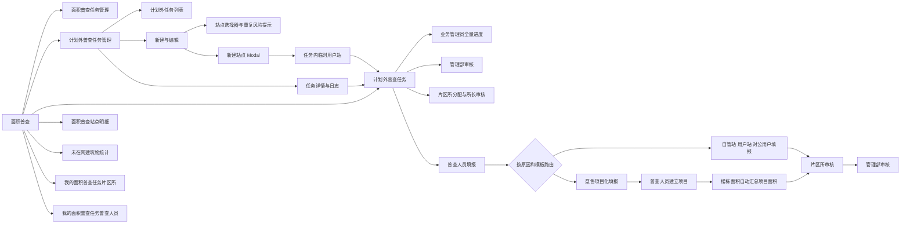
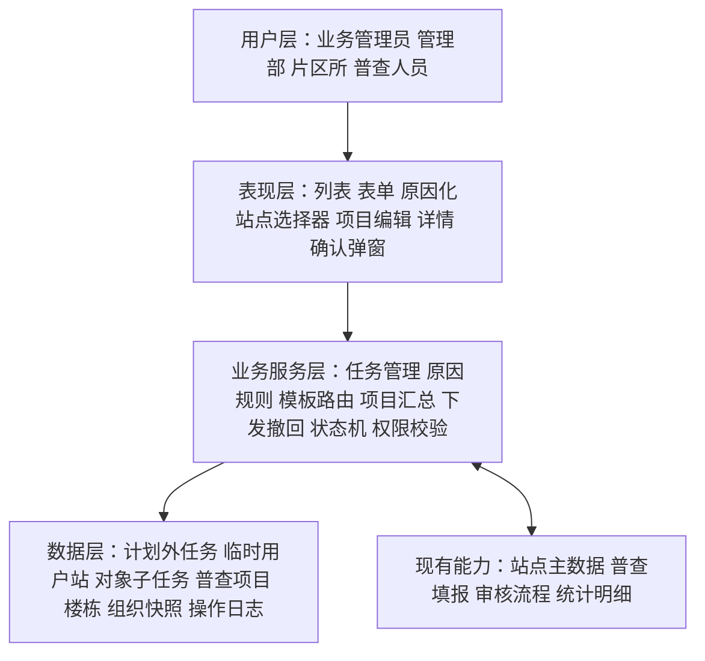

# 计划外普查任务管理《系统建设方案》

> 实施状态：V1.11 客户新口径方案待确认；V1.10 已实施能力继续保留。

## 1. 建设范围

本期在“面积普查”菜单组下设置两个计划外任务入口：“计划外普查任务管理”负责主任务的新建、编辑、下发、撤回和跟踪；“计划外普查任务”作为独立执行列表，负责片区所分配、普查人员填报、所长审核和管理部审核。计划外对象子任务不混入正常普查任务列表；通用状态机、审核和日志继续复用正常普查，但对象范围、模板、项目结构和成果规则按四类原因配置。

全局组织范围仅保留长安管理部、裕华管理部、桥西管理部。实施时同步移除新华管理部的筛选项、组织树节点、模拟站点和模拟任务，并在数据读取层过滤浏览器本地已保存的新华管理部数据。

当原因是“一管到户”“新开户及增容”或“趸售用户”时，新建/编辑页支持新增任务内临时用户站；“面积变化”不支持新增。临时站用户编码允许暂不填写，只写入计划外任务域，不直接进入正式用户站主数据。趸售任务下发后由普查人员在对象填报阶段建立一个或多个普查项目，项目面积由项目内楼栋或建筑物普查面积自动求和。

## 2. 产品架构



## 3. 系统分层架构



## 4. 模块划分

| 模块 | 功能 | 复用/新建 |
| --- | --- | --- |
| 菜单与路由 | 新增入口、选中态、面包屑 | 改造现有导航 |
| 任务查询 | 多条件筛选、分页、状态标签、完成统计、面积变化站点统计 | 复用现有列表规范并补充聚合字段 |
| 任务新建/编辑 | 基础字段、原因选择、“添加计划外普查站点”、保存与下发 | 新建，复用面积普查计划创建页布局和站点选择器 |
| 原因规则引擎 | 按四类原因约束对象来源、业务方式、模板和临时对象入口 | 新增集中配置，替代各页面散落判断 |
| 临时趸售用户站 | 条件展示按钮、居中表单 Modal、新建/编辑/移除、字段校验、未保存保护、来源展示 | 新建任务内临时对象模块，不接正式建档能力 |
| 行政区/办事处录入 | 新增两个必填文本字段；编辑时直接回显 | 新建自由输入能力，不复用片区所字段或组织字典 |
| 范围列表序号 | 正常面积普查和计划外普查已选范围的首列动态编号 | 复用列表渲染索引，不新增数据字段或接口 |
| 冲突提示 | 检查站点在时间区间内的未完成任务，只提示、不阻止 | 新建非阻断式检查能力 |
| 任务详情 | 展示基本信息、站点子任务、进度、日志 | 改造现有任务详情模式 |
| 下发/撤回 | 状态校验、数据锁定、消息提示 | 新建业务编排，复用下游任务列表 |
| 执行与审核 | 片区所长分配/转派/改派、普查人员填报、所长审核、管理部审核 | 复用现有流程并收紧角色校验 |
| 计划外任务执行列表 | 按角色呈现计划外站点子任务、来源、原因和当前可操作节点 | 保留独立列表壳层，复用正常普查执行组件 |
| 趸售项目填报 | 下发后由普查人员新增/编辑项目，维护项目表头、楼栋、核查表和签章成果 | 新增项目化填报模块，不放入主任务创建页 |
| 项目面积汇总 | 监听楼栋新增、编辑、删除，按有效明细自动求和并只读展示 | 新增派生计算能力，不保存人工覆盖值 |
| 权限与审计 | 角色权限、数据范围、变更日志 | 扩展现有机制 |
| 管理部站点操作 | 在站点明细审核本部数据、删除计划内站点、查看完整审批记录 | 补齐计划内权限基线并复用于计划外审核 |
| 全量导出 | 管理部全量普查数据导出 | 本期暂缓，后续单独建设 |

## 5. 核心数据模型

### 5.1 计划外任务主表

| 字段 | 说明 |
| --- | --- |
| id | 任务主键 |
| task_name | 任务名称 |
| source_type | 固定为 OUT_OF_PLAN |
| reason_type | AREA_CHANGE / DIRECT_TO_HOUSEHOLD / NEW_ACCOUNT_OR_CAPACITY / WHOLESALE_USER |
| start_time / end_time | 任务时间范围 |
| status | 未下发、待分配、进行中、所长审核、管理部审核、已完成、已作废 |
| creator_id / creator_org_id | 创建人与创建组织 |
| created_at / updated_at | 审计时间 |
| version | 乐观锁版本号，防止并发覆盖 |

### 5.2 站点子任务

| 字段 | 说明 |
| --- | --- |
| id / out_plan_task_id | 子任务与主任务关联 |
| station_id | 站点唯一标识 |
| department_id / office_id | 创建时的组织快照 |
| survey_type | 对象主数据类型；同一主任务是否允许混合类型由 `reason_type` 规则决定 |
| template_type | 实际填报模板；由原因、业务方式和对象类型共同确定 |
| assignee_ids | 普查人员 |
| execution_status / audit_status | 执行与审核状态 |
| dispatched_at / completed_at | 下发与完成时间 |

### 5.3 重复风险提示

计划内与计划外任务通过统一的“站点冲突检查”服务识别重复风险。逻辑为：

```text
相同 station_id
AND 任务状态 NOT IN (已完成, 已作废)
AND 新开始时间 < 已有结束时间
AND 新结束时间 > 已有开始时间
```

检查结果仅用于提示，不构成保存或下发的硬性约束。前端展示冲突详情，服务端返回最新冲突结果并记录用户“确认继续”的操作日志。

### 5.4 原因枚举与历史兼容

| 标准编码 | 标准文案 | 兼容的历史编码/文案 |
| --- | --- | --- |
| `AREA_CHANGE` | 面积变化 | `area`、面积变化 |
| `DIRECT_TO_HOUSEHOLD` | 一管到户 | `direct`、一管到户（自管站） |
| `NEW_ACCOUNT_OR_CAPACITY` | 新开户及增容 | `new`、新开户 |
| `WHOLESALE_USER` | 趸售用户 | `gas`、`GAS_REPLACEMENT`、燃气替代 |

- 数据写入统一使用四项新标准编码，禁止继续写入旧编码。
- 数据读取层兼容旧编码和旧文案，并转换为新标准编码后参与展示、筛选和统计；正式后端上线时执行一次性数据迁移，读取兼容逻辑保留至历史数据核验完成。
- 原因始终为单选。对象与模板规则集中配置：面积变化允许已有自管站、用户站、对公用户；一管到户只允许用户站且使用自管站模板；新开户及增容按三个业务方式确定对象和模板；趸售用户允许选择权限范围内系统全部已有站点类型或新增临时用户站。
- 未匹配的异常值保留原始值并记录告警，前端显示“未知原因”；进入编辑时要求用户重新选择标准原因。

### 5.5 任务内临时用户站

| 字段 | 说明 |
| --- | --- |
| temp_station_id | 系统生成的任务内唯一标识；推荐 UUID/雪花 ID，不作为正式用户站编码 |
| out_plan_task_id | 所属计划外主任务；临时对象不得跨任务复用 |
| source_type | 固定 `TEMP_CREATED`；页面展示“新建” |
| station_type | 固定 `USER_STATION` |
| department_id / department_name | 所属管理部；管理部人员只能写入本部 |
| station_name | 用户站名称，1–100 个字符 |
| user_code | 选填，标准化为大写后为 9 位字母数字；当前任务内非空唯一 |
| full_name / short_name | 用户全称、简称 |
| district_name | 新增行政区文本字段，1–50 个字符 |
| business_office_name | 新增办事处文本字段，1–50 个字符；不复用 `office_id` 片区所字段，也不与行政区联动 |
| heating_address | 用热地址 |
| contact_name / contact_phone | 联系人、联系电话 |
| remark | 备注，最多 300 个字符 |
| created_by / created_at / updated_at | 审计字段 |

临时对象与正式站点采用互斥引用：站点子任务增加 `station_ref_type=MASTER|TEMP`；既有站使用 `station_id`，临时站使用 `temp_station_id`。保存和下发时服务端验证二者只能存在一个，避免临时标识被误当作正式主数据主键。

任务删除或从范围移除临时对象时，删除任务域关联数据或保留审计快照，不调用正式用户站删除接口。后续如需正式建档，应由独立建档流程复制并审核数据，本功能不承担自动转档。

### 5.6 趸售普查项目与楼栋

| 字段 | 说明 |
| --- | --- |
| project_id / object_task_id / round_id | 项目、对象子任务和当前轮次关联 |
| project_name | 普查人员在下发后的填报阶段录入 |
| header_snapshot | 项目核查表表头快照 |
| surveyed_area | 只读派生值，等于当前项目全部有效楼栋或建筑物 `surveyed_area` 之和 |
| sequence_no | 项目展示及合并 PDF 顺序 |
| created_by / created_at / updated_at | 创建人必须为当前有权限的普查人员；保留审计时间 |

楼栋或建筑物记录通过 `project_id` 归属项目。新增、编辑、删除明细后均重新计算项目面积；无有效明细时为 `0.00`。项目面积不提供手工覆盖字段，核查表、项目总计和后续最终确认均读取同一派生结果。

## 6. 核心交互逻辑

### 6.1 新建任务

1. 点击“新建计划外普查任务”进入独立页。
2. 录入任务名称、时间，并从四类原因中单选；选择后加载对应对象规则、业务方式和模板提示。
3. 点击“添加计划外普查站点”打开站点选择器；候选对象按原因过滤。趸售用户的类型候选覆盖系统全部已有站点，实际记录仍按操作者数据权限过滤。
4. 只有当前原因允许时才可混合站点类型；存在时间冲突的站点保持可选，并展示冲突任务。
5. 保存后回到列表，状态为“未下发”。
6. 当原因是“一管到户”“新开户及增容”或“趸售用户”时，在“添加计划外普查站点”旁展示“新建站点”；“面积变化”下隐藏。
7. 点击后打开居中 Modal，按三列紧凑布局填写；保存通过后生成 `temp_station_id`，追加到范围列表，来源显示“新建”，数量加一。
8. 切换至其他原因且已存在临时对象时，使用 `Modal.confirm` 二次确认；确认后批量清空临时对象，取消后恢复“趸售用户”选中值。
9. 原因切换后，对已选但不符合新原因规则的既有对象同样提示处理；用户确认移除后才能继续保存，取消则恢复原原因和范围。

### 6.1.1 临时用户站新建与编辑

1. 打开弹窗时根据新建/编辑模式初始化表单；编辑使用 `temp_station_id` 回显并定位原记录。
2. 表单顶部使用提示区说明对象只服务当前计划外普查，不进入正式用户站档案。
3. 用户编码允许留空；输入时实时转大写、限制最多 9 位并显示计数，非空失焦或提交时执行 9 位字母数字校验。
4. 提交时对当前任务内非空用户编码做唯一性校验；编辑时排除当前 `temp_station_id`。重复则保留弹窗和已输入内容。
5. 行政区与办事处均使用必填文本输入；保存时去除首尾空格并校验 1–50 个字符，二者可独立修改，编辑时直接回显。
6. 保存成功后关闭弹窗：新建追加一条，编辑覆盖原条目，两者都重新计算范围数量。
7. 表单发生修改后，取消、关闭或遮罩操作触发放弃确认；确认后关闭，取消后继续编辑。
8. 点击范围列表“移除”时二次确认；确认后只删除当前任务内对象并减少数量。

### 6.2 下发任务

1. 列表点击“下发”，弹出影响范围确认框。
2. 系统重新执行权限、状态和时间校验，并刷新站点冲突提示；冲突不阻止下发。
3. 全部通过后将子任务分发到各站点归属片区所。
4. 成功后更新列表状态与操作日志；失败则保持原状态。

### 6.2.1 趸售项目建立与面积汇总

1. 主任务创建、编辑和下发阶段只确定趸售普查对象，不创建项目。
2. 任务下发至片区所并分配普查人员后，负责该对象的普查人员进入趸售项目化填报页。
3. 普查人员点击“新增普查项目”维护项目名称及表头；同一对象允许一个或多个项目。
4. 项目建立后维护楼栋或建筑物明细、核查表和签章成果。
5. 每次新增、编辑、删除楼栋明细后调用统一汇总函数，以有效明细普查面积求和，结果保留两位小数并只读显示。
6. 项目没有有效明细时面积为 `0.00`，不得上报；存在非法、空值或负数面积的明细时阻止保存或上报。

### 6.3 撤回后修改

1. 只有“待分配”或“进行中且未上报”的任务显示“撤回”。
2. 确认框明确告知任务将从片区所和普查人员列表移除。
3. 撤回后恢复“未下发”，允许编辑。
4. 再次下发前展示变更摘要，并执行完整校验。

### 6.4 状态与逾期展示

- 业务状态与“已逾期”展示标记分离；逾期不改变业务状态。
- 时间到期前可用颜色和文案提示，不在本期默认引入消息中心提醒。

### 6.5 “计划外普查任务”执行列表

1. 菜单路由进入计划外任务独立执行列表，并根据当前角色应用数据范围和操作权限。
2. 列表查询固定增加 `source_type=OUT_OF_PLAN`，确保不混入计划内任务。
3. 业务管理员查看全部站点子任务及进度；管理部人员仅查看本部并处理管理部审核；片区所长仅查看本所并进行人员分配、转派、改派与所长审核；普查人员仅查看本人任务并填报上报。
4. 进入详情、填报或审核页时携带 `source=out-of-plan` 和计划外原因；页面标题区显示“任务来源：计划外”。
5. 分配、下发、改派、填报、暂存、上报、撤回、审核、退回、再次提交均调用正常普查同一套状态机与日志能力，不新增平行状态定义。
6. 同一主任务包含多个组织时按站点子任务授权；主任务的完成统计和有面积变化站点数由全部子任务实时汇总。
7. 片区所长相关写操作必须同时校验角色、所属片区所和任务当前状态；普通片区所人员只读。
8. 管理部人员在“面积普查站点明细”中仅能审核本部管辖站点；计划内站点删除采用二次确认并写入审计日志。
9. 本期不展示全量普查数据导出按钮，也不建设对应导出接口。
10. 计划外子任务不得写入正常普查的片区所任务列表或普查人员任务列表；所有执行待办均在计划外任务列表内按角色展示。
11. 每条子任务依据 `reason_type + business_mode + survey_type` 计算 `template_type`；趸售用户进入项目化填报，其他原因复用或组合既有模板。

## 7. Ant Design 组件选型

| 场景 | 组件 | 选型说明 |
| --- | --- | --- |
| 菜单 | `Menu` | 使用嵌套子菜单，新入口位于“面积普查任务管理”之后 |
| 页面路径 | `Breadcrumb` | 展示首页 / 面积普查 / 计划外普查任务管理 |
| 查询表单 | `Form` + `Input` + `Select` + `RangePicker` | 两个计划外列表均提供“普查原因”单选筛选，固定为全部及四项标准原因，选项口径保持一致 |
| 任务列表 | `Table` + `Pagination` | 固定操作列，展示任务完成统计和有面积变化站点数，删除任务进度列，支持横向滚动 |
| 任务状态 | `Tag` + `Badge` | 状态用 Tag，逾期用独立的风险标记 |
| 新建页 | `Form` + `Input` + `DatePicker.RangePicker` + `Select` | 使用必填下拉单选四类原因；切换时刷新对象规则、业务方式和模板提示 |
| 站点选择 | `Button` + `Modal` + `Table` + `Checkbox` | 按原因过滤候选；趸售覆盖权限范围内系统全部已有站点类型；支持分页多选和非阻断式冲突提示 |
| 新建站点 | `Button` + `Modal` + `Form` | 原因是一管到户、新开户及增容或趸售用户且任务可编辑时展示；Modal 居中、紧凑布局，不使用过大圆角和间距 |
| 临时对象提示 | `Alert` | 表单顶部提示仅作为当前任务临时对象，后续正式建档由其他流程处理 |
| 临时对象字段 | `Form.Item` + `Input` + `Select` + `Input.TextArea` | 三列栅格优先，窄屏两列；用户全称与用热地址跨列，备注整行；标签和控件对齐 |
| 字数与格式 | `Input` + `showCount` + `maxLength` | 用户编码显示 0/9 并转大写；备注显示 0/300；联系电话同时支持手机和固定电话 |
| 行政区/办事处 | `Input` | 两项均为必填自由输入，限制 50 字符；不提供候选、联动、禁用或自动清空 |
| 趸售项目 | `Card` + `Table` + `Form` + `Button` | 下发后普查人员建立一个或多个项目；卡片展示项目表头、楼栋和成果状态 |
| 项目面积 | `Statistic` + `InputNumber` 只读态 | 从楼栋普查面积自动求和；结果只读、两位小数，不提供人工覆盖 |
| 来源展示 | `Table` + `Tag` | 计划外普查范围增加来源列，既有站显示“既有”，临时站显示“新建” |
| 范围列表序号 | `Table` | 正常和计划外创建页的范围列表首列显示 `index + 1`；移除后通过重新渲染自动连续编号 |
| 详情信息 | `Descriptions` + `Tabs` + `Timeline` | 分别承载基本信息、站点子任务和操作日志 |
| 下发/撤回/作废 | `Modal.confirm` | 危险操作展示影响范围，确认按钮防重复提交 |
| 冲突提示 | `Alert` + `Tooltip` + `Modal.confirm` | 行内展示具体冲突任务，保存或下发时汇总提示并允许用户确认继续 |
| 成功/失败反馈 | `message` / `notification` | 短结果用 message，含多站点失败明细时用 notification |
| 计划外任务角色视图 | `Tabs` + `Table` + `Tag` | 独立展示计划外任务，复用正常普查任务标签和表格结构，按角色显示待分配、进行中、待审核、已完成等视图 |

## 8. 页面信息架构

### 8.1 列表页

1. 顶部导航与当前角色。
2. 面包屑与页面标题。
3. 查询区：任务名称、原因、状态、时间、站点、管理部。
4. 工具栏：列表名称、结果数、“新建计划外普查任务”。
5. 任务表格与分页。
6. “计划外普查任务管理”和“计划外普查任务”两个列表均展示“普查原因”列，并提供同名筛选项。
7. 列表、筛选、详情和填报来源提示统一使用“面积变化、一管到户、新开户及增容、趸售用户”四项标准文案，不显示旧文案、二级类型或括号说明。
8. 主任务列表展示“任务完成统计”和“有面积变化站点数”，不再展示“任务进度”。完成统计按已完成站点数/总站点数展示；面积变化站点数仅聚合已完成且现面积不等于原面积的站点。

### 8.2 新建/编辑页

1. 任务信息卡片。
2. 普查原因单选区。
3. 普查范围与已选站点列表。
4. 原因是“一管到户”“新开户及增容”或“趸售用户”时，普查范围工具栏并列显示“添加计划外普查站点”和“新建站点”；前者覆盖系统内已有站点，后者允许用户编码暂为空。
5. 范围表格首列展示仅用于界面的“序号”，按当前展示顺序从 1 连续编号。
6. 页底固定操作栏：取消、保存、保存并下发。

### 8.3 详情页

1. 基本信息与状态。
2. 子任务进度统计。
3. 站点子任务列表。
4. 操作日志与审核记录。
5. 根据状态展示编辑、下发、撤回或作废操作。

### 8.4 计划外任务列表及处理页

1. 菜单名称固定为“计划外普查任务”，与“计划外普查任务管理”并列展示。
2. 列表独立展示计划外站点子任务，不向正常普查片区所任务页或普查人员任务页注入计划外数据；布局复用正常普查任务列表的视觉与交互规范。
3. 公共信息区增加“任务来源：计划外”和“普查原因”；历史原因经映射后统一展示四项标准原因名称。
4. 片区所长人员分配/转派/改派、所长审核、管理部审核、退回弹窗、审核记录和操作日志复用正常普查组件；填报内容按原因和模板路由，趸售用户增加普查人员项目化填报。
5. 页面根据角色和子任务状态计算操作按钮，不允许仅通过前端隐藏实现权限控制。

## 9. 接口边界建议

| 能力 | 建议接口 |
| --- | --- |
| 任务列表 | `GET /survey/out-of-plan-tasks` |
| 任务详情 | `GET /survey/out-of-plan-tasks/{id}` |
| 创建任务 | `POST /survey/out-of-plan-tasks` |
| 更新未下发任务 | `PUT /survey/out-of-plan-tasks/{id}` |
| 站点冲突提示 | `POST /survey/station-conflicts/check` |
| 下发 | `POST /survey/out-of-plan-tasks/{id}/dispatch` |
| 撤回 | `POST /survey/out-of-plan-tasks/{id}/recall` |
| 作废 | `POST /survey/out-of-plan-tasks/{id}/cancel` |
| 操作日志 | `GET /survey/out-of-plan-tasks/{id}/logs` |
| 计划外执行列表 | `GET /survey/tasks?source_type=OUT_OF_PLAN`，只供计划外任务列表调用 |
| 分配普查人员 | 复用计划内任务分配接口，携带计划外子任务 ID |
| 填报、上报、审核、退回 | 复用计划内对应接口与状态机，增加来源上下文 |
| 转派/改派普查人员 | 复用计划内人员调整接口，服务端校验片区所长及本所范围 |
| 删除计划内站点 | 复用或补充计划内站点删除接口，记录原因与站点快照 |
| 新建临时用户站 | `POST /survey/out-of-plan-tasks/{id}/temporary-user-stations`；新任务草稿可随主任务创建请求一并提交 |
| 更新临时用户站 | `PUT /survey/out-of-plan-tasks/{id}/temporary-user-stations/{tempStationId}` |
| 移除临时用户站 | `DELETE /survey/out-of-plan-tasks/{id}/temporary-user-stations/{tempStationId}`，仅删除任务域对象或按审计策略软删除 |
| 任务内编码查重 | 创建/更新接口内强制校验；可选提供预校验接口，不以预校验替代提交校验 |
| 新建趸售项目 | `POST /survey/object-tasks/{objectTaskId}/rounds/{roundId}/projects`，仅下发并分配后的授权普查人员可调用 |
| 更新/删除项目 | `PUT/DELETE /survey/projects/{projectId}`，校验对象任务状态与版本 |
| 项目楼栋维护 | `POST/PUT/DELETE /survey/projects/{projectId}/buildings`，写入成功后服务端重新汇总项目面积 |
| 项目面积查询 | 随项目详情返回服务端派生值；前端可即时预计算，但不得覆盖服务端结果 |

所有写接口建议携带客户端请求标识和当前版本号，服务端实施幂等与乐观锁校验。

## 10. 实施边界与验收重点

- V1.11 分阶段实施：先改造计划外任务创建页的原因规则、趸售全量已有对象和可空编码；趸售项目化填报在下发后的普查人员页面单独实施，不在创建页预建。
- 计划内与计划外任务共用冲突检查口径，但检查结果仅提示、不阻止保存或下发。
- 下发后核心字段只读，撤回后方可编辑。
- 计划外任务在“计划外普查任务”列表中独立展示，不得混入正常普查的片区所任务列表和普查人员任务列表。
- 站点明细作为全局结果查询可按来源展示数据，但不得替代计划外任务执行列表承载待办。
- 四类角色进入同一执行菜单后必须获得正确的数据范围和操作权限；片区所审核、转派和改派严格限定为片区所长。
- 人员分配、填报、所长审核、管理部审核、退回、审核记录和操作日志的行为必须与计划内任务一致。
- 管理部人员只能在“面积普查站点明细”审核和删除本部管辖站点，且能够查看完整审批记录。
- 本期不建设全量普查数据导出能力，页面不得出现误导性的全量导出入口。
- 两个计划外列表必须同时具备“普查原因”字段和筛选项，统一使用“面积变化、一管到户、新开户及增容、趸售用户”，不出现旧文案、二级选项或括号文案。
- 新建、编辑、主任务列表、执行列表、详情、填报来源提示和审核上下文必须使用同一原因字典；历史任务按既定映射可展示、可筛选、可进入详情。
- 原因保持单选并按最新口径限制对象和模板；禁止继续沿用“任一原因均可选择三类站点”的旧逻辑。
- 权限测试必须覆盖越权查看、越权选站、越权编辑和越权撤回。
- 同一任务只可包含符合当前原因规则的对象；模板路由同时考虑原因、业务方式和对象类型。
- 计划外三类填报页必须与正常普查保持字段、附件、导入、面积计算、暂存、上报校验、只读和错误提示一致。
- 所有页面只能展示长安管理部、裕华管理部、桥西管理部；任何来源为新华管理部的历史本地数据均不得进入列表、统计和站点选择器。
- “新建站点”只在原因是一管到户、新开户及增容或趸售用户且任务可编辑时出现；从上述任一原因切换至面积变化时，清空确认不得误删既有站。
- 临时用户站必须随草稿保存，并按用户站类型进入下发、分配、填报和审核；任何节点均不得自动写入正式用户站档案。
- 来源列对正式主数据站点显示“既有”，对任务内临时站显示“新建”；新增、编辑、移除后数量必须同步。
- 用户编码的格式、转大写、当前任务内非空唯一校验必须同时在前端和服务端实现；并发提交以服务端结果为准。
- 行政区、办事处均为必填自由输入，编辑时直接回显；不得与现有片区所字段混用，也不得引入联动清空逻辑。
- 编辑必须覆盖原临时记录；移除和放弃未保存内容均须二次确认。
- 表单应支持常规桌面宽度下三列、窄屏两列的紧凑响应式布局；本地校验应即时反馈，不引入整页刷新。
- 正常面积普查和计划外普查的范围列表序号不得写入任务、站点或临时对象数据；新增、编辑不改变顺序，移除后重新渲染并自动连续编号。
- 趸售项目只能由任务下发后被分配的普查人员建立；创建页、主任务详情页和片区所分配页不得提供预建项目入口。
- 项目面积必须由有效楼栋或建筑物普查面积自动求和，前后端使用同一口径；任何人工覆盖字段均不纳入模型。

## 11. 已确认方案

1. 保留独立执行菜单“计划外普查任务”和原“计划外普查任务管理”。
2. 业务管理员、管理部、片区所、普查人员均按角色进入该菜单。
3. 处理流程与计划内任务一致。
4. 退回节点、审核记录和操作日志与计划内任务一致。
5. 列表及详情保留计划外普查原因和“任务来源：计划外”。
6. 业务管理员角色继续保留，并具有全量查看和计划外任务管理权限。
7. 人员分配、转派、改派和所长审核权限严格收口至片区所长。
8. 管理部全量普查数据导出延期，后续单独确认。
9. 计划外站点子任务只在计划外普查任务列表展示，不混入正常普查执行列表。
10. 通用执行审核流程与正常普查复用；对象、模板、项目和材料要求按计划外原因执行。
11. 计划外普查原因固定为四类且单选；四类原因分别限制对象来源、业务方式和模板，最新口径覆盖旧版“不限制站点类型”。
12. 计划外主任务列表删除任务进度列，新增任务完成统计和有面积变化站点数；未完成站点的面积变化不计入统计。
13. 历史原因按“一管到户（自管站）→ 一管到户”“新开户 → 新开户及增容”“燃气替代 → 趸售用户”兼容迁移，“面积变化”保持不变。
14. 趸售用户原因下允许创建只属于当前任务的临时用户站，并随任务按用户站流程执行，不写入正式档案。
15. 切换为其他原因时二次确认清空临时用户站；取消确认则保持原因和范围不变。
16. 业务管理员及管理部人员均可创建；管理部人员限定本部；下发后只读，撤回后可编辑、移除。
17. 行政区、办事处为新增必填自由输入字段，不复用片区所，也不建立联动。
18. 临时对象使用任务内标识；范围来源列统一展示“既有”或“新建”。
19. 正常面积普查和计划外普查的范围列表均在首列展示动态序号；序号不持久化、不参与任何业务校验或排序。
20. 趸售原因下“添加计划外普查站点”覆盖权限范围内系统全部已有站点类型。
21. 新增趸售用户站的用户编码允许暂不填写；非空时校验 9 位字母数字和当前任务内唯一。
22. 趸售普查项目由任务下发后负责对象的普查人员建立，主任务创建页不承载项目编辑。
23. 趸售项目面积由项目内全部有效楼栋或建筑物普查面积自动求和并只读展示。

## 12. 既有待确认项

1. 管理部是否可作废自己创建且尚未开始执行的任务。
2. 单次批量选站数量上限。
