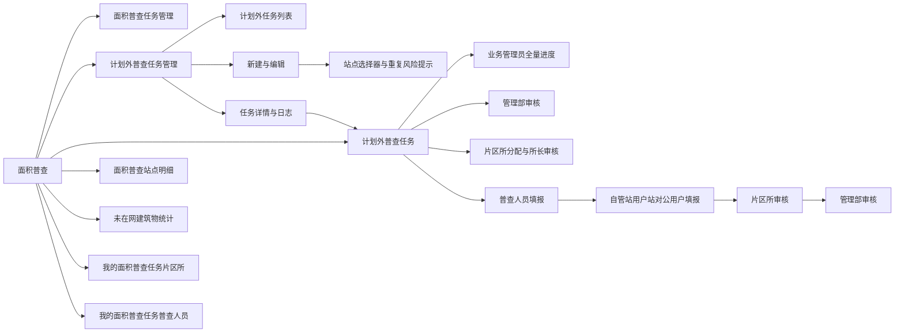
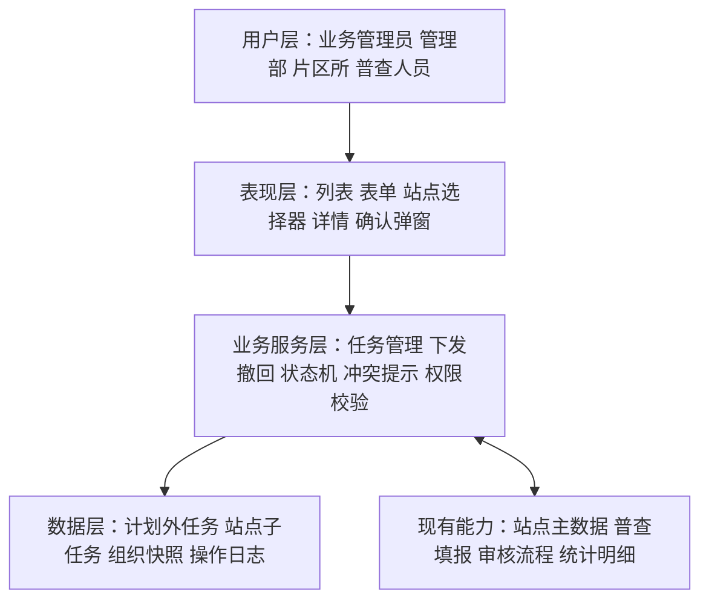

# 计划外普查任务管理《系统建设方案》

> 实施状态：V1.5 方案已通过；原型已删除燃气替代二级选项并完成历史数据归并。

## 1. 建设范围

本期在“面积普查”菜单组下设置两个计划外任务入口：“计划外普查任务管理”负责主任务的新建、编辑、下发、撤回和跟踪；“计划外普查任务”作为独立执行列表，负责片区所分配、普查人员填报、所长审核和管理部审核。计划外站点子任务不混入正常普查的片区所任务或普查人员任务列表，但从独立列表进入后，完整复用正常普查的三类填报页面、交互、校验、状态机、审核和日志能力。

全局组织范围仅保留长安管理部、裕华管理部、桥西管理部。实施时同步移除新华管理部的筛选项、组织树节点、模拟站点和模拟任务，并在数据读取层过滤浏览器本地已保存的新华管理部数据。

## 2. 产品架构



## 3. 系统分层架构



## 4. 模块划分

| 模块 | 功能 | 复用/新建 |
| --- | --- | --- |
| 菜单与路由 | 新增入口、选中态、面包屑 | 改造现有导航 |
| 任务查询 | 多条件筛选、分页、状态标签 | 复用现有列表规范 |
| 任务新建/编辑 | 基础字段、原因选择、“添加计划外普查站点”、保存与下发 | 新建，复用面积普查计划创建页布局和站点选择器 |
| 冲突提示 | 检查站点在时间区间内的未完成任务，只提示、不阻止 | 新建非阻断式检查能力 |
| 任务详情 | 展示基本信息、站点子任务、进度、日志 | 改造现有任务详情模式 |
| 下发/撤回 | 状态校验、数据锁定、消息提示 | 新建业务编排，复用下游任务列表 |
| 执行与审核 | 片区所长分配/转派/改派、普查人员填报、所长审核、管理部审核 | 复用现有流程并收紧角色校验 |
| 计划外任务执行列表 | 按角色呈现计划外站点子任务、来源、原因和当前可操作节点 | 保留独立列表壳层，复用正常普查执行组件 |
| 权限与审计 | 角色权限、数据范围、变更日志 | 扩展现有机制 |
| 管理部站点操作 | 在站点明细审核本部数据、删除计划内站点、查看完整审批记录 | 补齐计划内权限基线并复用于计划外审核 |
| 全量导出 | 管理部全量普查数据导出 | 本期暂缓，后续单独建设 |

## 5. 核心数据模型

### 5.1 计划外任务主表

| 字段 | 说明 |
| --- | --- |
| id | 任务主键 |
| task_name | 任务名称 |
| source_type | 固定为 OUT_OF_PLAN |
| reason_type | AREA_CHANGE / DIRECT_MANAGEMENT / NEW_ACCOUNT / GAS_REPLACEMENT |
| start_time / end_time | 任务时间范围 |
| status | 未下发、待分配、进行中、所长审核、管理部审核、已完成、已作废 |
| creator_id / creator_org_id | 创建人与创建组织 |
| created_at / updated_at | 审计时间 |
| version | 乐观锁版本号，防止并发覆盖 |

### 5.2 站点子任务

| 字段 | 说明 |
| --- | --- |
| id / out_plan_task_id | 子任务与主任务关联 |
| station_id | 站点唯一标识 |
| department_id / office_id | 创建时的组织快照 |
| survey_type | 自管站、用户站或对公用户，根据每个站点自动确定；同一主任务允许混合类型 |
| assignee_ids | 普查人员 |
| execution_status / audit_status | 执行与审核状态 |
| dispatched_at / completed_at | 下发与完成时间 |

### 5.3 重复风险提示

计划内与计划外任务通过统一的“站点冲突检查”服务识别重复风险。逻辑为：

```text
相同 station_id
AND 任务状态 NOT IN (已完成, 已作废)
AND 新开始时间 < 已有结束时间
AND 新结束时间 > 已有开始时间
```

检查结果仅用于提示，不构成保存或下发的硬性约束。前端展示冲突详情，服务端返回最新冲突结果并记录用户“确认继续”的操作日志。

## 6. 核心交互逻辑

### 6.1 新建任务

1. 点击“新建计划外普查任务”进入独立页。
2. 录入任务名称、时间和原因。
3. 点击“添加计划外普查站点”打开与面积普查计划一致的站点选择器，按管理部、片区所、站点类型、站点名称/编码筛选。
4. 用户站、自管站和对公用户可在同一个任务中混合勾选；存在冲突的站点保持可选，并展示冲突任务。
5. 保存后回到列表，状态为“未下发”。

### 6.2 下发任务

1. 列表点击“下发”，弹出影响范围确认框。
2. 系统重新执行权限、状态和时间校验，并刷新站点冲突提示；冲突不阻止下发。
3. 全部通过后将子任务分发到各站点归属片区所。
4. 成功后更新列表状态与操作日志；失败则保持原状态。

### 6.3 撤回后修改

1. 只有“待分配”或“进行中且未上报”的任务显示“撤回”。
2. 确认框明确告知任务将从片区所和普查人员列表移除。
3. 撤回后恢复“未下发”，允许编辑。
4. 再次下发前展示变更摘要，并执行完整校验。

### 6.4 状态与逾期展示

- 业务状态与“已逾期”展示标记分离；逾期不改变业务状态。
- 时间到期前可用颜色和文案提示，不在本期默认引入消息中心提醒。

### 6.5 “计划外普查任务”执行列表

1. 菜单路由进入计划外任务独立执行列表，并根据当前角色应用数据范围和操作权限。
2. 列表查询固定增加 `source_type=OUT_OF_PLAN`，确保不混入计划内任务。
3. 业务管理员查看全部站点子任务及进度；管理部人员仅查看本部并处理管理部审核；片区所长仅查看本所并进行人员分配、转派、改派与所长审核；普查人员仅查看本人任务并填报上报。
4. 进入详情、填报或审核页时携带 `source=out-of-plan` 和计划外原因；页面标题区显示“任务来源：计划外”。
5. 分配、下发、改派、填报、暂存、上报、撤回、审核、退回、再次提交均调用正常普查同一套状态机与日志能力，不新增平行状态定义。
6. 同一主任务包含多个组织时按站点子任务授权，主任务进度由全部子任务实时汇总。
7. 片区所长相关写操作必须同时校验角色、所属片区所和任务当前状态；普通片区所人员只读。
8. 管理部人员在“面积普查站点明细”中仅能审核本部管辖站点；计划内站点删除采用二次确认并写入审计日志。
9. 本期不展示全量普查数据导出按钮，也不建设对应导出接口。
10. 计划外子任务不得写入正常普查的片区所任务列表或普查人员任务列表；所有执行待办均在计划外任务列表内按角色展示。
11. 同一主任务包含混合站点类型时，每条子任务依据 `survey_type` 路由到正常普查对应填报组件，禁止另建简化版计划外填报表单。

## 7. Ant Design 组件选型

| 场景 | 组件 | 选型说明 |
| --- | --- | --- |
| 菜单 | `Menu` | 使用嵌套子菜单，新入口位于“面积普查任务管理”之后 |
| 页面路径 | `Breadcrumb` | 展示首页 / 面积普查 / 计划外普查任务管理 |
| 查询表单 | `Form` + `Input` + `Select` + `RangePicker` | 两个计划外列表均增加“普查原因”单选筛选，选项口径保持一致 |
| 任务列表 | `Table` + `Pagination` | 固定操作列，长文本省略，支持横向滚动 |
| 任务状态 | `Tag` + `Badge` | 状态用 Tag，逾期用独立的风险标记 |
| 新建页 | `Form` + `Input` + `DatePicker.RangePicker` + `Radio.Group` | 原因数量固定时使用单选组，避免下拉中隐藏选项 |
| 站点选择 | `Button` + `Modal` + `Table` + `Checkbox` | 按钮文案为“添加计划外普查站点”；支持跨类型筛选、分页多选、已选数量和非阻断式冲突提示 |
| 详情信息 | `Descriptions` + `Tabs` + `Timeline` | 分别承载基本信息、站点子任务和操作日志 |
| 下发/撤回/作废 | `Modal.confirm` | 危险操作展示影响范围，确认按钮防重复提交 |
| 冲突提示 | `Alert` + `Tooltip` + `Modal.confirm` | 行内展示具体冲突任务，保存或下发时汇总提示并允许用户确认继续 |
| 成功/失败反馈 | `message` / `notification` | 短结果用 message，含多站点失败明细时用 notification |
| 计划外任务角色视图 | `Tabs` + `Table` + `Tag` | 独立展示计划外任务，复用正常普查任务标签和表格结构，按角色显示待分配、进行中、待审核、已完成等视图 |

## 8. 页面信息架构

### 8.1 列表页

1. 顶部导航与当前角色。
2. 面包屑与页面标题。
3. 查询区：任务名称、原因、状态、时间、站点、管理部。
4. 工具栏：列表名称、结果数、“新建计划外普查任务”。
5. 任务表格与分页。
6. “计划外普查任务管理”和“计划外普查任务”两个列表均展示“普查原因”列，并提供同名筛选项。
7. “燃气替代”不显示二级类型；列表、筛选、详情和填报来源提示统一使用一级文案“燃气替代”。

### 8.2 新建/编辑页

1. 任务信息卡片。
2. 普查原因单选区。
3. 普查范围与已选站点列表。
4. 页底固定操作栏：取消、保存、保存并下发。

### 8.3 详情页

1. 基本信息与状态。
2. 子任务进度统计。
3. 站点子任务列表。
4. 操作日志与审核记录。
5. 根据状态展示编辑、下发、撤回或作废操作。

### 8.4 计划外任务列表及处理页

1. 菜单名称固定为“计划外普查任务”，与“计划外普查任务管理”并列展示。
2. 列表独立展示计划外站点子任务，不向正常普查片区所任务页或普查人员任务页注入计划外数据；布局复用正常普查任务列表的视觉与交互规范。
3. 公共信息区增加“任务来源：计划外”和“普查原因”；燃气替代只展示一级原因名称。
4. 片区所长人员分配/转派/改派、三类站点填报、所长审核、管理部审核、退回弹窗、审核记录和操作日志均复用正常普查页面及组件；填报字段和必填规则不得因任务来源不同而变化。
5. 页面根据角色和子任务状态计算操作按钮，不允许仅通过前端隐藏实现权限控制。

## 9. 接口边界建议

| 能力 | 建议接口 |
| --- | --- |
| 任务列表 | `GET /survey/out-of-plan-tasks` |
| 任务详情 | `GET /survey/out-of-plan-tasks/{id}` |
| 创建任务 | `POST /survey/out-of-plan-tasks` |
| 更新未下发任务 | `PUT /survey/out-of-plan-tasks/{id}` |
| 站点冲突提示 | `POST /survey/station-conflicts/check` |
| 下发 | `POST /survey/out-of-plan-tasks/{id}/dispatch` |
| 撤回 | `POST /survey/out-of-plan-tasks/{id}/recall` |
| 作废 | `POST /survey/out-of-plan-tasks/{id}/cancel` |
| 操作日志 | `GET /survey/out-of-plan-tasks/{id}/logs` |
| 计划外执行列表 | `GET /survey/tasks?source_type=OUT_OF_PLAN`，只供计划外任务列表调用 |
| 分配普查人员 | 复用计划内任务分配接口，携带计划外子任务 ID |
| 填报、上报、审核、退回 | 复用计划内对应接口与状态机，增加来源上下文 |
| 转派/改派普查人员 | 复用计划内人员调整接口，服务端校验片区所长及本所范围 |
| 删除计划内站点 | 复用或补充计划内站点删除接口，记录原因与站点快照 |

所有写接口建议携带客户端请求标识和当前版本号，服务端实施幂等与乐观锁校验。

## 10. 实施边界与验收重点

- 本期不重新建设普查填报页和审核页，仅增加计划外来源识别与字段展示。
- 计划内与计划外任务共用冲突检查口径，但检查结果仅提示、不阻止保存或下发。
- 下发后核心字段只读，撤回后方可编辑。
- 计划外任务在“计划外普查任务”列表中独立展示，不得混入正常普查的片区所任务列表和普查人员任务列表。
- 站点明细作为全局结果查询可按来源展示数据，但不得替代计划外任务执行列表承载待办。
- 四类角色进入同一执行菜单后必须获得正确的数据范围和操作权限；片区所审核、转派和改派严格限定为片区所长。
- 人员分配、填报、所长审核、管理部审核、退回、审核记录和操作日志的行为必须与计划内任务一致。
- 管理部人员只能在“面积普查站点明细”审核和删除本部管辖站点，且能够查看完整审批记录。
- 本期不建设全量普查数据导出能力，页面不得出现误导性的全量导出入口。
- 两个计划外列表必须同时具备“普查原因”字段和筛选项；燃气替代统一展示为一级原因，不出现二级选项或括号文案。
- 权限测试必须覆盖越权查看、越权选站、越权编辑和越权撤回。
- 同一任务可同时包含用户站、自管站和对公用户，站点子任务必须根据各自类型进入正确填报页面。
- 计划外三类填报页必须与正常普查保持字段、附件、导入、面积计算、暂存、上报校验、只读和错误提示一致。
- 所有页面只能展示长安管理部、裕华管理部、桥西管理部；任何来源为新华管理部的历史本地数据均不得进入列表、统计和站点选择器。

## 11. 已确认方案

1. 保留独立执行菜单“计划外普查任务”和原“计划外普查任务管理”。
2. 业务管理员、管理部、片区所、普查人员均按角色进入该菜单。
3. 处理流程与计划内任务一致。
4. 退回节点、审核记录和操作日志与计划内任务一致。
5. 列表及详情保留计划外普查原因和“任务来源：计划外”。
6. 业务管理员角色继续保留，并具有全量查看和计划外任务管理权限。
7. 人员分配、转派、改派和所长审核权限严格收口至片区所长。
8. 管理部全量普查数据导出延期，后续单独确认。
9. 计划外站点子任务只在计划外普查任务列表展示，不混入正常普查执行列表。
10. 自管站、用户站、对公用户填报内容及执行审核流程与正常普查一致。
11. 燃气替代不设置二级类型；历史数据中的原二级值读取时忽略，统一按一级原因展示和筛选。

## 12. 既有待确认项

1. 是否接受“下发后先撤回、再修改、重新下发”的规则。
2. 单任务是否允许选择多个站点。
3. 燃气替代的原因分类展示方式。
4. 管理部是否可作废自己创建且尚未开始执行的任务。
5. 单次批量选站数量上限。
