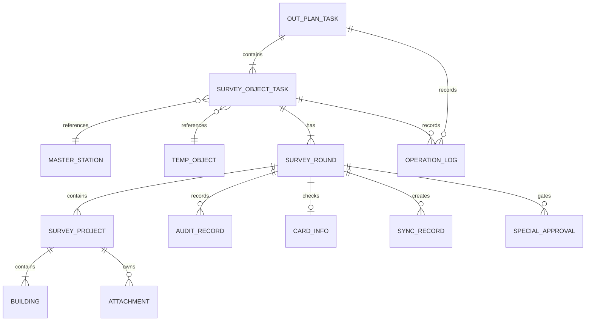

# 计划外面积普查数据模型

> 本文分为“当前原型模型”和“目标领域模型”。前者用于维护兼容，后者用于后续方案设计；未经方案通过，不得直接把目标模型写入页面代码。

## 1. 目标领域关系



## 2. 目标实体定义

### 2.1 计划外主任务 `OUT_PLAN_TASK`

| 字段 | 含义 |
| --- | --- |
| id | 主任务唯一标识 |
| name | 任务名称 |
| reason_code | 四类原因标准编码，单选 |
| business_mode | 原因下的业务方式/子场景，如新开户、用户站增容、自管站增容 |
| start_at / end_at | 任务起止时间 |
| status | 主任务聚合状态 |
| creator / creator_role | 创建人及角色 |
| version | 乐观锁版本 |
| created_at / updated_at | 审计时间 |

### 2.2 普查对象子任务 `SURVEY_OBJECT_TASK`

| 字段 | 含义 |
| --- | --- |
| id / out_plan_task_id | 子任务及所属主任务 |
| object_ref_type | `MASTER` 或 `TEMP` |
| station_id / temp_object_id | 互斥引用正式站点或任务内临时对象 |
| object_type | 自管站、用户站、对公用户、趸售用户站等稳定编码 |
| template_type | 实际使用模板；一管到户可来源用户站但使用自管站模板 |
| execution_node | 待分配、进行中、片区所审核、管理部审核、普查完成 |
| audit_result | 未上报、待审核、通过、已退回 |
| dispatch_status | 未下发、已下发、已撤回 |
| assignee_ids | 普查人员关系，正式系统建议独立关联表 |
| current_round_id | 当前处理轮次 |
| effective_round_id | 当前有效轮次 |
| version / updated_at | 并发控制与审计 |

### 2.3 任务内临时对象 `TEMP_OBJECT`

基础字段包括：任务内标识、所属主任务、来源类型、对象类型、管理部、站点名称、用户编码、用户全称、简称、行政区、办事处、用热地址、联系人、联系电话、备注和审计字段。

- 只属于一个计划外任务，不得跨任务复用。
- 不得写入正式站点档案。
- 用户编码允许暂不填写；非空时固定为 9 位字母或数字，并在当前任务内唯一。
- 一管到户、新开户和趸售用户是否共用同一临时对象实体、字段必填是否相同，需在逐页方案中确认。

### 2.4 普查轮次 `SURVEY_ROUND`

| 字段 | 含义 |
| --- | --- |
| id / object_task_id | 轮次及所属对象任务 |
| year / round_no | 年度和轮次序号 |
| source_type / reason_code | 任务来源和原因快照 |
| original_area / surveyed_area / confirmed_area | 原面积、普查面积、最终确认面积 |
| status | 审核中、当前有效、历史结果、已作废 |
| is_effective | 当前有效标记；同对象同年度最多一个 |
| approved_at | 最终审核通过时间 |
| invalidated_by_round_id | 被哪一轮替代 |
| version | 轮次版本 |

### 2.5 趸售普查项目 `SURVEY_PROJECT`

| 字段 | 含义 |
| --- | --- |
| id / round_id | 项目及所属轮次 |
| project_name | 项目名称 |
| header_snapshot | 项目核查表表头快照 |
| surveyed_area | 项目面积，只读派生值，由当前项目全部有效楼栋或建筑物普查面积自动求和 |
| sequence_no | 项目显示及合并 PDF 顺序 |
| signed_status | 签章状态 |

每个项目拥有独立楼栋/建筑物、核查表、签章成果。项目只允许在主任务下发并完成普查人员分配后，由负责当前对象的普查人员建立；主任务创建页不保存项目。页面展示序号与业务排序字段需区分；当前已实现的范围 `index + 1` 序号不持久化。

### 2.6 楼栋或建筑物 `BUILDING`

建议保留：名称、层数、建筑年代、用热性质、收费类别、控制方式、暖气类型、原面积、普查面积、核查依据、依据附件、备注、未在网关联及审计信息。具体必填随模板和原因配置，不在公共模型中硬编码。

### 2.7 附件与成果 `ATTACHMENT`

| 类型 | 目标规则摘要 |
| --- | --- |
| 普查依据附件 | 普通场景按模板要求；趸售场景非必填 |
| 门头图 | 一管到户、趸售等目标场景要求；现有用户站模板不展示，存在冲突 |
| 平面图 | 用户站/趸售等场景要求 |
| 核查表 | 项目或轮次生成 |
| 签字盖章成果 | 趸售每项目必须有，其他场景按模板 |
| 合并 PDF | 趸售全部项目合并，每项目另起页 |

### 2.8 建卡、专项审批和同步

- `CARD_INFO`：编码状态、正式编码、卡号状态、正式卡号、补录人/时间、建卡资料版本。
- `SPECIAL_APPROVAL`：触发阈值、差异值、审批状态、意见、操作者和时间。
- `SYNC_RECORD`：轮次、同步版本、流水号、状态、请求面积、操作人、时间、失败信息；记录不可覆盖。

## 3. 当前原型 JavaScript 数据结构

### 3.1 计划内计划

`areaSurveyPlans` 中的计划主要包含：

```text
id, name, department, type, year, status,
stations[], stationIds[], total, completed, changedSites, createdAt
```

`areaSurveyTasks` 中的任务由计划创建时生成，主要包含：

```text
id, planId, station, year, status, auditStatus, updatedAt
```

计划列表同时内置基础记录，删除基础记录时使用 `areaSurveyHiddenBasePlans` 隐藏，而非真正删除种子数据。

### 3.2 计划外主任务

`areaSurveyOutPlanTasks` 由 `area-survey-outplan-data.js` 读取和标准化：

```text
id, name, start, end, reason,
stationIds[], temporaryStations[],
status, creator, creatorRole, createdAt, logs[]
```

原因标准编码：

| 编码 | 文案 | 历史兼容值 |
| --- | --- | --- |
| `AREA_CHANGE` | 面积变化 | `area`、面积变化 |
| `DIRECT_TO_HOUSEHOLD` | 一管到户 | `direct`、一管到户（自管站） |
| `NEW_ACCOUNT_OR_CAPACITY` | 新开户及增容 | `new`、新开户 |
| `WHOLESALE_USER` | 趸售用户 | `gas`、`GAS_REPLACEMENT`、燃气替代 |

未知原因会变为 `UNKNOWN` 并保留 `reasonRaw`，但显示为“未知原因”。

### 3.3 当前临时用户站

标准化后主要字段：

```text
id(tmp-*), code, name, type=用户站,
department, office, district, address,
fullName, shortName, contact, phone, remark,
source=新建, temporary=true
```

该对象嵌入主任务 `temporaryStations[]`，`stationIds[]` 同时存正式站点 ID 和临时 ID；`outPlanStation(id, task)` 负责双来源解析。

### 3.4 计划外子任务

没有独立主数据数组。`area-survey-outplan-tasks.js` 每次把主任务范围展开为子任务：

```text
id = outplan-{parentId}-{stationId}
parentId, parentName, reason, reasonText, source,
year, station, status, auditStatus, dispatchStatus,
assignees[], updatedAt
```

`areaSurveyOutPlanChildStates` 只保存状态覆盖：

```text
{ [childId]: { status, auditStatus, dispatchStatus, assignees, updatedAt } }
```

### 3.5 趸售用户站项目填报（已实现原型模型）

仅当主任务 `reason=WHOLESALE_USER` 时，主任务增加 `wholesaleTaskItems[]`。每项以计划外对象站点为唯一来源，包含 `stationSnapshot` 与 `projects[]`；每个项目包含楼栋明细、项目平面图、核查表、签字盖章版核查表及自动计算的面积汇总。

- 楼栋属于项目，不能在用户站首页单独维护；
- 项目平面图、核查表、签章文件为项目完成条件；
- 门头图不属于趸售模型；普查依据及依据附件允许为空；
- 旧趸售任务读取时自动补齐空项目数组，避免旧数据报错。

## 4. localStorage / sessionStorage 清单

| Key | 类型 | 写入页面 | 读取页面 | 用途/风险 |
| --- | --- | --- | --- | --- |
| `areaSurveyPlans` | local | 计划创建、计划列表 | 计划创建、计划列表 | 计划主数据；与内置基础记录合并 |
| `areaSurveyTasks` | local | 计划创建、计划列表 | 计划创建、计划列表 | 计划内任务；角色任务页未直接读取，形成数据割裂 |
| `areaSurveyHiddenBasePlans` | local | 计划列表 | 计划列表 | 隐藏种子计划 |
| `areaSurveyTaskStates` | local | 角色任务、三类填报 | 角色任务、三类填报 | 正常任务状态覆盖；计划详情仍有独立任务数组 |
| `areaSurveyOutPlanTasks` | local | 计划外管理/执行 | 全部计划外页面 | 计划外主任务和嵌入临时对象 |
| `areaSurveyOutPlanStationArchiveOverrides` | local | 趸售用户站填报 | 计划外数据适配层 | 普查人员对正式站基础档案的原型回写覆盖；临时站不写入此 key |
| `areaSurveyOutPlanChildStates` | local | 计划外执行、三类填报 | 计划外列表/执行、三类填报 | 计划外子任务状态覆盖 |
| `areaSurveyDraft:{taskId}` | local | 自管站填报 | 自管站填报、计划外列表 | 自管站楼栋/附件/小结草稿 |
| `areaSurveyUserDraft:{taskId}` | local | 用户站填报 | 用户站填报、计划外列表 | 用户站楼栋/附件/未在网/报告草稿 |
| `areaSurveyCorporateDraft:{taskId}` | local | 对公用户填报 | 对公用户填报、计划外列表 | 对公楼栋/附件/报告草稿 |
| `areaSurveyOutPlanRole` | session | 计划外执行 | 计划外执行 | 当前模拟角色 |
| `outPlanNotice` | session | 计划外创建 | 计划外列表 | 保存/下发的一次性提示 |

## 5. 重复数据源与一致性风险

1. 计划内计划任务存在 `areaSurveyTasks`、`areaSurveyTaskStates`、计划详情页模拟任务三套来源。
2. 正常角色任务页本身用固定 24 条模拟数组，不读取 `areaSurveyTasks`；计划创建后的新任务不会自然出现在角色任务页。
3. 站点明细再维护独立 `stations` 数组，只通过 `taskUpdate` 临时接收单次变更。
4. 三类填报页同时写正常和计划外状态 key，不先判断来源；会在正常状态 key 中留下计划外拼接 ID。
5. 主任务统计会组合子状态与三类草稿推算面积变化，不是单一、版本化的审核结果源。
6. 任务详情的审核记录和操作日志多数只存在 URL 对象中，未稳定持久化。
7. 临时对象嵌套在主任务内，无法天然承载正式建卡映射、多轮、项目和独立版本。

## 6. 后续演进约束

- 在原型阶段也应先建立单一读取适配层，再逐步消除页面自带的重复数组。
- 状态、审核结果、下发、建卡、同步、有效性必须分字段；禁止继续新增含义重叠的 `status` 文案。
- URL 只传 ID、来源和动作意图；业务对象从统一存储读取。若仍需兼容旧 URL JSON，应建立显式迁移层。
- 数据结构变更必须兼容现有 localStorage，提供版本号和迁移函数；不能直接更换 key 导致演示数据丢失。
- 任何临时对象正式建档都应创建映射记录，不得原地把 `tmp-*` 改成正式 ID。
- 趸售项目面积不得另设人工录入事实源；前端可即时求和，持久化及最终结果以服务端按有效楼栋明细重算值为准。
