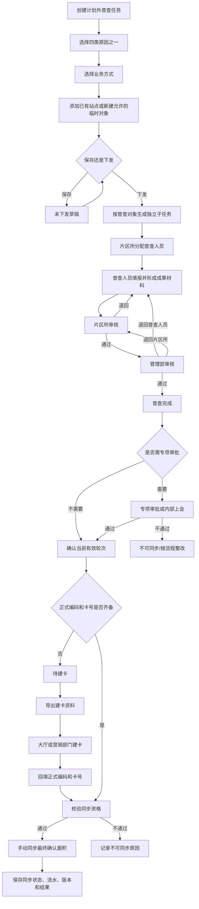
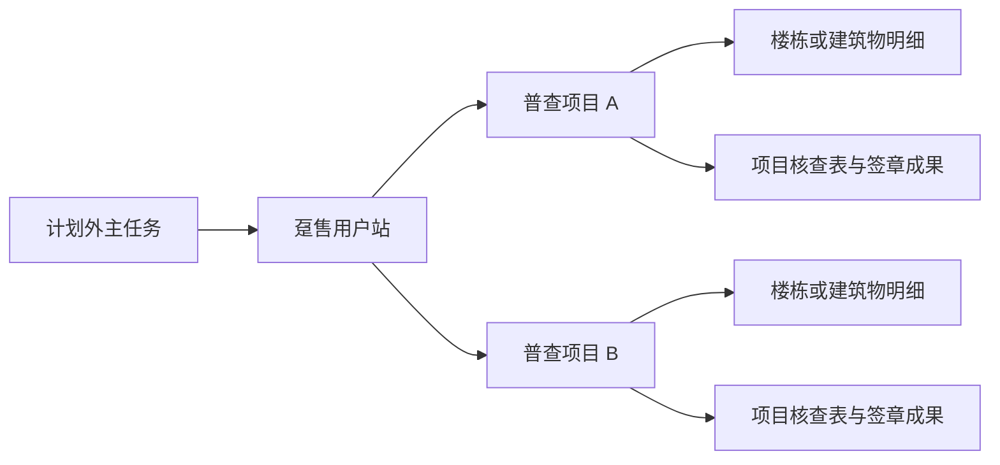
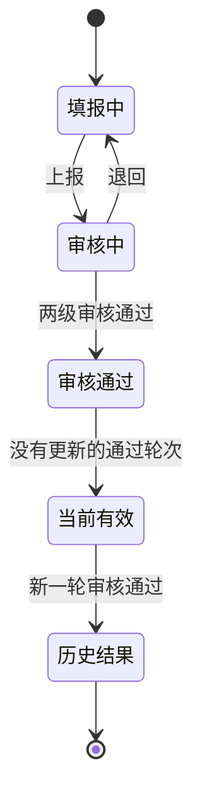

# 计划外面积普查整体流程

> 本文描述用户本轮给出的目标业务。涉及当前原型尚未实现或与既有方案冲突的内容，均标为“目标态”或“待确认”，不代表已经上线。

## 1. 总体流程

普查系统不生成正式用户编码或正式卡号。核心原则是：先普查、后建卡，补录正式信息并通过资格校验后再同步最终确认面积。

## 2. 主任务与普查对象

- 一项计划外主任务只能选择一个原因。
- 同一主任务可以包含多个符合该原因规则的普查对象。
- 不同原因的对象不得混入同一任务。
- 主任务负责范围、时间、来源、原因和总体进度；普查对象子任务负责人员、填报、审核、轮次、成果、建卡和同步状态。
- 同一主任务下每个对象独立执行。一个对象退回、失败或待建卡，不改变其他对象的执行状态。

## 3. 四类原因分支

### 3.1 面积变化

- 适用于已有自管站、用户站、对公用户。
- 不允许创建临时对象。
- 自管站使用自管站模板，用户站使用用户站模板，对公用户使用兼容模板。
- 同一站点、同一年度允许多轮普查；只有最后一次审核通过的轮次成为当前有效结果。
- 面积差异超过配置阈值时，需专项审批或内部上会通过后才可同步。

### 3.2 一管到户

- 只适用于用户站。
- 可选择已有用户站，也可新建任务内临时用户站。
- 业务来源虽是用户站，但普查使用自管站模板。
- 维护楼栋、单元、房屋或建筑物、普查面积、面积依据及附件、门头图、平面图、核查表和签章成果。
- 无正式编码或卡号时仍可完成普查和审核并生成建卡资料，但必须进入待建卡，禁止同步。

### 3.3 新开户及增容

包含三个子场景：

| 子场景 | 对象来源 | 核心处理 |
| --- | --- | --- |
| 用户站新开户 | 新建临时用户站 | 使用用户站模板；普查完成后进入待建卡 |
| 用户站增容 | 已有用户站 | 读取原面积，新增楼栋/建筑物，展示原面积、新增面积、增容后面积 |
| 自管站增容 | 已有自管站 | 增容可来自未在网建筑物或未登记新建筑物，不强制先选未在网记录；使用自管站模板 |

不存在纯自管站新开户场景。自管站增容如无卡号，同样先普查、后建卡。

### 3.4 趸售用户普查

- 适用于趸售用户、灵活供热、供汽等合同型用户、新增趸售项目和原合同范围调整。
- 对象来源用两个并列按钮表达，不使用页签：`添加计划外普查站点`、`新增趸售用户站`。
- `添加计划外普查站点`可检索系统内全部已有站点类型，实际候选记录按操作者数据权限裁剪。
- 新增趸售用户站字段：管理部、用户站名称、9 位用户编码、用户全称、简称、行政区、办事处、用热地址、联系人、联系电话。
- 用户编码允许暂不填写；填写时按 9 位字母或数字组合校验，不硬编码首字符或字符位置。

目标数据层级：

主任务创建和下发阶段只确定趸售普查对象，不预建项目。任务下发并分配后，由负责该对象的普查人员建立一个或多个项目。每个项目独立维护项目名称和表头、楼栋/建筑物、核查表和签章成果；项目面积为当前项目全部有效楼栋或建筑物普查面积之和，只读展示并随明细增删改自动重算。支持全部项目合并导出 PDF，每个项目单独起页。趸售场景的普查依据及其附件非必填；门头图、平面图、核查表和项目盖章必需。

## 4. 审核流程

目标节点：`待分配 → 进行中 → 片区所审核 → 管理部审核 → 普查完成`。

- 片区所：通过，或退回普查人员。
- 管理部：通过，退回片区所，或直接退回普查人员。
- 退回必须填写原因并保留原记录及版本。
- 普查人员上报后、片区所实际审核前，可撤回并继续修改；已填数据和附件不丢失。

当前原型以“所长审核”表示片区所审核节点，并以“已结束”或“已完成”表示完成；统一编码待确认。

## 5. 多轮普查与有效结果

新一轮尚未审核通过时，上一轮仍是当前有效结果。新一轮通过后自动替代上一轮，但历史记录不删除。每轮至少保留轮次、来源、原因、原面积、普查面积、审核记录、有效标记和同步记录。

## 6. 建卡与同步

- 卡号状态必须区分“已有卡号”“待建卡”“已补录卡号”，不能在卡号字段填写“无卡号”。
- 无卡号对象可以完成普查、审核和建卡资料导出，但不可同步。
- 同步内容只能是当前最后一轮审核通过的最终确认面积。
- 同步动作不得修改普查结果，只能新增/更新同步状态、时间、操作人、流水号、版本和成功/失败信息。
- 作废轮次不参与有效面积和待同步统计。

## 7. 删除、撤回、退回与作废

| 动作 | 适用范围 | 核心约束 |
| --- | --- | --- |
| 删除 | 草稿或未下发数据 | 删除后不可继续执行；已下发及已完成数据不得删除 |
| 撤回 | 已下发但尚未正式执行 | 同步回退子对象、人员分配和待办；恢复可编辑 |
| 退回 | 审核中或已完成对象 | 对象级；指定目标节点；原因必填；保留记录和版本 |
| 作废 | 已完成或不再有效的数据 | 保留历史；不参与有效面积和待同步统计 |

“已下发但尚未正式执行”的准确判定、已完成对象允许退回后的有效轮次处理，仍需业务确认。

## 8. 当前实现与目标差距

| 能力 | 当前实现 | 目标态 |
| --- | --- | --- |
| 四类原因 | 已有统一枚举和历史别名 | 按原因限制对象来源、模板和必填材料 |
| 临时对象 | 仅趸售原因下可新建临时用户站 | 一管到户、新开户等场景也需按规则支持 |
| 趸售项目 | 临时站直接复用用户站填报 | 站下多项目、项目独立核查/盖章/合并 PDF |
| 多轮 | 页面展示“首次普查/非首次”提示 | 独立轮次实体、有效性切换、历史查询 |
| 建卡 | 未实现 | 待建卡、资料导出、补录、校验 |
| 同步 | 站点明细有模拟同步 | 只同步有效轮次最终面积，保留版本与流水 |
| 专项审批 | 未实现 | 超阈值审批后才可同步 |
| 作废 | 主任务有状态字典但闭环不完整 | 对象/轮次作废、历史和统计排除 |
