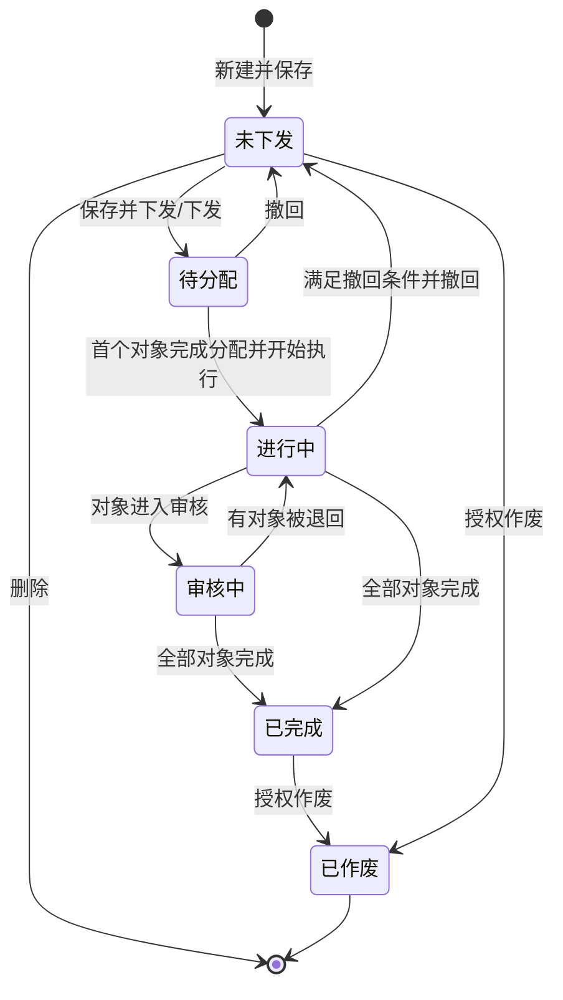
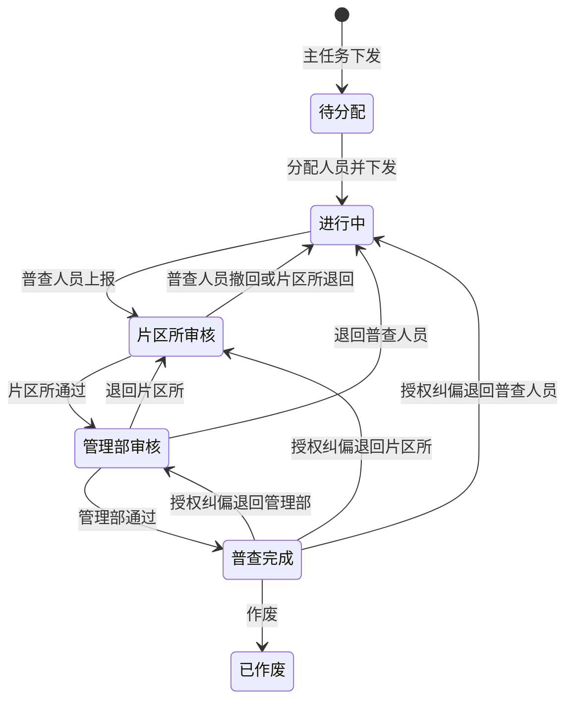
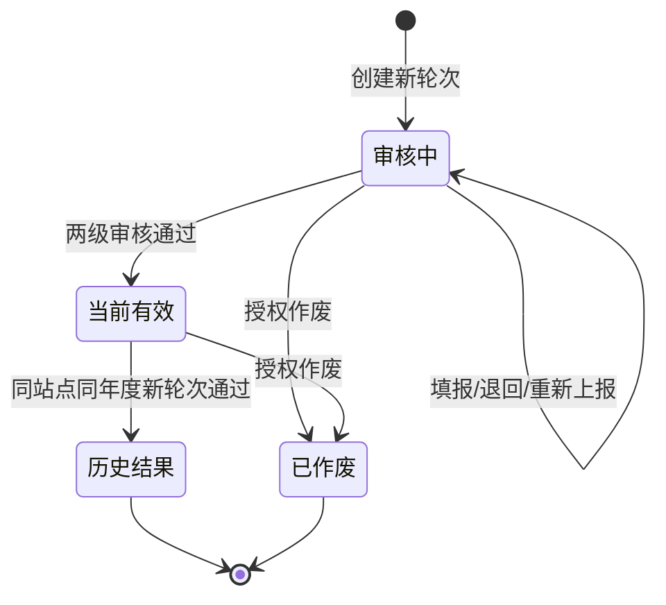
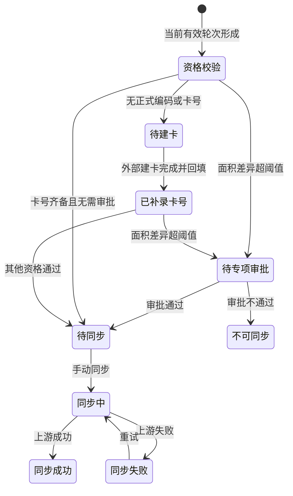

# 计划外面积普查状态机

> 本文同时记录目标状态机与当前原型映射。正式实现应拆分主任务状态、对象执行节点、审核结果、建卡状态、同步状态和轮次有效性，不应继续用单一 `status` 承载全部含义。

## 1. 建议的状态维度

| 维度 | 建议状态 |
| --- | --- |
| 主任务状态 | 草稿/未下发、已下发、执行中、已完成、已撤回、已作废 |
| 对象执行节点 | 待分配、进行中、片区所审核、管理部审核、普查完成 |
| 审核结果 | 未上报、待审核、通过、已退回 |
| 下发状态 | 未下发、已下发、已撤回 |
| 轮次有效性 | 审核中、当前有效、历史结果、已作废 |
| 建卡状态 | 已有卡号、待建卡、已补录卡号、建卡失败/待确认 |
| 同步状态 | 不可同步、待同步、同步中、同步成功、同步失败 |
| 专项审批 | 不需要、待审批、通过、不通过 |

## 2. 主任务状态机

主任务聚合规则建议：

1. 全部对象完成时主任务为已完成。
2. 任一对象处于管理部审核时可展示“管理部审核中”；否则任一对象处于片区所审核时展示“片区所审核中”。
3. 任一对象进行中或被退回，且没有更后节点时，主任务为执行中。
4. “已逾期”是时间标签，不改变业务状态。
5. 单个对象退回不回退其他对象。

当前原型的 `syncParentStatus()` 按最靠后子状态聚合为“待分配/进行中/所长审核/管理部审核/已完成”，不包含对象级待建卡、专项审批和同步状态。

## 3. 普查对象执行状态机

退回必须记录目标节点、原因、操作人、时间、来源状态、目标状态和版本。已完成后的纠偏退回是否立即取消当前有效轮次及同步资格，属于 P0 待确认。

## 4. 审核动作表

| 当前节点 | 角色 | 动作 | 下一节点 | 审核结果 |
| --- | --- | --- | --- | --- |
| 进行中 | 普查人员 | 上报 | 片区所审核 | 待审核 |
| 进行中 | 趸售任务普查人员 | 建立/维护普查项目及楼栋 | 进行中 | 未上报 |
| 片区所审核 | 普查人员 | 审核前撤回 | 进行中 | 未上报 |
| 片区所审核 | 片区所长 | 通过 | 管理部审核 | 待审核 |
| 片区所审核 | 片区所长 | 不通过 | 进行中 | 已退回 |
| 管理部审核 | 管理部人员 | 通过 | 普查完成 | 通过 |
| 管理部审核 | 管理部人员 | 退回片区所 | 片区所审核 | 已退回 |
| 管理部审核 | 管理部人员 | 退回普查人员 | 进行中 | 已退回 |

## 5. 轮次有效性状态机

- 新轮次未通过前，上一轮继续保持当前有效。
- 只有当前有效轮次可进入同步资格校验。
- 历史结果与同步记录永久保留，不物理删除。

## 6. 建卡与同步状态机

每次同步生成独立版本和流水；同步失败不得改写普查结果。

## 7. 当前原型状态映射与不一致

| 业务含义 | 当前文案/字段 | 位置 | 问题 |
| --- | --- | --- | --- |
| 片区所审核 | `所长审核`、`片区所审核` | 任务列表、任务详情、站点明细 | 同一节点两套文案 |
| 对象完成 | `已结束`、`普查完成` | 角色任务、站点明细 | 列表筛选和映射成本增加 |
| 主任务完成 | `已完成` | 计划外主任务 | 与子任务完成文案不同属合理层级差异，但需编码区分 |
| 执行中 | `进行中`、`普查中` | 任务列表、站点明细 | 同一含义两套文案 |
| 退回 | `status=已退回` 或目标节点状态 + `auditStatus=已退回` | 多页 | 仅看 `status` 无法稳定判断当前责任人 |
| 下发 | `dispatchStatus` 与主任务 `status` 混用 | 计划内/外任务 | 建议独立字段和事件日志 |

推荐正式编码统一为稳定英文枚举，页面文案通过字典映射；“流程节点”和“最近审核结果”必须分字段保存。

趸售项目建立和楼栋面积自动汇总属于对象任务“进行中”节点内的填报动作，不新增流程状态。项目至少存在一条有效楼栋明细且成果材料满足校验后，才允许对象上报至片区所审核。
