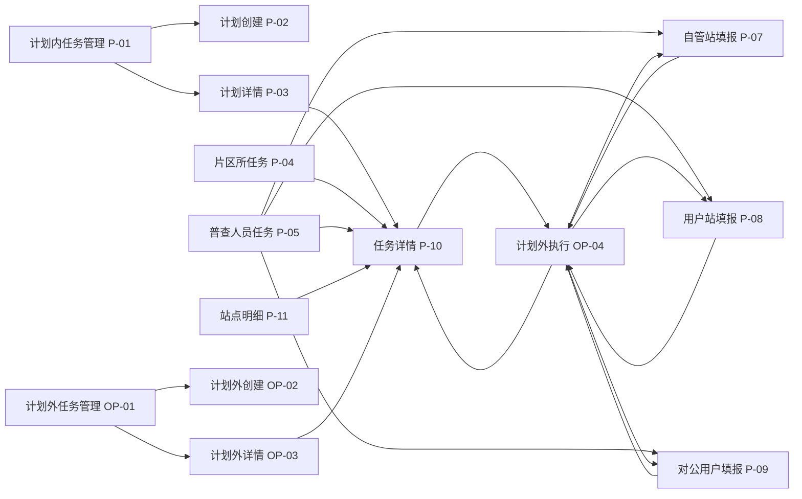

# 计划外面积普查页面清单

> 基线日期：2026-07-20。状态说明：`已实现` 表示当前原型存在可演示页面；`部分实现` 表示仅有局部交互或模拟数据；`未实现` 表示目标业务尚无对应页面闭环。

## 1. 当前仓库页面总览

| 编号 | 页面 | 文件 | 主要角色 | 状态 | 入口与去向 |
| --- | --- | --- | --- | --- | --- |
| P-01 | 面积普查任务管理 | `area-survey-plan-list.html` | 业务管理员 | 已实现 | 主入口 → 新建/编辑、计划详情 |
| P-02 | 新建/编辑普查计划 | `area-survey-plan-create.html` | 业务管理员 | 已实现 | 计划列表/详情 → 计划列表 |
| P-03 | 普查计划详情 | `area-survey-plan-detail.html` | 管理及审核角色 | 已实现 | 计划列表 → 任务详情 |
| P-04 | 我的面积普查任务（片区所） | `area-survey-office-tasks.html` | 片区所长 | 已实现 | 左侧菜单 → 任务详情/审核 |
| P-05 | 我的面积普查任务（普查人员） | `area-survey-surveyor-tasks.html` | 普查人员 | 已实现 | 左侧菜单 → 三类填报/任务详情 |
| P-06 | 早期合并任务页 | `area-survey-my-tasks.html` | 片区所/普查人员 | 遗留 | 非正式主导航；不应继续扩展 |
| P-07 | 自管站普查填报 | `area-survey-survey-fill.html` | 普查人员 | 已实现 | 普查人员或计划外执行列表 → 来源列表 |
| P-08 | 用户站普查填报 | `area-survey-user-fill.html` | 普查人员 | 已实现 | 普查人员或计划外执行列表 → 来源列表 |
| P-09 | 对公用户普查填报 | `area-survey-corporate-fill.html` | 普查人员 | 已实现 | 普查人员或计划外执行列表 → 来源列表 |
| P-10 | 普查任务详情/审核 | `area-survey-task-detail.html` | 多角色 | 已实现 | 计划详情/任务列表/站点明细 → 原来源页 |
| P-11 | 面积普查站点明细 | `area-survey-station-details.html` | 多角色 | 已实现 | 左侧菜单 → 任务详情/审核/模拟同步 |
| P-12 | 未在网建筑物统计 | `area-survey-offnetwork-stats.html` | 管理角色 | 已实现 | 左侧菜单 → 详情弹窗 |
| OP-01 | 计划外普查任务管理 | `area-survey-outplan-list.html` | 业务管理员/管理部 | 已实现 | 左侧菜单 → 新建、详情、编辑、下发、撤回 |
| OP-02 | 新建/编辑计划外任务 | `area-survey-outplan-create.html` | 业务管理员/管理部 | 部分实现 | 主任务列表/详情 → 主任务列表；一管到户、新开户及增容、趸售用户可新建任务内临时站点，面积变化不可新建 |
| OP-03 | 计划外主任务详情 | `area-survey-outplan-detail.html` | 管理角色 | 已实现 | 主任务列表 → 编辑/下发/撤回/子任务详情 |
| OP-04 | 计划外普查任务执行列表 | `area-survey-outplan-tasks.html` | 四类执行角色 | 已实现 | 左侧菜单 → 按计划外原因页签查询 → 分配、填报、详情、审核 |
| OP-05 | 趸售用户站普查填报 | `area-survey-wholesale-fill.html` | 普查人员 | 已实现 | 计划外执行列表（趸售用户）→ 项目新增/项目填报/上报 |
| OP-06 | 趸售普查项目楼栋填报 | `area-survey-wholesale-project-fill.html` | 普查人员 | 已实现 | 趸售用户站项目列表 → 返回项目列表 |

## 2. 计划外页面读写关系

| 页面 | 主要读取 | 主要写入 | 关键状态 |
| --- | --- | --- | --- |
| OP-01 主任务列表 | `areaSurveyOutPlanTasks`、`areaSurveyOutPlanChildStates`、三类草稿 | 主任务下发/撤回/删除；一次性提示 | 未下发、待分配、进行中、审核中、已完成、已作废 |
| OP-02 创建/编辑 | 主任务、全局站点种子、任务内临时站 | `areaSurveyOutPlanTasks`、`outPlanNotice` | 未下发、待分配 |
| OP-03 主任务详情 | 主任务、站点/临时对象、日志 | 下发/撤回后的主任务 | 主任务状态和推导子任务状态 |
| OP-04 执行列表 | 主任务即时展开、子状态覆盖、会话角色 | `areaSurveyOutPlanChildStates`、同步主任务聚合状态 | 原因页签：面积变化、一管到户、新开户及增容、趸售用户；任务状态：待分配、进行中、所长审核、管理部审核、已结束、已退回 |
| OP-05/OP-06 趸售填报 | 计划外主任务、任务内趸售对象及项目 | `areaSurveyOutPlanTasks.wholesaleTaskItems[]`、子状态覆盖 | 项目：未填写、填写中、待完善、已完成；对象：进行中/已退回 → 所长审核 |
| P-07/P-08/P-09 填报 | URL `task`、对应草稿 | 三类草稿、正常/计划外子状态 | 进行中 → 所长审核 |
| P-10 详情/审核 | URL `data/source/audit` | 先改页面内对象，再通过 `taskUpdate` 返回来源页 | 所长审核、管理部审核、已结束、已退回 |

## 3. 页面关系图

## 4. 已发现的断链与弱链

### 4.1 明确的业务返回链错误

`area-survey-outplan-detail.html` 从主任务详情进入子任务详情时传递 `source=office`。因此任务详情的返回地址被计算为 `area-survey-office-tasks.html`，会离开计划外链路。目标应在“返回计划外主任务详情”与“进入计划外执行列表”之间确认一种，并使用计划外来源参数。

### 4.2 URL 临时状态弱链

- `area-survey-task-detail.html` 的审核先只修改页面内 `task`，依赖返回链接携带 `taskUpdate` 才由来源页接收。
- 若用户审核后直接点击左侧菜单而不是页面返回按钮，修改可能不进入对应 localStorage。
- URL 传输完整 JSON，数据量、编码、刷新恢复和篡改校验均未处理。

### 4.3 遗留页面

`area-survey-my-tasks.html` 不在当前拆分后的正式菜单链路中，但仍维护独立模拟任务和交互。后续应确认保留为演示页、重定向还是移除；确认前不删除。

### 4.4 静态资源检查

2026-07-20 对所有 HTML 的静态 `href/src` 检查未发现真实缺失文件。扫描器识别的 `${detailUrl}`、`${src}`、`${selectedHref}` 是运行时模板变量，不是断链。

## 5. 目标业务尚缺页面/能力

| 优先级 | 目标页面/能力 | 当前缺口 |
| --- | --- | --- |
| P0 | 趸售用户计划外任务创建增强 | 现有只支持站点/临时站，没有业务方式、站下多项目建模 |
| P0 | 趸售项目填报/编辑 | 无项目级表头、楼栋、独立面积和成果 |
| P0 | 项目核查表与签章成果 | 无每项目独立生成/盖章及合并 PDF 每项目起页 |
| P0 | 多轮普查历史与有效轮次 | 无轮次列表、有效标记切换和历史对比 |
| P0 | 待建卡与正式信息补录 | 无待建卡列表、资料导出、编码/卡号补录与校验 |
| P0 | 同步资格与同步版本 | 现有仅站点明细模拟同步，无有效轮次/卡号/审批校验 |
| P1 | 专项审批/内部上会 | 无阈值配置、审批记录和同步门禁 |
| P1 | 作废与历史留痕 | 无完整对象/轮次作废页面和统计排除 |
| P2 | 面积检查 | 只有菜单“待接入”占位 |

## 6. 样式与脚本依赖

- 基础后台壳层：`area-survey-detail.css`；计划外管理页另有 `area-survey-outplan.css`。
- 角色任务公共层：`area-survey-role-tasks.css`、`area-survey-role-tasks.js`。
- 三类填报公共层：`area-survey-survey-fill.css`，自管站用 `area-survey-survey-fill.js`，用户站/对公用户在其上叠加各自 CSS/JS。
- 计划外共享数据：`area-survey-outplan-data.js`。
- 计划外执行：`area-survey-outplan-tasks.js`，依赖计划外数据脚本先加载。
- 站点查询：`area-survey-station-details.css/js`；未在网统计复用其部分样式并叠加页面级资源。

## 7. 页面变更记录

| 日期 | 页面 | 变更 |
| --- | --- | --- |
| 2026-07-20 | 全量页面 | 建立 16 页基线清单、关系图、读写关系和已知断链；未修改页面源码 |
| 2026-07-20 | OP-02 / 趸售填报目标页 | 确认创建页只选对象；项目由下发后的普查人员建立，项目面积按楼栋自动求和；待方案通过后逐页实施 |
