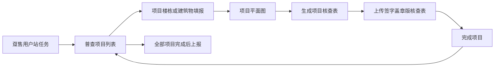

# 趸售用户计划外普查

> 版本：2026-07-20。本文件仅描述趸售用户计划外普查的普查人员填报，不涵盖审核、建卡或同步。

## 1. 页面流程

用户站首页只展示项目列表，不直接展示楼栋明细；楼栋及成果均属于项目。

## 2. 项目完成条件

1. 项目基础信息完整；
2. 至少一条楼栋或建筑物，且必填字段完整；
3. 项目平面图已上传；
4. 项目核查表已生成；
5. 签字盖章版核查表已上传。

趸售不上传门头图；普查依据及依据附件非必填。项目完成后不可删除，未完成项目可删除。全部有效项目完成前不得上报用户站任务。

## 3. 数据与权限

数据统一写入计划外主任务 `wholesaleTaskItems[].projects[]`。项目和楼栋的面积均由有效楼栋明细自动汇总。普查人员仅在待分配后已接收、进行中或已退回状态编辑；所长审核、管理部审核、普查完成、已作废时仅查看。
