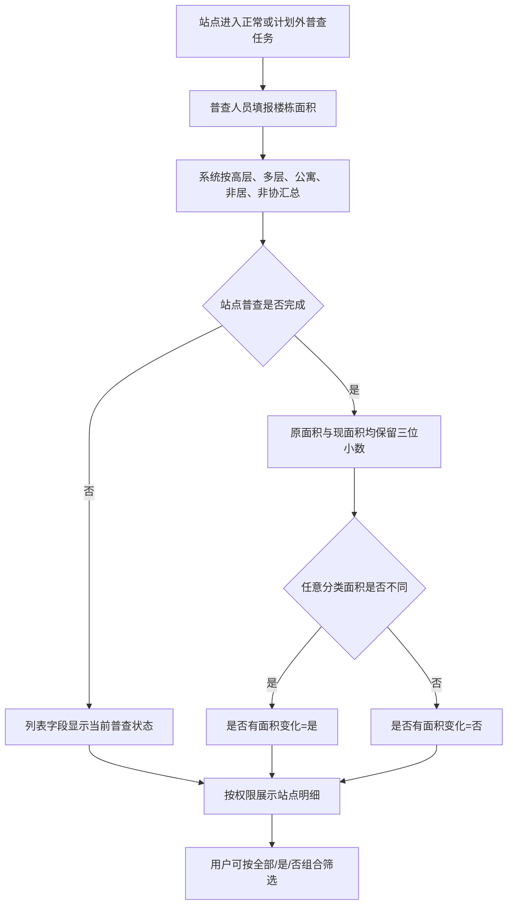

# 面积普查站点明细《功能规格说明书》

## 1. 文档信息

| 项目 | 内容 |
| --- | --- |
| 功能名称 | 是否有面积变化字段与筛选 |
| 适用页面 | 面积普查站点明细 |
| 版本 | V1.0 |
| 当前阶段 | 方案待确认，原型未实施 |

## 2. 功能定义

在“面积普查站点明细”列表中增加“是否有面积变化”字段，并增加同名筛选项，帮助授权用户快速定位已经完成普查且分类面积发生变化的站点。

该菜单仅展示已经进入面积普查任务的站点，数据范围包括正常普查任务和计划外普查任务，不展示尚未纳入任何普查任务的站点。

## 3. 用户与数据范围

| 角色 | 数据范围 | 使用能力 |
| --- | --- | --- |
| 业务管理员 | 全部管理部 | 查看字段并按是/否筛选 |
| 管理部人员 | 本管理部 | 查看字段并按是/否筛选 |
| 片区所长 | 本片区所 | 查看字段并按是/否筛选 |
| 普查人员 | 本人任务范围 | 查看字段并按是/否筛选 |

新增字段和筛选项不改变既有角色权限，仅在当前角色可见数据内计算和筛选。

## 4. 用户故事

作为面积普查业务用户，我希望在站点明细中直接看到站点是否存在面积变化，并能筛选有变化或无变化的站点，以便快速开展复核、审核和后续统计工作。

### 验收条件

- 列表增加“是否有面积变化”字段。
- 查询区增加“是否有面积变化”筛选项，选项为“全部、是、否”。
- 已完成普查的站点按五类面积比较结果显示“是”或“否”。
- 尚未完成普查的站点不提前判定是/否，该列显示当前普查状态。
- 筛选“是”或“否”时仅返回已经完成普查并具有明确判定结果的站点，未完成站点不进入“否”的结果集。
- 正常普查与计划外普查采用同一判定规则。

## 5. 判定规则

### 5.1 比较维度

分别比较以下五类收费类别的原普查面积与现普查面积：

1. 高层；
2. 多层；
3. 公寓；
4. 非居；
5. 非协。

### 5.2 判定逻辑

| 条件 | “是否有面积变化”展示值 |
| --- | --- |
| 站点普查已完成，五类面积中任意一类原面积与现面积不一致 | 是 |
| 站点普查已完成，五类面积原面积与现面积均一致 | 否 |
| 站点尚未完成普查 | 当前普查状态，如“待普查”“普查中”“所长审核”“管理部审核”“已退回” |

面积统一保留三位小数后再进行比较。计算规则为：

```text
是否有面积变化 =
  round(高层现面积, 3) != round(高层原面积, 3)
  OR round(多层现面积, 3) != round(多层原面积, 3)
  OR round(公寓现面积, 3) != round(公寓原面积, 3)
  OR round(非居现面积, 3) != round(非居原面积, 3)
  OR round(非协现面积, 3) != round(非协原面积, 3)
```

某一分类没有楼栋数据时，该分类汇总面积按 `0.000` 参与比较。

## 6. 页面规格

### 6.1 查询条件

在既有“站点类型”筛选项之后增加：

| 字段 | 控件 | 选项 | 默认值 |
| --- | --- | --- | --- |
| 是否有面积变化 | 单选下拉框 | 全部、是、否 | 全部 |

点击“查询”后与年度、组织、站点编码、站点名称、普查状态、站点类型等既有条件组合生效；点击“重置”恢复为“全部”。

### 6.2 列表字段

在“面积变化率”之后增加“是否有面积变化”列。建议居中展示，已完成站点使用“是/否”标签，未完成站点使用既有普查状态标签样式。

所有面积字段及面积差值统一展示三位小数，包含但不限于原面积、现面积、居民面积变化、非居民面积变化及五类面积汇总。

### 6.3 空状态与异常处理

- 组合筛选无结果时沿用“未找到符合条件的站点”空状态。
- 面积汇总数据读取失败时不判定为“否”，字段显示“数据异常”，并允许用户进入详情核对。
- 单个站点分类面积缺失时按 `0.000` 汇总；若整站填报结果缺失，则按数据异常处理。

## 7. 业务流程



## 8. 非功能要求

- 统计必须复用最终普查结果，不得使用页面显示文本反推。
- 正常普查与计划外普查必须复用同一计算函数或服务端聚合口径。
- 列表分页、组织权限和固定操作列能力保持不变。
- 本次未提出新的硬性性能指标；建设阶段建议由查询接口直接返回判定值，避免列表逐站点发起明细请求。

## 9. 本期不包含

- 不新增全量导出功能。
- 不改变普查任务状态机和审核流程。
- 不改变现有角色数据权限。
- 不对未完成站点提前给出“是/否”结论。

