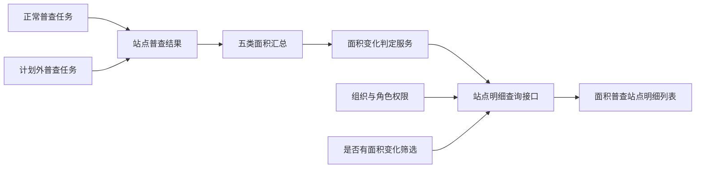

# 面积普查站点明细《系统建设方案》

## 1. 建设目标

在现有“面积普查站点明细”查询能力上增加统一的面积变化判定、列表展示和筛选能力，使正常普查和计划外普查站点共用同一业务口径。

当前版本为 V1.1，字段独立展示修复方案已通过并完成原型实施。

## 2. 产品架构



## 3. 模块划分

| 模块 | 建设内容 | 处理方式 |
| --- | --- | --- |
| 数据范围 | 只查询已进入普查任务的站点 | 复用既有任务站点关联关系 |
| 分类汇总 | 汇总高层、多层、公寓、非居、非协原/现面积 | 复用填报楼栋数据并统一三位小数 |
| 变化判定 | 完成站点任一分类变化即返回“是” | 新增统一计算函数 |
| 未完成展示 | 变化字段返回空值并显示灰色“—”，普查状态由独立字段展示 | 保持两个字段职责独立 |
| 列表查询 | 增加判定字段和是/否筛选 | 改造站点明细查询 |
| 页面展示 | 新增筛选项、列表列和标签 | 改造现有页面 |

## 4. 核心数据模型

站点明细查询结果补充以下逻辑字段：

| 字段 | 类型 | 说明 |
| --- | --- | --- |
| `hasAreaChange` | `boolean / null` | 已完成站点返回 true/false；未完成或异常返回 null |
| `areaChangeDisplay` | `string` | 是、否、灰色“—”或数据异常，不承载普查状态 |
| `originalAreaByCategory` | `object` | 五类原面积汇总，统一三位小数 |
| `currentAreaByCategory` | `object` | 五类现面积汇总，统一三位小数 |

筛选参数增加：

| 参数 | 取值 | 说明 |
| --- | --- | --- |
| `hasAreaChange` | 空、`true`、`false` | 空表示全部；true/false 只匹配已完成且判定明确的站点 |

## 5. 核心计算逻辑

1. 按站点和收费类别汇总楼栋原普查面积、现普查面积。
2. 五类汇总均使用十进制定点数处理，输出和比较精度为三位小数。
3. 仅当站点状态为“普查完成”时计算 `hasAreaChange`。
4. 任一分类原/现面积不一致时返回 `true`，全部一致返回 `false`。
5. 未完成站点返回 `null`，“是否有面积变化”列显示灰色“—”；当前普查状态只在“普查状态”列显示。
6. 数据整体缺失或计算异常时返回 `null` 并标记数据异常，不得降级为“否”。

推荐伪代码：

```text
if station.status != COMPLETED:
    return null

for category in [HIGH_RISE, MULTI_STOREY, APARTMENT, NON_RESIDENTIAL, NON_COOPERATIVE]:
    original = decimal(category.original or 0).round(3)
    current = decimal(category.current or 0).round(3)
    if original != current:
        return true
return false
```

## 6. 核心交互逻辑

1. 用户进入“面积普查站点明细”，系统先按角色加载组织权限范围。
2. 查询区默认“是否有面积变化=全部”，列表同时展示完成和未完成站点；两个字段保持独立列展示。
3. 选择“是”后，只展示已完成且至少一类面积发生变化的站点。
4. 选择“否”后，只展示已完成且五类面积均未变化的站点。
5. 未完成站点在新增列显示灰色“—”，不重复显示普查状态，也不进入“是”或“否”的筛选结果。
6. 点击重置后清空新增筛选条件，并恢复既有默认条件。
7. 新增列不影响右侧操作列固定、分页、勾选和批量同步。

## 7. Ant Design 组件选型

| 场景 | 组件 | 使用说明 |
| --- | --- | --- |
| 筛选表单 | `Form` | 与既有筛选条件统一布局 |
| 是否变化筛选 | `Select` | 选项为全部、是、否，默认全部 |
| 站点列表 | `Table` | 增加判定列，保留横向滚动与固定操作列 |
| 判定结果 | `Tag` | “是”使用提示/风险色，“否”使用成功或中性色 |
| 未完成变化值 | 普通文本 | 使用灰色“—”，避免与普查状态标签混淆 |
| 空状态 | `Empty` | 组合筛选无结果时展示 |
| 异常提示 | `Tooltip` + `Tag` | 数据异常时提示进入详情核对 |

## 8. 原型改造范围

方案通过后修改：

- `area-survey-station-details.html`：增加筛选控件和列表列。
- `area-survey-station-details.js`：增加五类面积汇总、三位小数格式化、变化判定和筛选逻辑。
- 相关样式文件：仅在需要时补充标签与列宽样式，保持操作列固定。
- 正常普查与计划外普查的本地演示数据：补充可验证的分类原/现面积数据。

## 9. 验证方案

- 五类面积均相同：已完成站点显示“否”。
- 高层、多层、公寓、非居、非协分别单独变化：每种场景均显示“是”。
- 多类同时变化：显示“是”，不得重复统计站点。
- 差值发生在第四位小数：三位小数舍入后一致时显示“否”。
- 未完成站点存在暂存变化：“是否有面积变化”显示灰色“—”，普查状态列正常显示当前状态，且不进入“是/否”筛选。
- 计划内、计划外任务使用相同测试数据时判定结果一致。
- 选择“否”时不包含未完成站点。
- 业务管理员、管理部、片区所长、普查人员的数据范围保持不变。

## 10. 待确认项

- 本次没有新增硬性性能指标；生产接口的目标响应时间和最大数据量由研发设计阶段结合现网规模补充。
