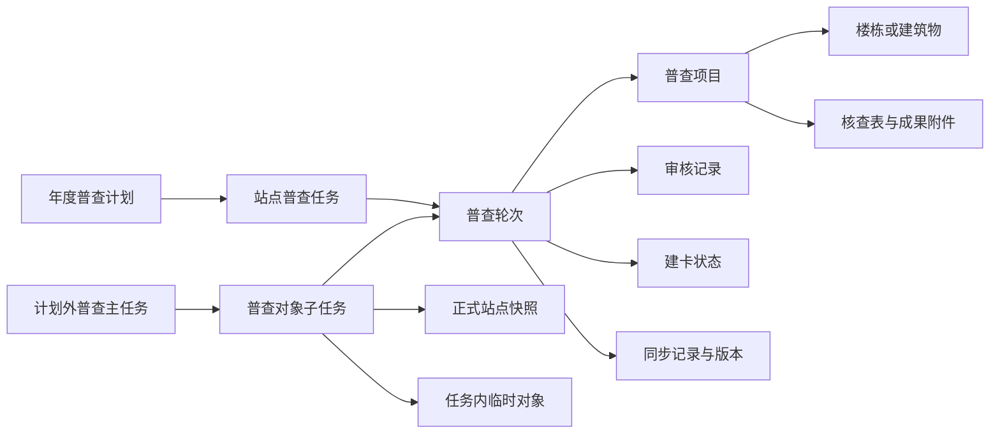
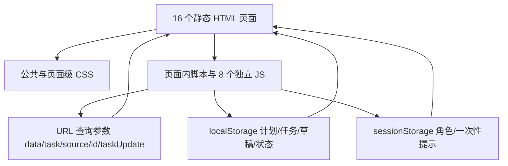

# 面积普查项目上下文

> 基线日期：2026-07-20
> 信息来源：当前工作区源码、现有 `docs/` 文档、`HANDOFF.md` 与用户本轮业务说明。
> 记录原则：区分“目标业务”“当前实现”“待确认”，不以原型模拟数据代替正式规则。

## 1. 项目定位

本项目是供热面积普查产品的多页面高保真原型，服务于需求评审、业务闭环确认和研发沟通。技术形态为静态 HTML + CSS + 原生 JavaScript，无构建工具和真实后端，使用 URL 查询参数、页面内模拟数据、`localStorage` 和 `sessionStorage` 模拟跨页面流转。

- 主入口：`area-survey-plan-list.html`
- 页面数量：16 个 HTML
- 独立脚本：8 个 JS
- 独立样式：10 个 CSS
- 当前分支：`main`，HEAD `91631bf Add temporary wholesale user station support`，与 `origin/main` 一致。
- 本轮初次检查时存在 12 个既有修改和未跟踪的 `HANDOFF.md`；在文档建立期间，这些成果由外部流程提交为 `91631bf`。本轮没有提交、回退或覆盖这些文件；当前工作区仅包含本轮新增的 8 份上下文文档。

## 2. 业务范围

### 2.1 目标业务

1. 年度计划面积普查；
2. 计划外面积普查；
3. 普查人员填报；
4. 片区所审核；
5. 管理部审核；
6. 多轮普查结果和当前有效轮次；
7. 先普查、后建卡；
8. 最终确认面积同步；
9. 站点/对象级退回、作废和历史留痕；
10. 后续面积检查业务。

### 2.2 当前原型覆盖

- 已形成正常普查“计划创建 → 站点任务 → 人员分配与下发 → 三类对象填报 → 片区所审核 → 管理部审核 → 完成”的演示闭环。
- 已实现计划外主任务列表、创建/编辑、详情和独立角色执行列表，并复用三类填报页与公共任务详情页。
- 已实现站点明细、模拟同步、业务管理员纠偏退回和未在网建筑物统计。
- 已实现计划外“趸售用户”原因下任务内临时用户站的新建、编辑、移除和任务内持久化（已包含在 `91631bf`）。
- 多轮普查、建卡、正式卡号补录、同步资格、专项审批、同步版本历史、项目级趸售填报与面积检查尚未形成完整页面和数据闭环。

## 3. 核心角色

| 角色 | 目标数据范围 | 核心职责 |
| --- | --- | --- |
| 业务管理员/计划经营人员 | 全部管理部 | 年度计划与计划外主任务管理、全局查询、异常纠偏 |
| 管理部人员 | 本管理部 | 计划外任务发起（按既有口径）、管理部审核、结果查看 |
| 片区所长 | 本片区所 | 接收对象任务、分配/改派人员、片区所审核、退回普查人员 |
| 普查人员 | 本人被分配对象 | 暂存填报、提交审核、审核前撤回 |
| 大厅/营销/建卡人员 | 待明确 | 正式编码和卡号建档、把结果回传普查系统 |
| 专项审批/内部上会人员 | 待明确 | 对超过面积差异阈值的结果作同步前审批 |

当前原型通过页面角色下拉模拟权限，正式系统必须在服务端校验数据范围和动作权限。

## 4. 核心业务对象及关系

- 年度计划按选择范围生成站点任务。
- 计划外主任务只能选择一种原因，可包含多个符合该原因规则的普查对象。
- 每个普查对象独立执行和审核；单个对象退回不影响同任务其他对象。
- 普查轮次承载一次完整填报与审核，同站点同年度可有多轮。
- 趸售场景中，一个趸售用户站可包含一个或多个独立普查项目；每个项目独立维护楼栋、面积、核查表和签章成果。
- 临时对象只存在于当前计划外任务域，不更新正式档案。

## 5. 计划内与计划外的区别

| 维度 | 计划内 | 计划外 |
| --- | --- | --- |
| 发起依据 | 年度普查计划 | 临时业务原因 |
| 主对象 | 普查计划 | 计划外主任务 |
| 原因 | 无计划外原因 | 四类原因单选 |
| 范围 | 计划选中的正式站点 | 已有站点或符合规则的临时对象 |
| 执行单位 | 站点任务 | 普查对象子任务 |
| 执行/审核 | 共用一套角色和状态机 | 共用一套角色和状态机 |
| 列表入口 | 计划管理、片区所任务、普查人员任务 | 计划外任务管理、计划外任务 |
| 建卡/同步 | 目标态均需判断卡号和同步资格 | 临时对象更常进入待建卡 |
| 当前实现 | 主流程较完整 | 主任务和通用执行已实现，原因差异化业务尚不完整 |

## 6. 四类计划外原因的目标口径

| 原因 | 适用对象 | 临时对象 | 模板/关键差异 |
| --- | --- | --- | --- |
| 面积变化 | 自管站、用户站、对公用户 | 不允许 | 按对象类型匹配模板；多轮；超阈值需专项审批 |
| 一管到户 | 用户站 | 可新建临时用户站 | 来源为用户站但使用自管站模板；完成后可能待建卡 |
| 新开户及增容 | 用户站新开户、用户站增容、自管站增容 | 新开户可创建临时用户站 | 展示原面积/新增面积/增容后面积；自管站增容不强制选择未在网建筑物 |
| 趸售用户 | 趸售、灵活供热、供汽等合同型用户 | 可新增趸售用户站 | 站下多项目；项目独立核查与盖章；支持合并 PDF 且每项目另起页 |

> 2026-07-20 客户已确认：本表最新原因口径覆盖旧版“任一原因可混选三类站点”的规则。当前原型尚未按新口径改造，必须在方案通过后分页面实施。

趸售补充确认：已有对象可从系统内全部站点类型中选择（仍受角色数据权限约束）；新增站的用户编码允许暂不填写；普查项目在任务下发后由普查人员建立；项目面积由楼栋或建筑物普查面积自动求和。

## 7. 当前技术架构

没有真实接口、鉴权、文件服务、PDF/Excel 解析、消息中心或后端状态机；相关能力均为交互模拟。

## 8. 已发现的实现风险

1. 正常任务、计划外子任务和站点明细各维护模拟数组及状态副本，存在同一业务对象多份事实源。
2. `areaSurveyTaskStates` 与 `areaSurveyOutPlanChildStates` 并行写入，填报页会同时更新两者，来源隔离不彻底。
3. 计划详情/任务详情通过 URL 编码完整对象，返回时再传 `taskUpdate`；直接跳到其他菜单会丢失未持久化的审核结果。
4. 计划外主任务详情把子任务详情标记为 `source=office`，返回会进入片区所任务页，而不是计划外详情或计划外执行列表。
5. 主任务使用“已完成”，子任务使用“已结束”，站点明细使用“普查完成”；片区所流程节点同时出现“所长审核”和“片区所审核”。
6. `area-survey-my-tasks.html` 是早期合并页，已不在主导航正式链路，但文件仍可访问并维护独立模拟数据。
7. 菜单在多页中复制，新增入口或改名容易漏页；样式存在 `area-survey-detail.css` 与 `area-survey-outplan.css` 两套基础壳层。
8. 当前计划外子任务由主任务即时展开，任务 ID 是拼接字符串，缺少独立版本、轮次、项目、卡号和同步记录。

## 9. 验证基线

2026-07-20 已完成：

- 16 个 HTML 的静态资源引用检查：现有静态引用均可解析；模板变量误报不计断链。
- 8 个独立 JS 的 `node --check`：通过。
- 16 个 HTML 的内联脚本解析：通过。
- `git diff --check`：通过。

未完成：浏览器逐页 DOM、交互、响应式和跨页状态回归；未验证线上 GitHub Pages 对 `91631bf` 的部署结果。

## 10. 变更记录

| 日期 | 变更 | 状态 |
| --- | --- | --- |
| 2026-07-20 | 建立项目级上下文、计划外流程/状态机/页面/数据模型/设计规范/待确认问题文档与根级协作规则 | 已完成，未修改业务页面 |
| 2026-07-20 | 确认四类原因采用客户新口径；确认趸售已有对象范围、可空用户编码、项目建立时点和面积汇总方式 | 已写入 V1.11 规格与建设方案，待方案授权 |
| 2026-07-20 | 计划外普查任务执行列表改按四类计划外原因展示页签；移除重复原因下拉，保留任务状态及站点条件查询 | 已实现；统计和列表均按当前角色权限及查询条件联动 |
| 2026-07-20 | 趸售用户计划外普查改为“用户站任务 → 项目列表 → 项目楼栋/成果 → 全部项目完成后上报”；新增项目级统一存储与两张填报页 | 已实现；未扩展审核、建卡、同步和其他原因 |
